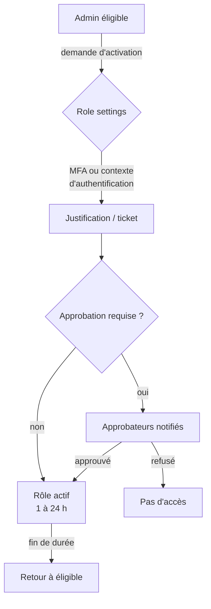
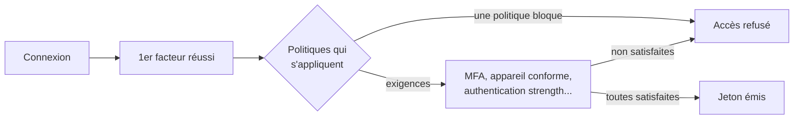

## L'essentiel en 2 minutes

Microsoft Entra ID est le plan de contrôle de l'identité pour Azure et Microsoft 365. Cet objectif couvre six mécanismes qui répondent chacun à une question simple :

| Mécanisme | La question à laquelle il répond |
| --- | --- |
| Privileged Identity Management (PIM) | Qui a des droits élevés, **quand**, et avec quelle validation ? |
| Conditional Access | **Dans quelles conditions** une connexion est-elle acceptée ? |
| Méthodes d'authentification | **Comment** l'utilisateur prouve-t-il son identité ? |
| App registrations et enterprise apps | Comment une **application** obtient-elle une identité ? |
| Consentement OAuth | **Quelles données** une application peut-elle lire, et qui l'a autorisé ? |
| Identités managées | Comment une ressource Azure s'authentifie-t-elle **sans secret** ? |

Pour un ingénieur réseau, une bonne analogie : Conditional Access joue le rôle d'un pare-feu, mais placé devant les applications et fondé sur l'identité, l'appareil, l'emplacement et le risque, pas sur des adresses IP seules. PIM ressemble à une ouverture de flux temporaire avec ticket et validation, appliquée aux rôles.

> [!INFO] Fil rouge du site : Brisemer Logistique, une entreprise fictive de logistique maritime, met en place un accès privilégié Just-in-Time. Aucun administrateur ne garde de rôle élevé en permanence. On retrouve ce projet dans les leçons, les questions et le lab fil rouge.

## Privileged Identity Management (PIM) {#s-1-1-1}

### Pourquoi

Un compte avec un rôle permanent (Global Administrator, Owner d'un abonnement) est une cible idéale : s'il est compromis, l'attaquant a immédiatement tous les droits. PIM réduit cette fenêtre en rendant les rôles **éligibles** : le droit existe, mais il faut l'activer, pour une durée limitée et sous conditions.

### Comment

PIM gère trois familles de rôles :

- les **rôles Microsoft Entra** (Global Administrator, Security Administrator, Privileged Role Administrator...) ;
- les **rôles Azure** (RBAC : Owner, Contributor, User Access Administrator... sur un groupe d'administration, un abonnement, un groupe de ressources ou une ressource) ;
- **PIM for Groups** : appartenance ou propriété d'un groupe en juste-à-temps.

Vocabulaire officiel, à connaître par cœur :

| Terme | Sens |
| --- | --- |
| Eligible | Le rôle doit être **activé** avant usage (MFA, justification, approbation...). |
| Active | Le rôle est utilisable immédiatement, sans action. |
| Permanent / time-bound | Sans date de fin, ou bornée par des dates de début et de fin. |
| Activate | L'action de l'utilisateur éligible pour obtenir le rôle pour une durée limitée. |
| Extend / renew | Demander la prolongation d'une attribution qui expire, ou le renouvellement d'une attribution expirée. Approuvé par un Global Administrator ou un Privileged Role Administrator. |

Les **role settings** (aussi appelés PIM policies) se définissent **par rôle** et s'appliquent à toutes les attributions de ce rôle :

- **Activation maximum duration** : de 1 à 24 heures ;
- **On activation, require** : MFA, ou un **contexte d'authentification d'accès conditionnel** (authentication context) ;
- **Require justification**, **Require ticket information** (champ informatif, sans contrôle dans l'outil de ticketing) ;
- **Require approval to activate**, avec des approbateurs désignés (au moins un, deux recommandés). L'approbateur n'a besoin d'aucun rôle ;
- durée des attributions : autoriser ou non les attributions éligibles ou actives **permanentes**, sinon expiration après une durée ;
- MFA et justification exigées pour **créer** une attribution active ;
- notifications par e-mail.



**Qui administre quoi :**

- rôles Entra : seul un **Privileged Role Administrator** ou un **Global Administrator** gère les attributions des autres administrateurs ;
- rôles Azure : un **Owner** ou un **User Access Administrator** de la ressource (ou un administrateur de l'abonnement). Par défaut, un Privileged Role Administrator ne voit **pas** les attributions des rôles Azure.

**Licences :** PIM exige **Microsoft Entra ID P2** ou **Microsoft Entra ID Governance** (inclus aussi dans Microsoft Entra Suite). Il faut une licence pour chaque utilisateur ayant une attribution éligible ou limitée dans le temps, pour chaque **approbateur** et pour chaque **réviseur** d'une revue d'accès.

> [!PIEGE] Si la licence expire, les attributions **éligibles** sont supprimées et les attributions actives limitées dans le temps deviennent **actives permanentes**. C'est l'inverse de l'objectif de PIM : surveillez les renouvellements.

> [!PIEGE] Verrouillage du tenant : si tous les Global Administrators et Privileged Role Administrators sont éligibles, que l'approbation est exigée et qu'aucun approbateur n'est désigné, personne ne peut plus approuver. Les approbateurs par défaut sont les administrateurs **actifs** de ces rôles. Désignez des approbateurs et gardez des comptes d'urgence actifs.

### Contexte d'authentification et accès conditionnel

Le réglage **On activation, require Microsoft Entra Conditional Access authentication context** relie PIM à une politique d'accès conditionnel. Exemple : exiger une **authentication strength** résistante au phishing et un appareil conforme pour activer Global Administrator.

Points précis documentés par Microsoft :

- créez et activez d'abord la politique d'accès conditionnel qui cible le contexte, **puis** configurez le contexte dans PIM ;
- ne ciblez pas à la fois le contexte et le rôle d'annuaire dans la même politique : pendant l'activation, l'utilisateur n'a pas encore le rôle ;
- pour forcer une réauthentification à chaque activation, la politique du contexte utilise **sign-in frequency : Every time**. Une fenêtre de 10 minutes s'applique ensuite entre activations ;
- l'exigence porte sur l'**activation**. Une fois le rôle actif, l'utilisateur pourrait l'utiliser depuis un autre appareil. Pour l'empêcher, ajoutez une seconde politique qui cible les rôles d'annuaire.

> [!EXAMEN] Distinguez bien : « éligible » ne donne **aucun** droit avant activation ; « actif » donne les droits tout de suite. Les attributions éligibles de rôles Azure se créent pour des **utilisateurs** (et groupes), pas pour des service principals ni des identités managées, qui ne peuvent pas faire l'activation. Depuis la page Access control (IAM), on crée des attributions éligibles au niveau groupe d'administration, abonnement ou groupe de ressources, pas au niveau d'une ressource.

### Exemples

Portail : **Microsoft Entra admin center > ID Governance > Privileged Identity Management > Microsoft Entra roles > Roles > (rôle) > Role settings > Edit**. Pour Azure : **Access control (IAM) > Add role assignment > onglet Assignment type > Eligible**.

PowerShell (module Az) pour rendre un utilisateur éligible au rôle Contributor sur un groupe de ressources, pendant 90 jours :

```powershell
$scope = "/subscriptions/<subId>/resourceGroups/rg-prod-app"
$role  = Get-AzRoleDefinition -Name "Contributor"
New-AzRoleEligibilityScheduleRequest -Name (New-Guid) -Scope $scope `
  -PrincipalId "<objectIdUtilisateur>" `
  -RoleDefinitionId "$scope/providers/Microsoft.Authorization/roleDefinitions/$($role.Id)" `
  -RequestType AdminAssign `
  -ScheduleInfoStartDateTime (Get-Date).ToUniversalTime().ToString("o") `
  -ExpirationType AfterDuration -ExpirationDuration "P90D" `
  -Justification "Astreinte applicative T4"

# Lister les attributions éligibles sur l'abonnement
Get-AzRoleEligibilitySchedule -Scope "/subscriptions/<subId>"
```

Bicep, même attribution déclarée en code (API stable 2020-10-01) :

```bicep
param principalId string
param startDateTime string = utcNow()

var contributorId = subscriptionResourceId('Microsoft.Authorization/roleDefinitions', 'b24988ac-6180-42a0-ab88-20f7382dd24c')

resource eligible 'Microsoft.Authorization/roleEligibilityScheduleRequests@2020-10-01' = {
  name: guid(resourceGroup().id, principalId, contributorId)
  properties: {
    principalId: principalId
    roleDefinitionId: contributorId
    requestType: 'AdminAssign'
    justification: 'Astreinte applicative'
    scheduleInfo: {
      startDateTime: startDateTime
      expiration: {
        type: 'AfterDuration'
        duration: 'P90D'
      }
    }
  }
}
```

> [!TERRAIN] Dans un projet JIT réel, on commence par l'inventaire : qui a quoi en permanent ? On convertit ensuite par vagues (d'abord les rôles les plus puissants), avec des approbateurs joignables en astreinte. Une activation qui exige une approbation à 3 h du matin sans approbateur disponible pousse les équipes à contourner le dispositif.

## Accès conditionnel (Conditional Access) {#s-1-1-2}

### Pourquoi

Une connexion réussie avec le bon mot de passe ne dit rien du contexte : appareil inconnu, pays inhabituel, protocole hérité sans MFA. L'accès conditionnel est le **moteur de politique Zero Trust** de Microsoft : il combine des signaux et décide.

### Comment

Une politique est un « si... alors... » :

- **Affectations** : utilisateurs, groupes ou agents (préversion) ; ressources cibles (applications cloud, actions utilisateur, contextes d'authentification) ; conditions : risque de connexion et risque utilisateur, plateformes d'appareil, emplacements (named locations, pays), applications clientes (dont l'authentification héritée), filtres d'appareils.
- **Contrôles d'accès** : **Block**, ou **Grant** avec une ou plusieurs exigences : MFA, **authentication strength**, appareil conforme, appareil Microsoft Entra hybrid joined, application cliente approuvée, politique de protection d'application, changement de mot de passe, conditions d'utilisation.
- **Contrôles de session** : fréquence de connexion, session de navigateur persistante, Conditional Access App Control (Defender for Cloud Apps), restrictions imposées par l'application.



Règles de fonctionnement à retenir :

- les politiques sont évaluées **après** le premier facteur d'authentification. Ce n'est pas une défense contre le déni de service ;
- toutes les politiques qui s'appliquent sont combinées : l'utilisateur doit satisfaire **toutes** leurs exigences (logique ET), et une politique avec **Block** arrête l'évaluation ;
- une politique qui cible un **rôle** ou un **groupe** n'est évaluée qu'à l'émission d'un jeton : un utilisateur qui vient d'obtenir le rôle n'y est soumis qu'au prochain jeton. D'où l'intérêt de déclencher l'accès conditionnel **pendant l'activation PIM** ;
- le mode **Report-only** évalue la politique sans l'appliquer : indispensable avant un déploiement ;
- l'outil **What If** simule l'effet des politiques pour un utilisateur et un contexte.

**Licences :** Microsoft Entra ID **P1** (ou Microsoft 365 Business Premium). Les politiques fondées sur le **risque** (sign-in risk, user risk) exigent **Microsoft Entra ID Protection**, donc **P2**. Sans P1, il reste les **security defaults**, gratuits mais non personnalisables.

### Authentication strengths

Une authentication strength précise **quelles combinaisons de méthodes** satisfont la politique. Trois forces intégrées :

| Combinaison | MFA strength | Passwordless MFA | Phishing-resistant MFA |
| --- | --- | --- | --- |
| Passkey FIDO2 (clé de sécurité) | Oui | Oui | Oui |
| Windows Hello for Business ou platform credential | Oui | Oui | Oui |
| Certificate-based authentication (multifacteur) | Oui | Oui | Oui |
| Microsoft Authenticator (phone sign-in) | Oui | Oui | Non |
| Temporary Access Pass | Oui | Non | Non |
| Mot de passe + SMS, appel, push ou OATH | Oui | Non | Non |

> [!PIEGE] On ne peut pas combiner **Require multifactor authentication** et **Require authentication strength** dans la même politique : la force intégrée « Multifactor authentication » est équivalente au premier contrôle.

### Comptes d'accès d'urgence

Microsoft recommande au moins **deux** comptes d'urgence (« break glass ») :

- comptes **cloud-only** en `*.onmicrosoft.com`, non fédérés ni synchronisés ;
- rôle Global Administrator **actif permanent** dans PIM (pas éligible) ;
- méthode **résistante au phishing** différente de celle des admins habituels : passkey FIDO2 (recommandé) ou CBA ;
- **exclus** des politiques d'accès conditionnel qui bloquent ou restreignent la connexion (via un groupe dédié). Les politiques en report-only n'ont pas besoin d'exclusion ;
- connexions surveillées avec **alerte** (par exemple requête `SigninLogs` dans Azure Monitor ou Sentinel) et tests au moins **tous les 90 jours**.

### Exemple : exiger une force résistante au phishing pour les rôles d'administration

Microsoft Graph PowerShell (la politique démarre en report-only) :

```powershell
Connect-MgGraph -Scopes "Policy.ReadWrite.ConditionalAccess"

$params = @{
  displayName = "CA-Admins-PhishingResistant"
  state       = "enabledForReportingButNotEnforced"
  conditions  = @{
    users        = @{
      includeRoles  = @("62e90394-69f5-4237-9190-012177145e10") # Global Administrator
      excludeGroups = @("<id-groupe-comptes-urgence>")
    }
    applications = @{ includeApplications = @("All") }
  }
  grantControls = @{
    operator               = "OR"
    authenticationStrength = @{ id = "00000000-0000-0000-0000-000000000004" } # Phishing-resistant MFA
  }
}
New-MgIdentityConditionalAccessPolicy -BodyParameter $params
```

Les identifiants de rôle et de force intégrée ci-dessus sont ceux publiés par Microsoft ; vérifiez-les dans votre tenant avec `Get-MgDirectoryRoleTemplate` et l'API `authenticationStrength/policies` (à vérifier) avant usage.

> [!EXAMEN] Si la question parle de « risque de connexion » ou de « risque utilisateur », pensez Entra ID P2 et ID Protection. Si elle parle de « tester une politique sans impacter les utilisateurs », la réponse est **Report-only** (et What If pour une simulation ponctuelle).

## Méthodes d'authentification, MFA et passwordless {#s-1-1-3}

### Pourquoi

Le mot de passe seul est la première cause de compromission. Mais toutes les MFA ne se valent pas : SMS, appel vocal et notifications push restent vulnérables au **phishing en temps réel**. Microsoft recommande les méthodes **résistantes au phishing**.

### Comment

Les méthodes se gèrent dans la **Authentication methods policy** (Entra admin center > Entra ID > Authentication methods > Policies), méthode par méthode et groupe par groupe. Usage de chaque méthode :

| Méthode | 1er facteur | MFA | SSPR |
| --- | --- | --- | --- |
| Passkey (FIDO2), passkey dans Authenticator, synced passkey | Oui | Oui | Non |
| Windows Hello for Business | Oui | Oui (voir note Microsoft) | Non |
| Certificate-based authentication | Oui | Oui | Non |
| Microsoft Authenticator push | Non | Oui | Oui |
| Temporary Access Pass (TAP) | Oui | Oui | Non |
| SMS sign-in | Oui | Oui | Oui |
| Appel vocal | Non | Oui | Oui |
| OATH logiciel | Non | Oui | Oui |
| Mot de passe | Oui | Non | Non |

**Méthodes résistantes au phishing** selon Microsoft : Windows Hello for Business, Platform Credential for macOS, synced passkeys, clés FIDO2, passkeys dans Microsoft Authenticator, certificate-based authentication.

Le **Temporary Access Pass** est un code limité dans le temps, utilisable comme premier facteur et comme MFA : il sert à l'**amorçage** (enregistrer une passkey sans mot de passe) et à la récupération.

> [!PIEGE] « Passwordless » ne veut pas dire « résistant au phishing ». Microsoft Authenticator en phone sign-in est passwordless mais **n'entre pas** dans la force Phishing-resistant MFA. Les passkeys dans Authenticator, elles, y figurent.

> [!TERRAIN] Pour les comptes à privilèges du projet JIT, on vise : passkey FIDO2 ou Windows Hello for Business pour la connexion, et une authentication strength « Phishing-resistant MFA » exigée à l'activation PIM via un contexte d'authentification. Le TAP sert à l'enrôlement initial des clés.

## Identité des applications : app registrations et enterprise apps {#s-1-1-4}

### Pourquoi

Une application qui appelle une API (Microsoft Graph, une API maison, Azure Resource Manager) a besoin de sa propre identité, distincte des utilisateurs. Mal gérée, c'est une porte dérobée : secret qui traîne dans un dépôt, permissions trop larges.

### Comment

| | Application object | Service principal |
| --- | --- | --- |
| Où le voir | **App registrations** | **Enterprise applications** |
| Portée | Global : un seul objet, dans le tenant d'origine (home tenant) | Local : un par tenant où l'application est utilisée |
| Rôle | Modèle : comment émettre des jetons, quelles ressources, quelles actions | Instance : ce que l'app peut faire **dans ce tenant**, qui y accède |
| Analogie | La classe | L'instance de la classe |

Il existe **trois types** de service principals : **Application** (instance d'un application object), **Managed identity** (pas d'application object associé, non modifiable directement) et **Legacy**.

Points de sécurité :

- **identifiants de l'application** : préférer un **certificat** à un **client secret**, et mieux encore la **workload identity federation** (federated identity credential) qui supprime tout secret ;
- **Assignment required** sur l'enterprise app : seuls les utilisateurs et groupes affectés peuvent se connecter. Une application qui exige l'affectation doit recevoir le consentement d'un administrateur ;
- **désactiver** une application (plutôt que la supprimer) empêche l'émission de nouveaux jetons tout en conservant les objets pour l'enquête. Supprimer l'application object supprime aussi le service principal du tenant d'origine ;
- les **propriétaires** d'une app registration peuvent ajouter des identifiants : limitez-les.

```azurecli
# Créer une app registration et son service principal
az ad app create --display-name "app-brisemer-reporting"
az ad sp create --id <appId>

# Retrouver le service principal d'une application
az ad sp list --filter "appId eq '<appId>'"
```

> [!EXAMEN] « Où configurer les permissions d'API demandées par l'application ? » : App registrations (application object). « Où restreindre quels utilisateurs peuvent se connecter, voir les consentements accordés, les connexions ? » : Enterprise applications (service principal).

## Permissions OAuth et consentement {#s-1-1-5}

### Pourquoi

Le **consent phishing** consiste à faire accepter par un utilisateur une application malveillante qui demande, par exemple, la lecture de sa messagerie. Aucun mot de passe n'est volé : l'application reçoit un jeton légitime.

### Comment

| | Permissions déléguées | Permissions d'application |
| --- | --- | --- |
| Contexte | Au nom d'un utilisateur connecté | Sans utilisateur (daemon, automatisation) |
| Autres noms | Scopes, OAuth2 permission scopes | App roles, app-only permissions |
| Accès effectif | Limité à ce que **l'utilisateur** peut déjà faire | Tout ce que couvre la permission, dans tout le tenant |
| Qui consent | L'utilisateur pour ses données, ou un admin pour tous | **Administrateur uniquement** |
| Résultat dans Graph | `oauth2PermissionGrant` | `appRoleAssignment` |

**Paramètres de consentement utilisateur** (Enterprise apps > Consent and permissions > User consent settings) :

- **Do not allow user consent** ;
- **Allow user consent for apps from verified publishers, for selected permissions** (politique `microsoft-user-default-low`) : seulement les éditeurs vérifiés et les apps du tenant, et seulement les permissions classées **low impact** dans les **permission classifications** ;
- **Allow user consent for apps** (`microsoft-user-default-legacy`) : tout ce qui n'exige pas un admin. C'est le comportement par défaut historique, que Microsoft déconseille.

Le **admin consent workflow** permet à l'utilisateur bloqué de **demander** l'approbation d'un administrateur au lieu de rester sans solution. Modifier les paramètres n'affecte que les **futurs** consentements : les autorisations déjà accordées se révoquent dans l'enterprise app (Permissions).

```powershell
# Restreindre le consentement aux éditeurs vérifiés et permissions à faible impact
Connect-MgGraph -Scopes "Policy.ReadWrite.Authorization"
# Lire d'abord la politique actuelle pour conserver les politiques ManagePermissionGrantsForOwnedResource.*
(Get-MgPolicyAuthorizationPolicy).DefaultUserRolePermissions.PermissionGrantPoliciesAssigned

$body = @{
  permissionGrantPolicyIdsAssignedToDefaultUserRole = @(
    "managePermissionGrantsForSelf.microsoft-user-default-low"
  )
}
Update-MgPolicyAuthorizationPolicy -BodyParameter $body
```

Rôle requis pour changer ces paramètres : **Privileged Role Administrator** (Global Administrator si vous passez par le portail, selon la documentation).

> [!PIEGE] Une permission déléguée `Files.Read.All` ne lit que les fichiers accessibles à l'utilisateur. La **même** permission en application lit **tous** les fichiers du tenant. La question d'examen se joue souvent sur ce mot : délégué ou application.

## Identités managées {#s-1-1-6}

### Pourquoi

Une VM, une Function App ou un AKS qui doit lire un secret Key Vault ou un blob a besoin d'une identité. Une identité managée fournit un jeton Entra **sans aucun identifiant à stocker ni à faire tourner**. Elle est gratuite.

### Comment

| | System-assigned | User-assigned |
| --- | --- | --- |
| Création | Activée sur la ressource | Ressource Azure autonome |
| Cycle de vie | Supprimée avec la ressource | Indépendant, suppression explicite |
| Partage | Une seule ressource | Plusieurs ressources |
| Cas d'usage | Charge contenue dans une ressource | Plusieurs VM partageant un accès, ressources recréées souvent, droits accordés avant le déploiement |

Dans les deux cas, Entra ID crée un **service principal de type managed identity**. Le code obtient un jeton via **Azure.Identity** ou **MSAL**, sans secret. On donne ensuite des droits avec **Azure RBAC** sur la ressource cible. Une identité managée peut aussi servir de **federated identity credential** pour une app registration (limite de 20 FIC par application dans ce cas).

```azurecli
# Identité système sur une VM, puis accès en lecture aux secrets d'un Key Vault
az vm identity assign -g rg-app -n vm-batch
principalId=$(az vm show -g rg-app -n vm-batch --query identity.principalId -o tsv)
az role assignment create --assignee-object-id $principalId \
  --assignee-principal-type ServicePrincipal \
  --role "Key Vault Secrets User" \
  --scope $(az keyvault show -n kv-brisemer --query id -o tsv)

# Identité affectée par l'utilisateur, partagée
az identity create -g rg-app -n id-batch-shared
```

```bicep
resource uami 'Microsoft.ManagedIdentity/userAssignedIdentities@2023-01-31' = {
  name: 'id-batch-shared'
  location: resourceGroup().location
}

resource app 'Microsoft.Web/sites@2023-12-01' = {
  name: 'func-brisemer-batch'
  location: resourceGroup().location
  kind: 'functionapp'
  identity: {
    type: 'UserAssigned'
    userAssignedIdentities: {
      '${uami.id}': {}
    }
  }
  properties: {
    serverFarmId: '<planId>'
  }
}
```

> [!EXAMEN] Mot-clé « sans gérer de secret » ou « éviter de stocker des identifiants dans le code » : identité managée. Mot-clé « plusieurs ressources doivent partager la même identité » : **user-assigned**. Mot-clé « l'identité doit disparaître avec la ressource » : **system-assigned**.

> [!TERRAIN] Une identité managée avec le rôle Owner sur l'abonnement reste un compte à privilèges, même sans mot de passe. Appliquez le moindre privilège : rôle de données (`Key Vault Secrets User`, `Storage Blob Data Reader`) sur la ressource précise, pas Contributor sur le groupe.

## Comparatif : quel mécanisme pour quel besoin ?

| Besoin | Mécanisme |
| --- | --- |
| Limiter la durée des droits d'admin | PIM (éligible + activation) |
| Exiger une clé FIDO2 pour l'activation d'un rôle | PIM + contexte d'authentification + authentication strength |
| Bloquer l'authentification héritée | Conditional Access (condition Client apps) |
| Empêcher les utilisateurs d'accepter des apps inconnues | User consent settings + admin consent workflow |
| Une VM doit lire un secret sans mot de passe | Identité managée + RBAC Key Vault |
| Une application CI/CD externe sans secret | Workload identity federation (federated credential) |

## Sources

Toutes les affirmations de cette leçon proviennent des pages Microsoft Learn listées en bas de page, consultées le 2026-10-04.
