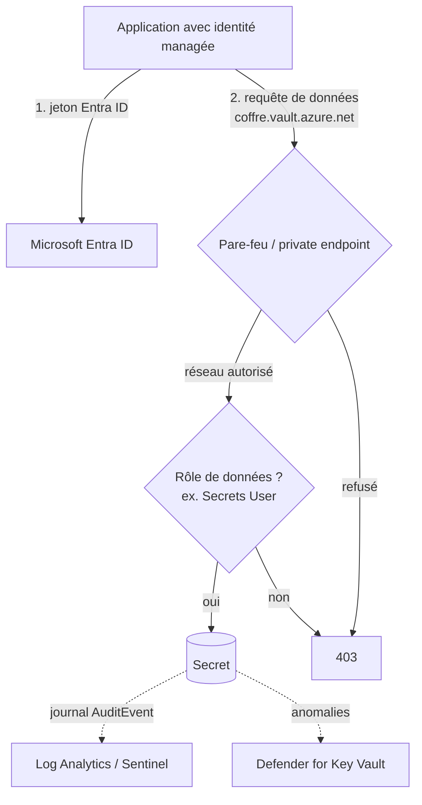
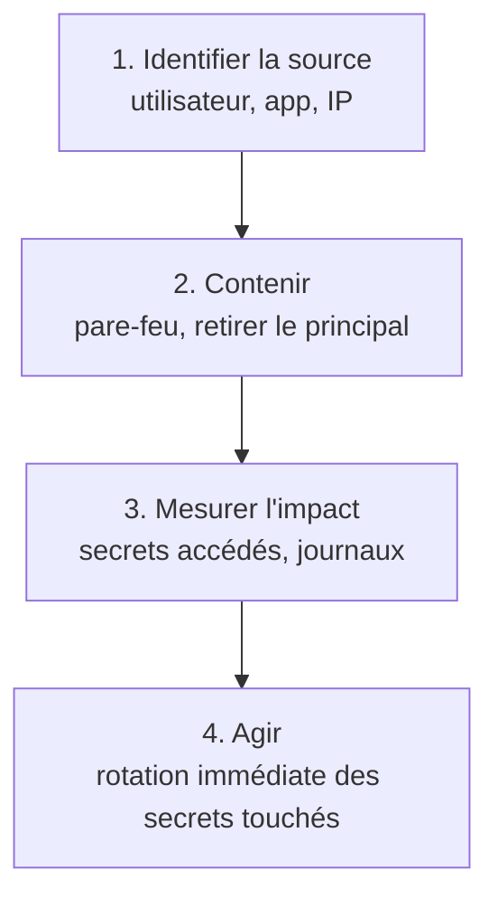

## L'essentiel en 2 minutes

Azure Key Vault stocke trois types d'**objets** : des **clés** cryptographiques, des **secrets** (mots de passe, chaînes de connexion) et des **certificats**. Son intérêt : sortir ces valeurs du code et des fichiers de configuration, contrôler qui y accède, tracer chaque accès et faire tourner les valeurs.

Sécuriser un coffre se fait en quatre couches, comme pour n'importe quel service PaaS :

| Couche | Mécanisme Key Vault |
| --- | --- |
| Résilience | Soft-delete (toujours actif) et purge protection |
| Identité et accès | Azure RBAC (modèle par défaut des nouveaux coffres) ou access policies (modèle hérité) |
| Réseau | Pare-feu, service endpoints, private endpoint, Network Security Perimeter |
| Détection | Journaux de diagnostic, Defender for Key Vault, scan de secrets Defender CSPM |



## Déployer un coffre {#s-1-2-1}

Choix à faire au déploiement :

- **SKU** : **Standard** (clés protégées par logiciel) ou **Premium** (ajoute les clés protégées par **HSM**). Pour un HSM dédié à un seul client, il existe une ressource distincte, **Managed HSM**, qui ne stocke que des clés ;
- **un coffre par application et par environnement** (dev, préproduction, production), recommandation de Microsoft ;
- nom unique au niveau mondial, 3 à 24 caractères ;
- modèle d'accès : **Azure RBAC** ;
- **purge protection** activée si le coffre sert au chiffrement (Storage, SQL TDE, disques) ;
- réseau restreint dès le départ.

```azurecli
az keyvault create \
  --name kv-brisemer-prod-01 \
  --resource-group rg-secrets-prod \
  --location francecentral \
  --sku standard \
  --enable-rbac-authorization true \
  --enable-purge-protection true \
  --retention-days 90 \
  --public-network-access Disabled
```

```bicep
param location string = resourceGroup().location

resource kv 'Microsoft.KeyVault/vaults@2023-07-01' = {
  name: 'kv-brisemer-prod-01'
  location: location
  properties: {
    tenantId: subscription().tenantId
    sku: {
      family: 'A'
      name: 'standard'
    }
    enableRbacAuthorization: true
    enableSoftDelete: true
    softDeleteRetentionInDays: 90
    enablePurgeProtection: true
    publicNetworkAccess: 'Disabled'
    networkAcls: {
      defaultAction: 'Deny'
      bypass: 'AzureServices'
    }
  }
}
```

> [!TERRAIN] Dans un hub-and-spoke, placez les private endpoints des coffres dans les spokes applicatifs (ou un spoke « services partagés ») et liez la zone DNS privée `privatelink.vaultcore.azure.net` aux réseaux qui résolvent les noms. Sans la bonne résolution DNS, l'application continue d'appeler l'adresse publique et se fait refuser.

## Paramètres du coffre : soft-delete et purge protection {#s-1-2-2}

| | Soft-delete | Purge protection |
| --- | --- | --- |
| Par défaut | **Activé** sur tout nouveau coffre | **Désactivée** |
| Désactivable ? | Non, une fois activé | Non, une fois activée (à vérifier) |
| Effet | Un objet ou un coffre supprimé reste **récupérable** pendant la rétention | **Personne** ne peut purger avant la fin de la rétention |
| Rétention | 7 à 90 jours, **90 par défaut**, fixée **à la création** et non modifiable | Même intervalle que le soft-delete |

Points à connaître :

- supprimer définitivement demande **deux** opérations : suppression puis purge. La purge exige une permission dédiée (rôle **Key Vault Purge Operator**, ou propriétaire de l'abonnement pour un coffre) ;
- tant qu'un coffre supprimé est en rétention, son **nom** ne peut pas être réutilisé ;
- la plupart des services Azure qui chiffrent avec une clé du coffre (par exemple Storage avec clé gérée par le client) **exigent** la purge protection ;
- la suppression d'un coffre supprime les services intégrés (attributions RBAC, abonnements Event Grid) : la **récupération ne les restaure pas**.

```azurecli
az keyvault secret delete --vault-name kv-brisemer-prod-01 --name sql-conn
az keyvault secret list-deleted --vault-name kv-brisemer-prod-01
az keyvault secret recover --vault-name kv-brisemer-prod-01 --name sql-conn
# Coffre supprimé
az keyvault list-deleted
az keyvault recover --name kv-brisemer-prod-01
```

> [!PIEGE] La rétention se choisit **une seule fois**, à la création. Une question qui demande de « passer la rétention de 7 à 90 jours sur un coffre existant » n'a pas de solution directe : il faut un nouveau coffre.

## Contrôler l'accès au coffre {#s-1-2-3}

Deux plans, autorisés indépendamment :

| Plan | Point d'accès | Opérations | Autorisation |
| --- | --- | --- | --- |
| Contrôle | `management.azure.com` | Créer, supprimer, configurer le coffre, tags, réseau | Azure RBAC |
| Données | `<coffre>.vault.azure.net` | Lire, écrire, utiliser clés, secrets, certificats | **Azure RBAC** ou access policy (hérité) |

Depuis la **version d'API 2026-02-01**, Azure RBAC est le modèle **par défaut** des nouveaux coffres. Rôles de données à connaître :

| Rôle | Ce qu'il permet |
| --- | --- |
| Key Vault Administrator | Toutes les opérations de données (pas la gestion du coffre ni des attributions) |
| Key Vault Secrets Officer | Toute action sur les secrets, sauf gérer les permissions |
| Key Vault Secrets User | **Lire la valeur** des secrets |
| Key Vault Crypto Officer | Toute action sur les clés, sauf gérer les permissions |
| Key Vault Crypto User | Opérations cryptographiques avec les clés |
| Key Vault Crypto Service Encryption User | Lire les métadonnées et faire wrap/unwrap (chiffrement par un service Azure) |
| Key Vault Certificates Officer / Certificate User | Gérer les certificats / lire tout le certificat, partie privée comprise |
| Key Vault Reader | Lire les **métadonnées**, jamais les valeurs |
| Key Vault Data Access Administrator | Attribuer ou retirer uniquement les rôles Key Vault ci-dessus (avec condition ABAC) |
| Key Vault Contributor | **Plan de contrôle seulement** : aucun accès aux données |

Microsoft recommande d'attribuer les rôles **au niveau du coffre**. Les attributions par secret individuel restent des exceptions (secret partagé entre deux applications, clé SSH d'un utilisateur pour Azure Bastion).

> [!PIEGE] Avec le modèle **access policy**, un utilisateur qui a **Contributor** sur le coffre peut s'ajouter une access policy et lire tous les secrets. C'est une raison majeure de passer à RBAC. Basculer un coffre existant vers RBAC **invalide** toutes les access policies : préparez d'abord les attributions de rôles équivalentes.

```azurecli
kvId=$(az keyvault show -n kv-brisemer-prod-01 --query id -o tsv)
az role assignment create --role "Key Vault Secrets User" \
  --assignee-object-id <principalIdIdentiteManagee> --assignee-principal-type ServicePrincipal \
  --scope $kvId
```

```powershell
New-AzRoleAssignment -RoleDefinitionName "Key Vault Crypto Service Encryption User" `
  -ObjectId <principalIdIdentiteDuStockage> `
  -Scope (Get-AzKeyVault -VaultName kv-brisemer-prod-01).ResourceId
```

> [!EXAMEN] « L'application doit lire des secrets sans pouvoir les modifier » : **Key Vault Secrets User**. « Un service Azure chiffre ses données avec une clé du coffre » : **Key Vault Crypto Service Encryption User** pour l'identité du service. « L'équipe d'exploitation gère le coffre sans voir les secrets » : **Key Vault Contributor** avec le modèle RBAC.

## Pare-feu et accès réseau {#s-1-2-4}

Par défaut, le pare-feu du coffre est **désactivé** : toutes les sources réseau peuvent présenter une requête (qui reste soumise à l'authentification Entra et aux permissions). Options, de la plus ouverte à la plus fermée :

1. **Selected networks** : règles IPv4 publiques (CIDR) et règles de **réseau virtuel** via service endpoint `Microsoft.KeyVault` ;
2. **Exception** « Allow trusted Microsoft services to bypass this firewall » : seuls les services de la liste officielle (où Microsoft contrôle tout le code exécuté). Azure DevOps, par exemple, n'y figure pas ;
3. **Disable public access** : accès uniquement par **private endpoint**. Les services de confiance gardent leur contournement s'il est activé ;
4. **Network Security Perimeter** en mode « Secure by perimeter » : même les services de confiance sont bloqués sans règle d'accès explicite du périmètre.

Limites documentées :

- au plus **200** règles de réseau virtuel et **1 000** règles IPv4 ;
- règles IP **uniquement** pour des adresses **publiques** : les plages RFC 1918 (10.x, 172.16-31.x, 192.168.x) sont refusées ;
- **IPv4 seulement** ;
- le pare-feu ne s'applique qu'au **plan de données**. Un déploiement ARM/Bicep qui crée un secret passe par le plan de contrôle et **n'est pas bloqué**.

```azurecli
# Service endpoint sur le sous-réseau, règle VNet, puis refus par défaut
az network vnet subnet update -g rg-net -n snet-app --vnet-name vnet-spoke-app \
  --service-endpoints Microsoft.KeyVault
subnetId=$(az network vnet subnet show -g rg-net -n snet-app --vnet-name vnet-spoke-app --query id -o tsv)
az keyvault network-rule add -g rg-secrets-prod -n kv-brisemer-prod-01 --subnet $subnetId
az keyvault update -g rg-secrets-prod -n kv-brisemer-prod-01 --default-action Deny --bypass AzureServices
```

> [!PIEGE] Après activation du pare-feu, le **portail Azure** est lui aussi soumis aux règles : un administrateur voit le coffre mais ne peut plus lister les secrets depuis un poste non autorisé. Ce n'est pas un problème de RBAC.

> [!TERRAIN] Pour un ingénieur réseau, le réflexe « ajouter l'IP privée du serveur dans le pare-feu du coffre » ne fonctionne pas : les règles IP n'acceptent que des IP publiques. Depuis un VNet, on passe par un service endpoint ou, mieux, un private endpoint.

## Gérer clés, secrets et certificats {#s-1-2-5}

| Objet | Contenu | Points clés |
| --- | --- | --- |
| Clé | Clé cryptographique (RSA, EC...) protégée par logiciel ou par HSM | La clé privée ne sort pas du coffre : on demande des opérations (chiffrer, signer, wrap). **Rotation** automatique possible par politique de rotation |
| Secret | Valeur arbitraire (mot de passe, chaîne de connexion) | Lue en clair par l'application autorisée. Attributs : activé, date d'activation, **date d'expiration** |
| Certificat | Certificat X.509 | Crée aussi une **clé** et un **secret** du même nom ; **renouvellement automatique** possible |

Chaque modification crée une **version** ; sans version dans l'URL, on obtient la version courante. Les noms d'objets font 1 à 127 caractères.

```azurecli
az keyvault secret set --vault-name kv-brisemer-prod-01 --name sql-conn \
  --value "<valeur>" --expires "2027-06-30T00:00:00Z"
az keyvault key create --vault-name kv-brisemer-prod-01 --name cmk-storage --kty RSA --size 3072
az keyvault key rotation-policy show --vault-name kv-brisemer-prod-01 --name cmk-storage
```

> [!INFO] La gestion des clés de compte de stockage par Key Vault est **dépréciée**. Microsoft recommande l'autorisation Microsoft Entra ID pour Azure Storage.

## Scanner les secrets avec Defender CSPM {#s-1-2-6}

Le meilleur coffre ne sert à rien si le secret traîne aussi dans un script sur une VM ou dans un dépôt Git. Defender for Cloud propose trois types de scan, **sans agent** :

| Type de scan | Cible | Plan requis |
| --- | --- | --- |
| Machine scanning | Disques des VM (Azure, AWS, GCP) | **Defender CSPM** ou **Defender for Servers Plan 2** |
| Cloud deployment resource scanning | Ressources de déploiement IaC dans le cloud | Defender CSPM |
| Code repository scanning | Dépôts Azure DevOps (DevOps security) | Defender CSPM |

Les découvertes (clés SSH non protégées, chaînes de connexion SQL ou Storage en clair, jetons SAS, secrets client Entra, clés d'accès AWS...) apparaissent dans **l'inventaire**, les **recommandations** (contrôle « Remediate vulnerabilities »), **cloud security explorer** et les **attack paths**, selon le type de secret.

> [!EXAMEN] Si l'énoncé parle de « trouver des secrets en clair sur les disques des VM sans installer d'agent », la réponse est le scan de secrets **agentless** de Defender for Cloud, avec **Defender CSPM** (ou Defender for Servers Plan 2).

## Defender for Key Vault {#s-1-2-7}

Plan de protection de Defender for Cloud qui détecte les **accès inhabituels ou malveillants** aux coffres (sans agent, à partir de la télémétrie du service). Les alertes apparaissent dans la page **Security** du coffre, dans les workload protections et dans les alertes de Defender for Cloud, avec l'Object ID ou l'UPN, ou l'adresse IP source.

Réponse recommandée par Microsoft, en quatre étapes :



> [!PIEGE] Ne fermez pas une alerte au motif que vous reconnaissez l'utilisateur ou l'application : Defender for Key Vault vise précisément les **identifiants volés**. Vérifiez avec le propriétaire, puis supprimez le bruit par une règle de suppression si l'activité est légitime.

```azurecli
# Activer le plan au niveau de l'abonnement
az security pricing create --name KeyVaults --tier Standard
```

## Comparatif : RBAC ou access policy ?

| Critère | Azure RBAC | Access policy (hérité) |
| --- | --- | --- |
| Défaut pour les nouveaux coffres | Oui (API 2026-02-01) | Non |
| Portée | Groupe d'administration, abonnement, groupe, coffre, objet | Coffre uniquement |
| Contributor peut lire les secrets | Non | **Oui**, en s'ajoutant une politique |
| Compatible PIM (accès juste-à-temps aux données) | Oui | Non |
| Gestion centralisée | Même outil que le reste d'Azure | Propre à chaque coffre |

## Sources

Affirmations vérifiées sur les pages Microsoft Learn listées en bas de page, le 2026-10-04.
