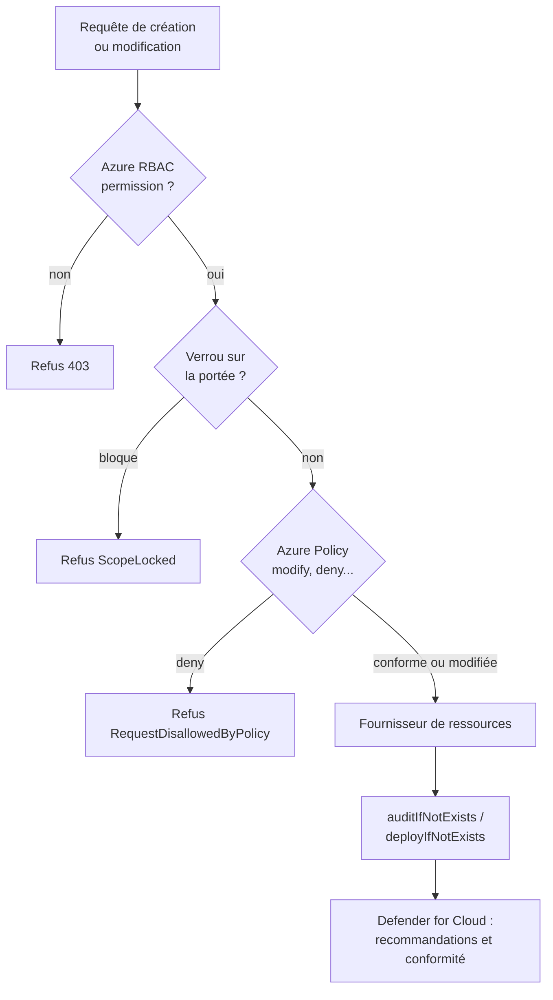
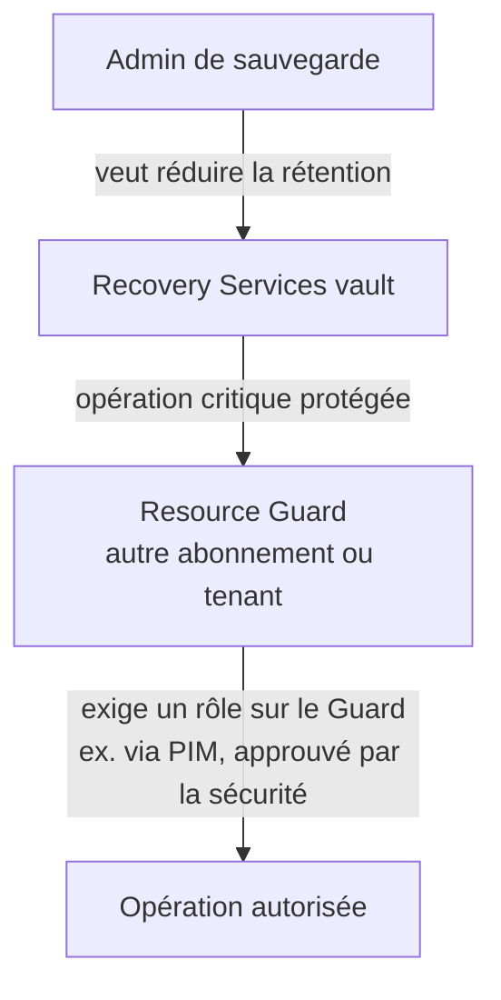

## L'essentiel en 2 minutes

La gouvernance répond à trois questions, chacune avec son outil :

| Question | Outil | Exemple |
| --- | --- | --- |
| **Qui** peut faire **quoi**, où ? | Azure RBAC (et rôles Entra) | Le groupe Exploitation est Contributor du groupe de ressources `rg-app` |
| À **quoi** doivent ressembler les ressources ? | Azure Policy | Interdire les comptes de stockage avec accès public ; exiger des diagnostics |
| Que doit-on **empêcher pour tout le monde** ? | Verrous de ressources | Personne, même Owner, ne supprime le coffre de production |

Defender for Cloud ajoute la **mesure** : standards de sécurité (Microsoft cloud security benchmark, ISO 27001, NIST...), recommandations et tableau de conformité. Votre culture NIST vous aide ici : les contrôles sont les mêmes, l'outillage est Azure.



## Azure Policy : définitions intégrées et personnalisées {#s-1-3-1}

### Les objets

- **Définition** : une règle JSON (`if` / `then`) avec un **effet**. Des centaines sont **intégrées** (built-in) ; on peut écrire des définitions **personnalisées** ;
- **Initiative** (policySet) : un groupe de définitions avec un objectif commun. Microsoft recommande d'assigner des initiatives même pour une seule règle, pour en ajouter plus tard ;
- **Affectation** (assignment) : une définition ou initiative appliquée à une **portée** (groupe d'administration, abonnement, groupe de ressources, ressource), héritée par tous les enfants. On peut **exclure** des sous-portées (`notScopes`) ;
- **Exemption** : retire une ressource ou une portée de l'évaluation d'une affectation, avec une catégorie (Waiver, Mitigated) et une date d'expiration possible.

> [!INFO] Les ressources ne sont évaluées qu'au niveau abonnement et groupe de ressources, même si l'affectation est posée sur un groupe d'administration.

### Les effets

| Effet | Ce qu'il fait |
| --- | --- |
| `disabled` | Désactive la règle (utile en paramètre) |
| `append` | Ajoute des champs à la requête |
| `modify` | Ajoute, modifie ou retire des propriétés ou des tags (identité managée requise) |
| `deny` | Refuse la création ou la modification non conforme |
| `audit` | Journalise la non-conformité |
| `auditIfNotExists` | Audite si une ressource liée manque (ex. extension, paramètre de diagnostic) |
| `deployIfNotExists` | Déploie la ressource liée manquante (identité managée requise) |
| `denyAction` | Bloque une **action** (ex. suppression) sur des ressources |
| `manual` | Attestation manuelle de conformité |
| `addToNetworkGroup` | Ajoute un VNet à un groupe réseau d'Azure Virtual Network Manager |
| `mutate` | Effet propre aux fournisseurs de ressources (par exemple AKS) |

**Ordre d'évaluation** lors d'une requête : `disabled`, puis `append` et `modify`, puis `deny`, puis `audit`, `manual`, `auditIfNotExists`, et `denyAction` en dernier. Après succès, `auditIfNotExists` et `deployIfNotExists` vérifient s'il faut journaliser ou déployer.

**Moments d'évaluation** : création ou mise à jour d'une ressource, nouvelle affectation, modification d'une affectation, et cycle standard **toutes les 24 heures**.

**Superposition** : chaque affectation est évaluée indépendamment, le résultat est **cumulatif, le plus restrictif l'emporte**. Azure Policy est un système de refus explicite : une affectation plus permissive sur une portée enfant ne lève pas un `deny` hérité. Il faut **exclure** la portée enfant de l'affectation parente.

### Remédiation

`modify` et `deployIfNotExists` agissent sur les **nouvelles** ressources. Pour les **existantes**, on lance une **tâche de remédiation**. L'affectation a une **identité managée** qui doit avoir les rôles nécessaires ; il faut **User Access Administrator** (ou Owner) pour les lui donner. Un **Contributor** peut déclencher une remédiation mais pas créer de définitions ni d'affectations ; **Resource Policy Contributor** couvre la plupart des opérations Policy.

### Exemple : définition personnalisée

Interdire les comptes de stockage qui autorisent l'accès anonyme aux blobs :

```json
{
  "mode": "All",
  "policyRule": {
    "if": {
      "allOf": [
        { "field": "type", "equals": "Microsoft.Storage/storageAccounts" },
        { "field": "Microsoft.Storage/storageAccounts/allowBlobPublicAccess", "notEquals": false }
      ]
    },
    "then": { "effect": "[parameters('effect')]" }
  },
  "parameters": {
    "effect": {
      "type": "String",
      "allowedValues": ["Audit", "Deny", "Disabled"],
      "defaultValue": "Audit"
    }
  }
}
```

```azurecli
az policy definition create --name deny-blob-public --rules rules.json --params params.json --mode All
az policy assignment create --name deny-blob-public-prod \
  --policy deny-blob-public --scope /subscriptions/<subId> \
  --params '{ "effect": { "value": "Deny" } }'
# Affectation deployIfNotExists avec identité managée, puis remédiation
az policy assignment create --name diag-kv --policy <defId> --scope /subscriptions/<subId> \
  --mi-system-assigned --location francecentral --role Contributor --identity-scope /subscriptions/<subId>
az policy remediation create --name fix-diag-kv --policy-assignment diag-kv
```

> [!EXAMEN] Commencez par `audit` ou `auditIfNotExists`, puis passez à `deny`, `modify` ou `deployIfNotExists` : c'est la recommandation de Microsoft et un réflexe attendu dans les scénarios « sans perturber la production ».

> [!PIEGE] « Exclusion » et « exemption » ne sont pas synonymes. L'**exclusion** (`notScopes`) se règle sur l'affectation : la portée n'est pas évaluée. L'**exemption** est un objet distinct, documenté, éventuellement temporaire, pour une ressource ou portée donnée : la non-conformité reste visible comme exemptée.

## Conformité réglementaire avec Defender for Cloud {#s-1-3-2}

Le tableau **Regulatory compliance** montre, standard par standard, les **contrôles** et leurs **évaluations** :

- le **Microsoft cloud security benchmark (MCSB)** est activé par défaut sur tout abonnement Azure, compte AWS ou projet GCP connecté ;
- d'autres standards (ISO 27001, PCI DSS, NIST SP 800-53, CIS...) s'ajoutent **dès qu'au moins un plan payant** de Defender for Cloud est activé ;
- évaluations **automatisées** (liées à des recommandations) et **manuelles** (attestation avec preuves) ;
- les évaluations tournent environ **toutes les 12 heures** : une correction n'apparaît pas immédiatement ;
- export : rapport PDF ou CSV, **Audit reports** (certifications de Microsoft : ISO, SOC, PCI), **continuous export** vers Event Hubs ou Log Analytics (flux continu ou instantanés hebdomadaires), **workflow automation** (Logic App) sur changement d'état ;
- intégration avec **Microsoft Purview Compliance Manager**.

Rôles : **Reader** sur l'abonnement voit les données de conformité, **Security Reader** non. Pour gérer les standards : **Resource Policy Contributor** et **Security Admin**.

> [!PIEGE] Une question qui demande d'« ajouter ISO 27001 au tableau de conformité » alors que seul le niveau gratuit (Foundational CSPM) est actif : il faut d'abord activer **un plan payant**.

## Standards et recommandations dans Defender for Cloud {#s-1-3-3}

Une **politique de sécurité** Defender for Cloud contient des **standards** :

- **benchmarks** (MCSB et benchmarks des fournisseurs cloud) ;
- **standards réglementaires** (disponibles avec un plan Defender) ;
- **standards personnalisés**, qui regroupent des recommandations intégrées ou personnalisées.

Quand une ressource ne respecte pas un contrôle, Defender for Cloud produit une **recommandation** : description, étapes de remédiation, ressources concernées, sévérité, facteurs de risque, contexte d'attack path. Les **recommandations personnalisées** s'écrivent en **KQL** et exigent **Defender CSPM**. Côté Azure, les standards s'appuient sur des initiatives Azure Policy.

> [!INFO] La priorisation par le risque (risk prioritization) n'affecte pas le **secure score**.

## Verrous de ressources {#s-1-3-4}

| Verrou (portail / CLI) | Lecture | Modification | Suppression |
| --- | --- | --- | --- |
| Delete / **CanNotDelete** | Oui | Oui | **Non** |
| Read-only / **ReadOnly** | Oui | **Non** | **Non** |

Règles :

- un verrou s'applique à **tous les utilisateurs et rôles**, Owner compris ;
- héritage vers les enfants, y compris les ressources ajoutées plus tard ; le plus restrictif l'emporte. Pas de verrou sur un **groupe d'administration** ;
- **plan de contrôle seulement** : un verrou sur un compte de stockage ne protège pas les blobs supprimés par le plan de données ;
- créer ou supprimer un verrou exige `Microsoft.Authorization/locks/*` (Owner, User Access Administrator).

Effets de bord documentés à connaître :

- ReadOnly sur un compte de stockage empêche de **lister les clés** (opération POST) et d'attribuer des rôles RBAC à sa portée ;
- ReadOnly sur un groupe de ressources empêche de **démarrer ou redémarrer** une VM et d'exécuter les runbooks Automation ;
- CanNotDelete sur un groupe empêche la suppression des attributions RBAC et le nettoyage de l'historique des déploiements (échec à 800).

```azurecli
az lock create --name lock-kv-prod --lock-type CanNotDelete \
  --resource-group rg-secrets-prod --resource-name kv-brisemer-prod-01 \
  --resource-type Microsoft.KeyVault/vaults
```

```bicep
resource rgLock 'Microsoft.Authorization/locks@2016-09-01' = {
  name: 'rgLock'
  properties: {
    level: 'CanNotDelete'
    notes: 'Groupe de production : suppression interdite.'
  }
}
```

> [!PIEGE] Un verrou **ReadOnly** paraît plus sûr mais casse souvent l'exploitation (VM qui ne redémarrent plus, clés non listables). Pour « empêcher la suppression accidentelle », la réponse attendue est **CanNotDelete**.

## Rôles intégrés Azure {#s-1-3-5}

| Rôle | Peut gérer les ressources | Peut attribuer des rôles |
| --- | --- | --- |
| Owner | Oui | Oui |
| Contributor | Oui | **Non** |
| Reader | Lecture | Non |
| User Access Administrator | Non | **Oui** |
| Role Based Access Control Administrator | Non | Oui, avec conditions possibles sur les rôles attribuables |

Bonnes pratiques Microsoft (Best practices for Azure RBAC) : moindre privilège, limiter le nombre de propriétaires d'abonnement, attribuer à des **groupes** plutôt qu'à des personnes, utiliser PIM pour les rôles privilégiés, éviter les attributions au niveau ressource quand un groupe suffit, préférer l'ID du rôle dans les scripts.

```azurecli
az role assignment create --assignee-object-id <groupId> --assignee-principal-type Group \
  --role "Reader" --scope /subscriptions/<subId>/resourceGroups/rg-app
az role assignment list --scope /subscriptions/<subId> --include-inherited -o table
```

## Rôles personnalisés : Azure et Microsoft Entra {#s-1-3-6}

| | Rôle personnalisé Azure | Rôle personnalisé Microsoft Entra |
| --- | --- | --- |
| Protège | Ressources Azure (ARM) | Objets de l'annuaire |
| Licence | Aucune particulière | **Entra ID P1 ou P2** |
| Qui crée | `Microsoft.Authorization/roleDefinitions/write` sur les AssignableScopes (Owner, User Access Administrator) | **Privileged Role Administrator** |
| Contenu | `Actions`, `NotActions`, `DataActions`, `NotDataActions`, `AssignableScopes` | `allowedResourceActions` parmi les permissions ouvertes : app registrations, enterprise apps, consentement, appareils, utilisateurs, groupes |
| Portée d'attribution | Groupe d'administration, abonnement, groupe de ressources | Annuaire entier ou une **app registration** précise |
| Limite | **5 000** rôles personnalisés par tenant | Voir les limites du service Entra |

Règles des rôles Azure personnalisés :

- **NotActions n'est pas un refus** : il retire des actions de ce rôle-ci, mais un autre rôle peut les accorder ;
- un rôle avec `DataActions` ne peut pas être **attribué** au niveau d'un groupe d'administration ;
- un seul groupe d'administration dans `AssignableScopes`, pas de racine `/`, pas de joker dans les portées ;
- éviter les jokers dans les actions (ils incluent les futures permissions).

```json
{
  "Name": "Opérateur VM Brisemer",
  "Description": "Surveille, démarre et redémarre les VM.",
  "Actions": [
    "Microsoft.Compute/*/read",
    "Microsoft.Compute/virtualMachines/start/action",
    "Microsoft.Compute/virtualMachines/restart/action",
    "Microsoft.Resources/subscriptions/resourceGroups/read"
  ],
  "NotActions": [],
  "DataActions": [],
  "NotDataActions": [],
  "AssignableScopes": ["/subscriptions/<subId>"]
}
```

```powershell
New-AzRoleDefinition -InputFile .\operateur-vm.json

# Rôle Entra personnalisé : gérer les identifiants des app registrations
Connect-MgGraph -Scopes "RoleManagement.ReadWrite.Directory"
New-MgRoleManagementDirectoryRoleDefinition -DisplayName "Gestion identifiants apps" `
  -Description "Met à jour les identifiants des app registrations" -IsEnabled:$true `
  -RolePermissions @{ allowedResourceActions = @("microsoft.directory/applications/credentials/update") }
```

> [!EXAMEN] « NotActions » ressemble à un refus mais n'en est pas un. Si l'énoncé exige d'empêcher une action pour tout le monde quelles que soient les attributions, pensez **verrou**, **policy denyAction** ou retrait des attributions, pas NotActions.

## Repérer et corriger les droits excessifs {#s-1-3-7}

Outils, du plus ponctuel au plus continu :

- **Access control (IAM) > Role assignments** et `az role assignment list` : inventaire ;
- **revues d'accès** Microsoft Entra : les réviseurs confirment ou retirent l'accès, sur des groupes, des applications ou des rôles (Entra et Azure via PIM) ;
- **PIM** : transformer les attributions permanentes en éligibles (voir 1.1) ;
- **CIEM dans Defender CSPM** : analyse continue des identités humaines et non humaines sur Azure, AWS et GCP, avec des recommandations comme retirer les comptes inactifs, invités ou bloqués qui ont des accès, limiter les administrateurs, ajuster les permissions sur-provisionnées selon l'usage réel. Les risques apparaissent aussi dans **cloud security explorer** et les **attack paths** (mouvement latéral via un service principal trop puissant).

> [!INFO] La dépréciation de Microsoft Entra Permissions Management n'affecte pas les capacités CIEM de Defender for Cloud.

> [!TERRAIN] Ordre de bataille réaliste : 1) inventaire des Owner et User Access Administrator permanents ; 2) passage en PIM ; 3) revue d'accès trimestrielle des rôles éligibles ; 4) suivi continu des recommandations CIEM pour les identités de service, souvent oubliées.

## Protéger les sauvegardes avec Azure Backup {#s-1-3-8}

Les rançongiciels visent d'abord les sauvegardes. Azure Backup propose :

| Fonction | Protège contre |
| --- | --- |
| **Soft delete** (14 jours supplémentaires sans coût ; **enhanced soft delete** avec rétention réglable et mode **always-on**) | Suppression accidentelle ou malveillante des données de sauvegarde |
| **Immutable vault** (verrouillable, donc irréversible) | Toute opération qui ferait perdre des points de restauration |
| **Multi-user authorization (MUA)** avec **Resource Guard** | Opérations critiques (désactiver le soft delete, réduire la rétention...) faites par un seul administrateur. Le Resource Guard peut être dans un autre abonnement ou tenant |
| Chiffrement par clés de plateforme ou **clés gérées par le client** (Key Vault) | Accès aux données au repos |
| **Private endpoints** | Exposition réseau du coffre de sauvegarde |
| Rôles **Backup Contributor / Operator / Reader** | Droits excessifs sur la sauvegarde |

Niveaux de sécurité d'un coffre selon Microsoft : **Excellent** = immutabilité verrouillée ou soft delete always-on **et** MUA ; **Good** = l'un ou l'autre (immutabilité verrouillée ou soft delete) ; **Fair** = MUA seul ; **Poor** = rien de tout cela.



> [!EXAMEN] « Empêcher qu'un administrateur compromis désactive seul la protection des sauvegardes » : **MUA avec Resource Guard**, idéalement dans un abonnement ou tenant géré par une autre équipe. « Rendre impossible la suppression des points de restauration avant leur expiration » : **immutable vault verrouillé**.

## Contrôles de sécurité dans l'infrastructure as code {#s-1-3-9}

Deux niveaux complémentaires :

1. **Écrire des templates sûrs** (Bicep, ARM, Terraform) : valeurs par défaut sécurisées (accès public désactivé, TLS minimal, diagnostics), et Azure Policy en **policy as code** avec revue des modifications ;
2. **Scanner les templates avant le déploiement** : **Microsoft Security DevOps** (action GitHub ou extension Azure DevOps) avec la catégorie `IaC`, qui exécute **Template Analyzer** (ARM et Bicep, avec PSRule), **Checkov** et **Terrascan** (Terraform, Kubernetes, Helm, CloudFormation, Dockerfile...). Les résultats remontent dans **Defender for Cloud > DevOps security** (et dans GitHub Code scanning avec GitHub Advanced Security).

```yaml
# GitHub Actions : scan IaC avec Microsoft Security DevOps
- name: Run Microsoft Security DevOps
  uses: microsoft/security-devops-action@latest
  with:
    categories: 'IaC'
```

```bicep
// Valeurs sûres par défaut dans un module de stockage
resource st 'Microsoft.Storage/storageAccounts@2023-05-01' = {
  name: stName
  location: location
  sku: { name: 'Standard_ZRS' }
  kind: 'StorageV2'
  properties: {
    allowBlobPublicAccess: false
    allowSharedKeyAccess: false
    minimumTlsVersion: 'TLS1_2'
    publicNetworkAccess: 'Disabled'
    supportsHttpsTrafficOnly: true
  }
}
```

> [!TERRAIN] Vous écrivez déjà du Bicep : le gain rapide est d'ajouter le scan IaC dans le pipeline (échec du build sur sévérité haute) et d'aligner vos modules sur les recommandations MCSB. Azure Policy en `deny` reste le filet de sécurité pour ce qui est déployé hors pipeline.

## Comparatif : quel outil pour quel besoin ?

| Besoin | Outil |
| --- | --- |
| Empêcher la création de ressources hors des régions autorisées | Azure Policy `deny` (Allowed locations) |
| Ajouter automatiquement un tag manquant | Azure Policy `modify` |
| Déployer les paramètres de diagnostic manquants | Azure Policy `deployIfNotExists` + remédiation |
| Empêcher toute suppression du groupe de production | Verrou CanNotDelete |
| Donner le droit de redémarrer des VM, rien d'autre | Rôle Azure personnalisé |
| Mesurer la conformité ISO 27001 | Defender for Cloud, standard réglementaire (plan payant) |
| Trouver les identités inactives encore privilégiées | CIEM dans Defender CSPM, revues d'accès |
| Protéger les sauvegardes contre un admin compromis | MUA + Resource Guard, immutable vault |

## Sources

Affirmations vérifiées sur les pages Microsoft Learn listées en bas de page, le 2026-10-04.
