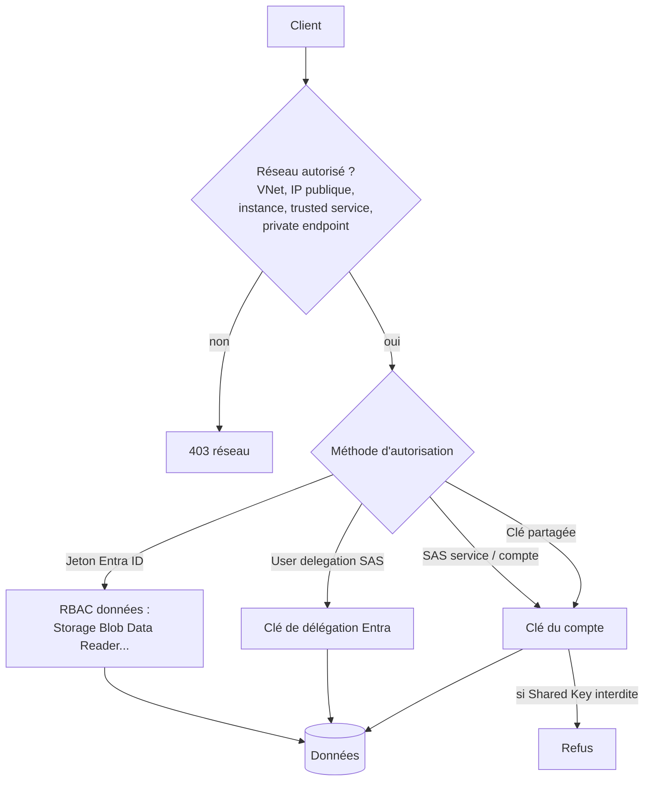

## L'essentiel en 2 minutes

Un compte de stockage se sécurise sur quatre axes, exactement comme un coffre :

| Axe | Ce qu'on règle |
| --- | --- |
| Configuration | HTTPS obligatoire, TLS minimal, accès anonyme désactivé, clé partagée interdite, chiffrement (clés Microsoft ou client), soft delete, immutabilité |
| Réseau | Règles de réseau virtuel, règles IP publiques, règles d'instance de ressource, exceptions pour services de confiance, private endpoints |
| Autorisation des données | Entra ID + RBAC (recommandé), user delegation SAS, SAS de service ou de compte, stored access policies |
| Détection | Defender for Storage, journaux de diagnostic (qui montrent comment chaque requête a été autorisée) |



## Configurer la sécurité du compte {#s-2-1-1}

Recommandations Microsoft pour Blob Storage, les plus utiles :

- **Secure transfer required** (HTTPS uniquement) et **version TLS minimale** ;
- **désactiver l'accès anonyme** en lecture aux conteneurs et blobs ;
- **interdire l'autorisation Shared Key** : seules les requêtes Entra ID (et user delegation SAS) passent. C'est aussi un **prérequis pour appliquer l'accès conditionnel** à un compte de stockage ;
- **soft delete** des blobs et des conteneurs, **versioning**, **immutabilité** (WORM, legal hold ou rétention temporelle) pour les données critiques ;
- chiffrement au repos activé par défaut avec des **clés gérées par Microsoft** ; **clés gérées par le client** dans Key Vault pour plus de contrôle ;
- **verrou** sur le compte contre la suppression du compte (pas des données) ;
- **interdire la réplication d'objets entre tenants** ;
- activer **Defender for Storage**.

Dans le portail : compte de stockage > **Settings > Configuration** (secure transfer, TLS minimal, accès anonyme, accès par clé), **Data management > Data protection** (soft delete, versioning), **Security + networking > Networking** (pare-feu, private endpoints) et **Security + networking > Microsoft Defender for Cloud**.

```azurecli
az storage account create -n stbrisemerdata01 -g rg-data -l francecentral \
  --sku Standard_ZRS --kind StorageV2 \
  --https-only true --min-tls-version TLS1_2 \
  --allow-blob-public-access false --allow-shared-key-access false \
  --default-action Deny --public-network-access Disabled
az storage account blob-service-properties update -n stbrisemerdata01 -g rg-data \
  --enable-delete-retention true --delete-retention-days 14 \
  --enable-container-delete-retention true --container-delete-retention-days 14 \
  --enable-versioning true
```

> [!PIEGE] Interdire la clé partagée casse tout ce qui l'utilise encore : chaînes de connexion avec `AccountKey`, SAS de compte ou de service, certains outils. Faites l'inventaire grâce aux journaux (ils indiquent la méthode d'autorisation de chaque requête) avant de l'interdire.

## Pare-feu du stockage {#s-2-1-2}

Par défaut, un compte accepte les connexions de **tout réseau**. Dès qu'on configure des règles, seules les sources autorisées passent par le point d'accès public :

| Type de règle | Usage | Limite |
| --- | --- | --- |
| **Règle de réseau virtuel** | Sous-réseaux Azure, avec service endpoint `Microsoft.Storage` (même région) ou `Microsoft.Storage.Global` (toute région) | **400** par compte ; sous-réseaux de n'importe quel abonnement ou tenant |
| **Règle IP** | Adresses **publiques** (sites on-premises, IP NAT du peering Microsoft ExpressRoute) | **400** par compte |
| **Règle d'instance de ressource** | Instances de services Azure qui ne peuvent pas être isolées par VNet ou IP (même tenant) | Droits définis par le RBAC de l'instance |
| **Exception services de confiance** | Services Azure listés (lecture des journaux, métriques, etc.) | Liste officielle |
| **Private endpoint** | Accès privé depuis un VNet ; **un par sous-ressource** (blob, file, queue, table, dfs, web) | Comptes GPv2 uniquement |

> [!PIEGE] Activer un service endpoint sur un sous-réseau fait sortir son trafic avec une **IP privée** : une règle IP publique qui autorisait ce sous-réseau ne sert plus à rien. Il faut une **règle de réseau virtuel**.

> [!TERRAIN] Vos réflexes ExpressRoute s'appliquent : en peering Microsoft, ce sont les **adresses NAT** du peering qu'il faut autoriser dans le pare-feu du stockage. En peering privé, préférez les private endpoints et une résolution DNS `privatelink.blob.core.windows.net` depuis vos DNS on-premises (redirecteur ou Private Resolver).

```azurecli
az network vnet subnet update -g rg-net --vnet-name vnet-spoke-data -n snet-app \
  --service-endpoints Microsoft.Storage
az storage account network-rule add -g rg-data --account-name stbrisemerdata01 \
  --vnet-name vnet-spoke-data --subnet snet-app
az storage account update -g rg-data -n stbrisemerdata01 --default-action Deny --bypass AzureServices Logging Metrics
```

## Defender for Storage {#s-2-1-3}

Plan Defender for Cloud **sans agent** qui analyse la télémétrie des plans de données et de contrôle de Blob Storage, Azure Files et Data Lake Storage. **Pas besoin d'activer les journaux de diagnostic.**

| Fonction | Ce qu'elle fait | Coût |
| --- | --- | --- |
| Activity monitoring | Accès anormaux, IP malveillantes, nœuds Tor, **SAS abusées** par des entités sans identité | Inclus (prix par compte) |
| Malware scanning | Microsoft Defender Antivirus sur chaque objet **téléversé**, ou **à la demande** | **Par Go analysé**, plafond mensuel par compte (défaut **10 000 Go**) |
| Sensitive data threat detection | Priorise les alertes selon la sensibilité des données (types d'informations Purview) | Sans coût additionnel |
| Réponse automatisée | Événements Event Grid vers Functions ou Logic Apps : supprimer, mettre en quarantaine, alerter | Services utilisés |

Activation **recommandée au niveau abonnement** (tous les comptes existants et futurs), avec possibilité d'**exclure** ou de **surcharger** les paramètres d'un compte (plafond, malware scanning). Deux alertes préviennent du plafond : à **75 %** et quand il est **atteint** (le scan s'arrête pour le mois).

```azurecli
# Plan au niveau abonnement, avec analyse des logiciels malveillants
az security pricing create -n StorageAccounts --tier Standard --subplan DefenderForStorageV2 \
  --extensions name=OnUploadMalwareScanning isEnabled=True additionalExtensionProperties='{"CapGBPerMonthPerStorageAccount":"5000"}' \
  --extensions name=SensitiveDataDiscovery isEnabled=True
```

La syntaxe exacte des extensions dans Azure CLI évolue : vérifiez la référence `az security pricing` avant usage (à vérifier).

> [!EXAMEN] « Bloquer la diffusion de fichiers malveillants téléversés par des partenaires dans un conteneur » : **malware scanning on-upload** de Defender for Storage, plus une **réponse automatisée** via Event Grid. « Maîtriser le coût » : plafond mensuel en Go par compte.

## Gérer l'accès aux données {#s-2-1-4}

### Les options, de la meilleure à la pire

| Option | Signée / autorisée par | Recommandation |
| --- | --- | --- |
| **Microsoft Entra ID** + RBAC (`Storage Blob Data Reader`, `Contributor`, `Owner`) | Jeton Entra | **Recommandé**, idéalement avec identité managée. Conditions ABAC possibles sur les blobs |
| **User delegation SAS** | Clé de délégation obtenue avec des identifiants Entra | Recommandée quand une SAS est nécessaire |
| **SAS de service** | Clé du compte | Une seule ressource d'un seul service ; peut s'appuyer sur une stored access policy |
| **SAS de compte** | Clé du compte | Plusieurs services, opérations de niveau service : la plus large |
| **Clé partagée** | Clé du compte | À interdire |
| **Accès anonyme** | Aucun | À désactiver |

La user delegation SAS est documentée pour Blob Storage (y compris Data Lake) ; la page SAS mise à jour en 2026 l'étend à Queue, Table et Azure Files, alors que la page d'autorisation indique encore l'inverse (à vérifier).

### Stored access policies

Une **stored access policy** est définie sur un conteneur (ou une table, une file, un partage) et porte le début, l'expiration et les permissions d'une ou plusieurs **SAS de service**. Avantage : on **révoque** ces SAS sans toucher aux clés, en supprimant la policy, en la renommant ou en avançant son expiration dans le passé. Limite : **5** stored access policies par conteneur. Elles ne s'appliquent **ni** aux user delegation SAS **ni** aux SAS de compte.

```azurecli
# Stored access policy + SAS de service qui la référence
az storage container policy create --account-name stbrisemerdata01 -c factures \
  -n lecture-partenaire --permissions r --expiry 2026-12-31T00:00Z --auth-mode key
az storage container generate-sas --account-name stbrisemerdata01 -n factures \
  --policy-name lecture-partenaire --https-only -o tsv

# User delegation SAS (aucune clé de compte), valable 2 heures
az storage blob generate-sas --account-name stbrisemerdata01 -c factures -n f-2026-09.pdf \
  --permissions r --expiry $(date -u -d "+2 hours" '+%Y-%m-%dT%H:%MZ') \
  --auth-mode login --as-user --https-only
```

```powershell
# Rôle de données pour une identité managée, au niveau du conteneur
New-AzRoleAssignment -ObjectId <principalId> -RoleDefinitionName "Storage Blob Data Reader" `
  -Scope "/subscriptions/<subId>/resourceGroups/rg-data/providers/Microsoft.Storage/storageAccounts/stbrisemerdata01/blobServices/default/containers/factures"
```

Bonnes pratiques SAS documentées : HTTPS seulement, user delegation dès que possible, plan de révocation, **politique d'expiration SAS** sur le compte (avertissement et journalisation si dépassée), expiration courte pour une SAS ad hoc (une SAS de service sans stored access policy ne se révoque pas : **une heure ou moins**), moindre privilège, heure de début 15 minutes dans le passé (décalage d'horloge).

> [!PIEGE] La génération de SAS n'est **pas auditée** et Azure Storage ne compte pas les SAS émises. Quiconque détient la clé du compte peut en créer à volonté. D'où l'intérêt d'interdire la clé partagée.

> [!EXAMEN] « Révoquer immédiatement toutes les SAS émises avec la clé 1 » : **régénérer la clé 1**. « Révoquer seulement les SAS d'un partenaire, sans impact sur les autres » : SAS de service liées à une **stored access policy** dédiée, puis supprimer cette policy. « Révoquer une user delegation SAS » : révoquer la **clé de délégation** de l'utilisateur.

## Comparatif : quel contrôle pour quel risque ?

| Risque | Contrôle |
| --- | --- |
| Clé de compte divulguée | Interdire Shared Key, rotation, Key Vault |
| SAS divulguée | User delegation SAS, expiration courte, stored access policy, politique d'expiration |
| Accès depuis Internet | Pare-feu, private endpoint, accès public désactivé |
| Suppression malveillante | Soft delete, versioning, immutabilité, verrou (compte seulement) |
| Fichier malveillant téléversé | Defender for Storage malware scanning |
| Exfiltration | Defender for Storage activity monitoring, diagnostic logs |

## Sources

Affirmations vérifiées sur les pages Microsoft Learn listées en bas de page, le 2026-10-04.
