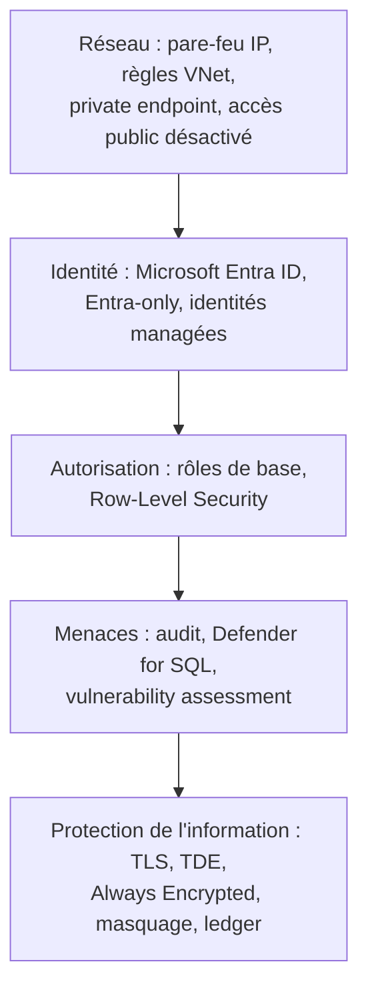

## L'essentiel en 2 minutes

Microsoft décrit la sécurité d'Azure SQL en couches, de l'extérieur vers la donnée :



Les trois sous-objectifs : **configurations de plateforme** (réseau, identité, chiffrement), **audit** (SQL Database et SQL Managed Instance), **Defender for Databases** (tous les moteurs).

## Sécurité de plateforme d'Azure SQL {#s-2-2-1}

### Réseau

- **Règles de pare-feu IP** au niveau serveur ou base, et **règles de réseau virtuel** (service endpoints `Microsoft.Sql`) pour Azure SQL Database. Elles **ne s'appliquent pas à SQL Managed Instance**, qui vit dans un sous-réseau dédié de votre VNet ;
- **private endpoint** (sous-ressource `sqlServer`, ou `managedInstance`) et **désactivation de l'accès public** ;
- Network Security Perimeter pour Azure SQL Database : **préversion** au 2026-10-04 ;
- TLS **toujours imposé** (`ForceEncryption = Yes`). Côté client : `Encrypt=True` et `TrustServerCertificate=False` ; TDS 8.0 strict si possible.

### Identité

- un **administrateur Microsoft Entra** par serveur ou instance (un seul objet : utilisez un **groupe**). Le supprimer coupe toutes les connexions Entra ;
- principaux Entra : logins (`CREATE LOGIN ... FROM EXTERNAL PROVIDER`), utilisateurs liés à un login, ou **utilisateurs de base contenus** (`CREATE USER [x] FROM EXTERNAL PROVIDER`) ;
- **Microsoft Entra-only authentication** : désactive l'authentification SQL (y compris le compte `sa`) ; peut être imposée par **Azure Policy** ;
- applications : **identités managées** plutôt que secrets de service principal ;
- l'authentification Entra **n'est pas liée à Azure RBAC** : `SQL DB Contributor` gère la ressource, pas l'accès aux données. Il faut créer le principal dans la base.

```sql
-- Dans la base applicative, connecté en tant qu'administrateur Entra
CREATE USER [func-brisemer-batch] FROM EXTERNAL PROVIDER;  -- identité managée
ALTER ROLE db_datareader ADD MEMBER [func-brisemer-batch];
CREATE USER [grp-dba-lecture] FROM EXTERNAL PROVIDER;      -- groupe Entra
```

```azurecli
az sql server ad-admin create -g rg-data -s sql-brisemer-prod \
  --display-name grp-sql-admins --object-id <groupObjectId>
az sql server ad-only-auth enable -g rg-data -n sql-brisemer-prod
az sql server update -g rg-data -n sql-brisemer-prod --enable-public-network false
```

### Chiffrement et protection des données

| Fonction | Protège | Contre |
| --- | --- | --- |
| **TLS** | Données en transit | Écoute réseau |
| **TDE** (AES-256) | Base, journaux de transaction, sauvegardes **au repos** | Vol de disques ou de sauvegardes |
| **Always Encrypted** (avec ou sans enclaves sécurisées) | Colonnes sensibles, **même pendant l'utilisation** | Administrateurs et opérateurs privilégiés ; la clé n'est jamais exposée au moteur |
| **Dynamic Data Masking** | Résultats des requêtes | Exposition aux utilisateurs non privilégiés (rien n'est chiffré) |
| **Row-Level Security** | Lignes | Accès à des lignes hors périmètre |
| **Ledger** | Intégrité | Altération non détectée (preuve cryptographique) |

**TDE** est activé par défaut sur toutes les **nouvelles** bases Azure SQL Database (les bases créées avant mai 2017 et les bases MI créées avant février 2019 ne le sont pas par défaut). Le **protecteur TDE** est soit un **certificat géré par le service** (tourné chaque année par Microsoft), soit une **clé gérée par le client** (BYOK) dans Key Vault ou Managed HSM, définie au niveau **serveur** (ou de la base pour SQL Database). Si le serveur perd l'accès à la clé client, les bases deviennent **inaccessibles**.

```powershell
# TDE avec clé client : l'identité du serveur doit pouvoir wrap/unwrap dans le coffre
Add-AzSqlServerKeyVaultKey -ResourceGroupName rg-data -ServerName sql-brisemer-prod `
  -KeyId "https://kv-brisemer-prod-01.vault.azure.net/keys/tde-protector/<version>"
Set-AzSqlServerTransparentDataEncryptionProtector -ResourceGroupName rg-data `
  -ServerName sql-brisemer-prod -Type AzureKeyVault `
  -KeyId "https://kv-brisemer-prod-01.vault.azure.net/keys/tde-protector/<version>"
```

> [!PIEGE] Un export **BACPAC** d'une base protégée par TDE n'est **pas chiffré**. Et TDE ne protège pas contre un utilisateur légitime qui interroge la base : pour cela, il faut Always Encrypted, le masquage ou la RLS.

> [!TERRAIN] Pour un coffre utilisé par TDE en clé client, appliquez tout ce que vous avez vu en 1.2 : purge protection, rôle **Key Vault Crypto Service Encryption User** pour l'identité du serveur, alerte sur toute désactivation de la clé. Une clé supprimée par erreur, c'est une base hors service.

## Audit d'Azure SQL Database et de SQL Managed Instance {#s-2-2-2}

### Azure SQL Database

- destinations : **compte de stockage**, **Log Analytics**, **Event Hubs** ;
- politique d'audit au niveau **serveur** (s'applique à toutes les bases) ou **base**. Pour de grosses charges OLTP avec beaucoup de bases, Microsoft recommande l'audit **au niveau base** pour réduire le volume à interroger ;
- vers un compte de stockage derrière un pare-feu ou un VNet : compte **GPv2** et **identité managée** du serveur avec **Storage Blob Data Contributor** ;
- stockage **immuable** possible (avec « Allow protected append writes ») ;
- l'audit est optimisé pour la disponibilité : en très forte charge, des événements peuvent ne pas être enregistrés ;
- avec l'authentification **Entra**, les **échecs de connexion n'apparaissent pas** dans l'audit SQL : ils sont dans les journaux de connexion Entra.

```azurecli
az sql server audit-policy update -g rg-data -n sql-brisemer-prod --state Enabled \
  --log-analytics-target-state Enabled \
  --log-analytics-workspace-resource-id <workspaceResourceId>
```

Noms des paramètres CLI à confirmer avec `az sql server audit-policy update --help` (à vérifier).

### SQL Managed Instance

L'audit se configure comme sur SQL Server, en **T-SQL** :

- vers le **stockage** : `CREATE CREDENTIAL` (SAS) puis `CREATE SERVER AUDIT ... TO URL` ;
- vers **Log Analytics ou Event Hubs** : paramètre de diagnostic avec la catégorie **SQLSecurityAuditEvents**, puis `CREATE SERVER AUDIT ... TO EXTERNAL_MONITOR` ;
- **audit des opérations du support Microsoft** : un audit **séparé** avec `OPERATOR_AUDIT = ON` (catégorie de diagnostic « DevOps operations Audit Logs »).

```sql
CREATE SERVER AUDIT [audit-securite] TO EXTERNAL_MONITOR;
CREATE SERVER AUDIT SPECIFICATION [spec-securite] FOR SERVER AUDIT [audit-securite]
  ADD (SUCCESSFUL_LOGIN_GROUP), ADD (FAILED_LOGIN_GROUP), ADD (BATCH_COMPLETED_GROUP)
  WITH (STATE = ON);
ALTER SERVER AUDIT [audit-securite] WITH (STATE = ON);
```

> [!EXAMEN] Retenez l'asymétrie : **SQL Database** = audit configuré dans le portail ou par API (serveur ou base). **Managed Instance** = diagnostic `SQLSecurityAuditEvents` + `TO EXTERNAL_MONITOR` en T-SQL, ou `TO URL` vers un conteneur.

## Defender for Databases {#s-2-2-3}

Defender for Databases regroupe plusieurs plans :

| Plan | Couvre |
| --- | --- |
| **Defender for Azure SQL Databases** | Azure SQL (bases uniques, pools élastiques), **SQL Managed Instance**, pools SQL dédiés Synapse |
| **Defender for SQL Servers on machines** | SQL Server sur VM Azure, SQL Server activé par **Azure Arc** (on-premises, autres clouds) |
| **Defender for Open-Source Relational Databases** | Azure Database for **PostgreSQL** et **MySQL** (Flexible Server), **Amazon RDS** (Aurora, PostgreSQL, MySQL, MariaDB) |
| **Defender for Azure Cosmos DB** | Comptes Cosmos DB |

Capacités pour SQL :

- **vulnerability assessment** : découverte, suivi et correction des faiblesses de configuration ;
- **Advanced Threat Protection** : injection SQL potentielle, accès et requêtes anormaux, **force brute**, activité suspecte (poste compromis), avec alertes dans Defender for Cloud et poursuite d'enquête dans Sentinel.

Activé au niveau **abonnement**, le plan protège les ressources existantes **et futures**.

```azurecli
az security pricing create -n SqlServers --tier Standard                # Azure SQL Databases
az security pricing create -n SqlServerVirtualMachines --tier Standard  # SQL sur machines
az security pricing create -n OpenSourceRelationalDatabases --tier Standard
az security pricing create -n CosmosDbs --tier Standard
```

> [!PIEGE] Defender for Open-Source Relational Databases n'est **pas** pris en charge sur les machines Azure Arc. Pour un SQL Server on-premises, le plan à activer est **Defender for SQL Servers on machines**, avec la machine connectée par Arc.

## Comparatif : qui gère quoi ?

| Question | Réponse |
| --- | --- |
| Qui peut créer la base ? | Azure RBAC (SQL DB Contributor, SQL Server Contributor) |
| Qui peut lire les données ? | Principaux de la base (Entra ou SQL) et leurs rôles de base |
| Qui gère la sécurité (audit, TDE) ? | SQL Security Manager, Owner, Contributor |
| Comment empêcher les mots de passe SQL ? | Microsoft Entra-only authentication (+ Azure Policy) |
| Comment détecter une injection SQL ? | Defender for Azure SQL Databases (ATP) |

## Sources

Affirmations vérifiées sur les pages Microsoft Learn listées en bas de page, le 2026-10-04.
