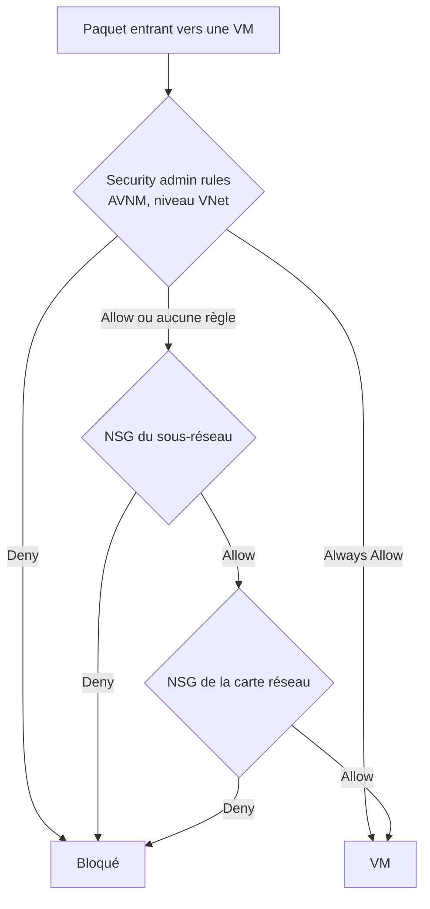

## L'essentiel en 2 minutes

Leçon en **rappel rapide** pour votre profil : on ne réexplique pas le filtrage à état ni l'IPsec. On se concentre sur ce qui est propre à Azure et sur ce que le guide ajoute : **Virtual Network Manager**, **Virtual WAN sécurisé**, **Entra Private Access**, et l'ordre exact d'évaluation des règles.



## NSG et ASG {#s-2-3-1}

| Point | Détail Azure |
| --- | --- |
| Priorité | **100 à 4096** ; la première règle qui correspond arrête le traitement |
| Règles par défaut | Entrée : AllowVNetInBound (65000), AllowAzureLoadBalancerInBound (65001), DenyAllInbound (65500). Sortie : AllowVnetOutBound (65000), AllowInternetOutBound (65001), DenyAllOutBound (65500). Non supprimables, mais remplaçables par des règles plus prioritaires |
| État | **Stateful** : la réponse est autorisée sans règle inverse. Modifier une règle n'affecte que les **nouvelles** connexions |
| Ordre | Entrant : NSG du **sous-réseau** puis NSG de la **carte réseau**. Sortant : carte réseau puis sous-réseau |
| Sources / destinations | IP, CIDR, **service tags** (VirtualNetwork, Internet, AzureLoadBalancer, Storage...), **ASG** |
| Plateforme | 168.63.129.16 et 169.254.169.254 (DHCP, DNS, IMDS, santé) ne sont pas filtrés sauf par les tags AzurePlatformDNS, AzurePlatformIMDS, AzurePlatformLKM |

Les **ASG** regroupent des cartes réseau par rôle applicatif (`asg-web`, `asg-sql`) pour écrire des règles sans IP. Les cartes d'un même ASG doivent être dans le **même VNet**.

> [!INFO] Les **NSG flow logs** sont retirés le **30 septembre 2027** et ne peuvent plus être créés : utilisez les **VNet flow logs**.

```azurecli
az network asg create -g rg-net -n asg-web
az network asg create -g rg-net -n asg-sql
az network nsg rule create -g rg-net --nsg-name nsg-snet-app -n allow-web-to-sql \
  --priority 200 --direction Inbound --access Allow --protocol Tcp \
  --source-asgs asg-web --destination-asgs asg-sql --destination-port-ranges 1433
```

## Azure Virtual Network Manager : security admin rules {#s-2-3-2}

Les **security admin rules** sont des règles **globales**, définies par l'équipe centrale, appliquées à des **groupes réseau** (statiques, ou dynamiques via Azure Policy) de VNet, à travers abonnements.

| Action | Effet |
| --- | --- |
| **Allow** | Autorise puis laisse les NSG évaluer |
| **Always Allow** | Autorise et **court-circuite** les NSG (aucune règle d'équipe ne peut bloquer) |
| **Deny** | Bloque, **sans** consulter les NSG |

- Évaluées **avant** les NSG, au niveau du **VNet** ; priorité **1 à 4096** ;
- **une seule** configuration de security admin **par région** déployée (plusieurs collections de règles possibles dedans) ;
- modèle de **cohérence à terme** : application après un court délai ;
- non appliquées par défaut aux VNet contenant **SQL Managed Instance** ou **Databricks**, ni aux sous-réseaux de Application Gateway, Bastion, Azure Firewall, Route Server, VPN et ExpressRoute Gateway, Virtual WAN.

Cas d'usage typique documenté : bloquer partout les ports à risque (22, 3389, 445, 23, 135...) avec des exceptions ciblées.

> [!EXAMEN] « Garantir que les équipes applicatives ne puissent jamais ouvrir RDP depuis Internet, quel que soit leur NSG » : security admin rule **Deny**. « Garantir que la supervision centrale passe toujours, même si une équipe écrit un NSG trop strict » : **Always Allow**.

## Virtual WAN sécurisé {#s-2-3-3}

Un **secured virtual hub** est un hub Virtual WAN dans lequel on déploie une solution de sécurité (Azure Firewall géré par **Azure Firewall Manager**, ou un NVA/NGFW éligible, ou une solution SaaS). Le **routing intent** déclare ce qui doit passer par elle :

| Routing policy | Effet |
| --- | --- |
| **Internet Traffic** | Annonce **0.0.0.0/0** aux VNet, passerelles et NVA connectés ; sortie Internet inspectée dans le hub |
| **Private Traffic** | Branche à branche, branche à VNet, VNet à branche et **inter-hub** passent par la solution de sécurité |

- au plus **une** policy de chaque type par hub, avec un seul next hop ;
- la route par défaut **ne se propage pas entre hubs** : chaque hub doit sortir par sa propre solution de sécurité ;
- incompatible avec les **tables de routage personnalisées** ;
- NVA éligibles comme next hop : liste limitée (dont **fortinet-ngfw** et **fortinet-ngfw-and-sdwan**) ;
- jusqu'à **600** espaces d'adressage de VNet directement connectés par hub avec routing intent.

> [!TERRAIN] Vous connaissez le hub-and-spoke « fait main » (UDR vers le pare-feu du hub). Virtual WAN avec routing intent remplace ces UDR par une déclaration : c'est la plateforme qui programme les routes. Le piège classique reste l'asymétrie entre hubs.

## VPN : site à site et point à site {#s-2-3-4}

- **Site à site** : passerelle VPN route-based ; **politiques IPsec/IKE personnalisées** (chiffrement, intégrité, groupes DH, PFS, durée de vie des SA) pour imposer des algorithmes forts au lieu des valeurs par défaut ; possibilité de n'accepter que des politiques précises ;
- **Point à site** : authentification par **certificat**, **RADIUS** ou **Microsoft Entra ID**. Avec Entra ID, on bénéficie de l'**accès conditionnel** et de la MFA sur la connexion VPN (client Azure VPN, protocole OpenVPN ; liste exacte des protocoles (à vérifier)).

```powershell
$pol = New-AzIpsecPolicy -IkeEncryption AES256 -IkeIntegrity SHA384 -DhGroup DHGroup24 `
  -IpsecEncryption GCMAES256 -IpsecIntegrity GCMAES256 -PfsGroup PFS24 `
  -SALifeTimeSeconds 14400 -SADataSizeKilobytes 102400000
Set-AzVirtualNetworkGatewayConnection -VirtualNetworkGatewayConnection $conn -IpsecPolicies $pol
```

## Microsoft Entra Private Access {#s-2-3-5}

Alternative **Zero Trust** au VPN : l'utilisateur installe le **client Global Secure Access** ; le trafic vers des **FQDN et IP privés** que vous déclarez est tunnelé par le service Microsoft jusqu'à un **connecteur de réseau privé** placé près de la ressource.

| Objet | Rôle |
| --- | --- |
| **Quick Access** | Le groupe principal de FQDN, IP et plages à **toujours** tunneler (une enterprise app) |
| **Global Secure Access app** (per-app access) | Un sous-ensemble de ressources avec ses **propres** affectations et politiques d'accès conditionnel |
| **Private network connector** | Agent dans votre réseau qui établit la connexion vers la ressource interne |
| **Conditional Access** | S'applique à chaque application : MFA, appareil conforme, risque... |

Différence avec un VPN : l'accès est **par application**, évalué par l'accès conditionnel, et l'utilisateur n'est jamais « posé » sur le réseau interne.

> [!EXAMEN] « Remplacer le VPN pour des utilisateurs nomades qui accèdent à un serveur de fichiers interne, avec MFA et appareil conforme, sans exposer de port entrant » : **Entra Private Access** (client Global Secure Access + connecteur + accès conditionnel sur l'application).

## Private endpoints pour les services PaaS {#s-2-3-6}

- une **carte réseau** en lecture seule avec une **IP privée** de votre sous-réseau, liée à **une** ressource précise (et une sous-ressource : blob, file, vault, sqlServer...) : protection contre l'**exfiltration** vers une autre instance du même service ;
- connexion **unidirectionnelle** (le client initie) ; approbation **automatique** si vous avez la permission `privateEndpointConnectionsApproval/action`, sinon **manuelle** (Pending puis Approved) ;
- le private endpoint doit être dans la **même région et le même abonnement** que son VNet ; la ressource cible peut être ailleurs ;
- **DNS** : la zone privée (par exemple `privatelink.blob.core.windows.net`) doit résoudre le FQDN public vers l'IP privée ; l'enregistrement public reste résolvable depuis Internet (CNAME vers privatelink) ;
- **network policies** : NSG, UDR et ASG s'appliquent au private endpoint seulement si on les **active sur le sous-réseau** ;
- un private endpoint **ne désactive pas** l'accès public : il faut aussi régler le pare-feu ou désactiver l'accès public du service.

```azurecli
stId=$(az storage account show -n stbrisemerdata01 -g rg-data --query id -o tsv)
az network private-endpoint create -g rg-net -n pe-st-blob --vnet-name vnet-spoke-data --subnet snet-pe \
  --private-connection-resource-id $stId --group-id blob --connection-name pe-st-blob
az network private-dns zone create -g rg-net -n privatelink.blob.core.windows.net
az network private-dns link vnet create -g rg-net -z privatelink.blob.core.windows.net -n link-spoke \
  -v vnet-spoke-data -e false
az network private-endpoint dns-zone-group create -g rg-net --endpoint-name pe-st-blob -n default \
  --private-dns-zone privatelink.blob.core.windows.net --zone-name blob
az network vnet subnet update -g rg-net --vnet-name vnet-spoke-data -n snet-pe \
  --private-endpoint-network-policies Enabled
```

## Private Link service {#s-2-3-7}

Le côté **fournisseur** : vous exposez **votre** service (une application derrière un **Standard Load Balancer**) à des consommateurs d'autres VNet, abonnements ou tenants, qui créent un private endpoint vers lui. Points clés : **alias** partageable, **visibilité** (qui peut voir le service) et **auto-approbation** par abonnement, IP de **NAT** côté fournisseur, approbation des connexions.

> [!PIEGE] Private endpoint = **consommer** un service. Private Link service = **publier** son service. Une question « un éditeur veut offrir son API à ses clients sans Internet ni peering » attend **Private Link service**.

## Azure Firewall {#s-2-3-8}

| Capacité | Basic | Standard | Premium |
| --- | --- | --- | --- |
| Débit | jusqu'à 250 Mb/s | jusqu'à 30 Gb/s | jusqu'à 100 Gb/s |
| Filtrage FQDN applicatif (SNI) HTTPS/SQL | Oui | Oui | Oui |
| Filtrage FQDN réseau (tous ports) | Non | Oui | Oui |
| Threat intelligence | Alerte seulement | Oui | Oui |
| Catégories web | Non | Oui | Oui |
| DNS proxy, DNS personnalisé | Non | Oui | Oui |
| **Inspection TLS sortante** | Non | Non | **Oui** |
| **IDPS** géré | Non | Non | **Oui** |
| **Filtrage d'URL** (chemin complet) | Non | Non | **Oui** |

Gestion par **Firewall Policy** (règles DNAT, réseau et application, organisées en collections et groupes de collections), centralisée avec **Azure Firewall Manager**. L'inspection TLS **entrante** se fait avec **Application Gateway**, pas avec le pare-feu.

> [!TERRAIN] Comparé à un FortiGate : Azure Firewall est un service managé, autoscalé, sans gestion d'OS ; les règles sont des ressources ARM versionnables en Bicep. Pour un besoin d'IPS sur le trafic HTTPS sortant, c'est Premium, avec une autorité de certification intermédiaire dans Key Vault.

## Diagnostics Network Watcher {#s-2-3-9}

| Outil | Question |
| --- | --- |
| **Effective security rules** | Quelles règles (NSG de carte et de sous-réseau, admin rules) s'appliquent réellement à cette carte réseau ? |
| **IP flow verify** | Ce flux (5-tuple) est-il autorisé ou refusé, et **par quelle règle** ? |
| **NSG diagnostics** | Même logique, pour une source et une destination données, avec le détail de chaque NSG |
| **Next hop** | Quel est le prochain saut (UDR, pare-feu, passerelle) ? |
| **Connection troubleshoot** | Une connexion de bout en bout aboutit-elle, et où échoue-t-elle ? |
| **VNet flow logs** + traffic analytics | Qu'est-ce qui a réellement circulé ? |

Dans le portail : **Network Watcher > Network diagnostic tools > IP flow verify** (ou NSG diagnostics), et sur une carte réseau : **Help > Effective security rules**.

```azurecli
az network watcher test-ip-flow -g rg-app --vm vm-web01 --direction Inbound \
  --protocol TCP --local 10.20.1.4:3389 --remote 203.0.113.10:50000
az network nic list-effective-nsg -g rg-app -n vm-web01-nic
```

> [!PIEGE] Les **effective security rules** ne s'affichent pas pour la carte réseau d'un **private endpoint**. Et Network Watcher ne voit pas le filtrage applicatif d'un PaaS (pare-feu du stockage, de Key Vault) : ce sont des contrôles du service, pas du VNet.

## Sources

Affirmations vérifiées sur les pages Microsoft Learn listées en bas de page, le 2026-10-04.
