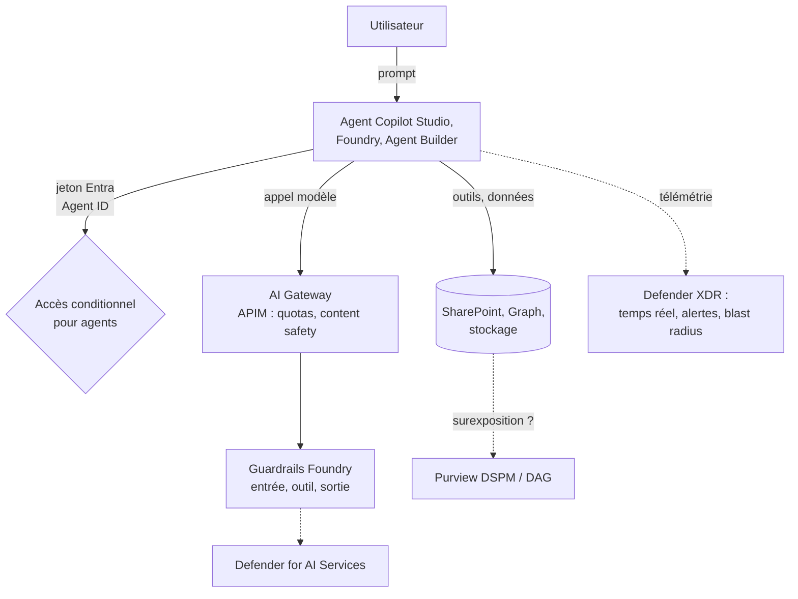

## L'essentiel en 2 minutes

L'IA n'invente pas de nouveaux principes de sécurité, elle **amplifie** les failles existantes : un Copilot trouve en une seconde un fichier mal partagé depuis 2019 ; un agent autonome avec trop de permissions agit sans humain dans la boucle ; un prompt malveillant caché dans un document détourne un agent (injection indirecte, XPIA). L'objectif 3.1 couvre quatre couches :

| Couche | Outils au programme |
| --- | --- |
| **Données** exposées à l'IA | Rapports Data access governance (SharePoint), Purview **DSPM for AI** |
| **Identité** des agents | **Microsoft Entra Agent ID** : accès conditionnel, sponsors, access packages, ID Protection |
| **Plateforme** IA | **AI Gateway** (API Management), **guardrails** Foundry |
| **Détection et gouvernance** | **Defender for AI Services**, Defender XDR (agents, blast radius, protection en temps réel), **tableau de bord Data and AI**, **centre d'administration Microsoft 365** (agents) |



> [!INFO] Beaucoup de ces fonctionnalités sont récentes, en **préversion** ou soumises à des licences spécifiques (Agent 365, Microsoft 365 E7). Le guide d'étude précise que l'examen peut couvrir des préversions courantes. Les statuts indiqués ici datent du 2026-10-04.

## Surexposition des données dans SharePoint {#s-3-1-1}

**Pourquoi** : Copilot respecte les permissions, mais si un site est ouvert à « Everyone except external users » (EEEU), Copilot répondra avec son contenu à tout le monde. Le problème, c'est la permission, pas l'IA.

Les **rapports Data access governance (DAG)**, dans **SharePoint admin center > Reports > Data access governance**, exigent SharePoint Advanced Management (SAM) ; avec Microsoft 365 E5 seul, on accède à une partie des rapports d'activité (jusqu'à 10 000 sites), sans rapports instantanés ni remédiation.

| Type | Rapports | Fenêtre |
| --- | --- | --- |
| **Snapshot** | Site permissions (organisation), site permissions for users, sensitivity labels for files, sites et fichiers partagés via les groupes spéciaux (EEEU, Everyone) | État à la date de génération |
| **Activity** | Sharing links, Shared with EEEU | **28 derniers jours** |

Méthode recommandée : rapports **snapshot** chaque trimestre pour la base, rapports **activity** chaque mois pour les nouveaux risques.

Remédiation :

- **Restricted access control (RAC)** : limiter un site à un groupe ;
- **Change history** : retrouver le changement de permission fautif ;
- **Site access review** : demander aux propriétaires de revoir les accès ;
- (via Purview) **Restricted Content Discovery** : exclure des sites des résultats de Copilot.

> [!PIEGE] Restricted Content Discovery masque un site **à Copilot**, il ne retire **aucune** permission : un utilisateur peut toujours ouvrir le fichier. RAC, lui, restreint l'accès au site.

## Risques Copilot et applications IA avec Purview DSPM {#s-3-1-2}

**Data Security Posture Management (DSPM) for AI** (Purview portal > Solutions) centralise : analyses de l'usage de l'IA, **politiques en un clic**, **évaluations de risque de données** (oversharing) et contrôles de conformité. La page « classic » est remplacée par la nouvelle expérience **Data Security Posture Management**, qui intègre les applications et agents IA.

Points clés documentés :

- prérequis : **Microsoft Purview Audit** activé ; pour les sites IA tiers (ChatGPT, Gemini...) : **extension de navigateur Purview** et **intégration des appareils** ;
- une **évaluation de risque par défaut** tourne **chaque semaine** sur les **100 sites SharePoint** les plus utilisés (premiers résultats après 4 jours) ; évaluations **personnalisées** en plus ;
- onglet **Protect** d'une évaluation : DLP pour **empêcher Copilot de résumer** les contenus portant certaines étiquettes, **Restricted Content Discovery**, politique d'**étiquetage automatique**, **rétention** pour le contenu inactif depuis 3 ans ;
- **Activity explorer** : interactions IA, types d'informations sensibles, visites de sites IA ;
- rôle : par exemple **Compliance Administrator**.

> [!EXAMEN] « Identifier les sites SharePoint qui exposeraient des données sensibles à Microsoft 365 Copilot, puis empêcher Copilot de résumer les documents étiquetés Confidentiel » : **DSPM for AI** (évaluation de risque) + **DLP** sur l'emplacement Microsoft 365 Copilot avec les étiquettes choisies.

## Protection en temps réel des agents Copilot Studio {#s-3-1-3}

Microsoft Defender inspecte l'activité des agents **pendant l'exécution** et peut **bloquer** une action risquée avant qu'elle ait lieu. Pour les **agents Copilot Studio** (préversion), la protection évalue les **appels d'outils**.

Configuration dans le **portail Microsoft Defender > Settings > Security for AI > Policies & rules > Real-time protection** :

- prérequis : activer la sécurité pour les agents IA, avec le **connecteur d'application Microsoft 365**, et **connecter Copilot Studio** ;
- une règle **Default** **audite** tous les agents (visibilité sans blocage) ;
- des **règles personnalisées** **bloquent** des types de détection (par exemple exfiltration de secrets, propagation de contenu malveillant, techniques d'évasion, domaine de messagerie dangereux), sur tous les agents ou certains (seuls les agents ayant un **Entra Agent ID** apparaissent) ;
- chaque audit ou blocage est enregistré comme **behavior** dans la table `BehaviorInfo` (chasse avancée) ;
- **Prompt evidence collection** (Settings > Security for AI) : inclut dans les alertes les extraits de prompts jugés suspects (secrets masqués) ; activé par défaut.

Côté Copilot Studio, il existe aussi une intégration de **détection externe des menaces** (préversion), qui envoie les actions prévues de l'agent à un fournisseur de sécurité pour validation.

```kusto
// Chasse avancée : blocages et audits de la protection en temps réel
BehaviorInfo
| where Timestamp > ago(7d)
| where Categories has "AI" or Description has "agent"
| project Timestamp, BehaviorId, Description, Categories, AttackTechniques
```

Les colonnes exactes de `BehaviorInfo` pour les événements d'agents sont à confirmer dans le schéma (à vérifier).

## Accès conditionnel pour Microsoft Entra Agent ID {#s-3-1-4}

**Licences** : **Microsoft 365 E7** (qui inclut Agent 365 et Entra Suite), ou une licence **Microsoft Agent 365** associée à au moins **Entra ID P1** ou **Microsoft 365 E3**.

L'accès conditionnel est évalué à l'**émission ou au renouvellement d'un jeton**. Il faut cibler le **sujet** du jeton, qui dépend du modèle d'accès :

| L'agent... | Modèle | Cible de la politique |
| --- | --- | --- |
| accède aux ressources **pour un utilisateur connecté** | On-behalf-of (délégué) | **Utilisateurs et groupes** |
| accède **avec sa propre identité**, sans utilisateur | Application seule | **Identité d'agent** ou **agent identity blueprint** |
| utilise **son propre compte utilisateur** (boîte aux lettres, Teams) | Agent-user | **Compte utilisateur de l'agent** |

Outils de ciblage : un **blueprint** (toutes les identités créées depuis ce modèle, y compris les futures), des **attributs de sécurité personnalisés** (politique sur tous les agents marqués, par exemple « approuvé = oui »), et la condition **agent risk** (ID Protection) pour bloquer les agents à risque élevé. Report-only fonctionne aussi.

Limites documentées :

- une politique qui cible **tous les utilisateurs** n'inclut **pas** les comptes utilisateurs d'agents ;
- une politique sur une identité d'agent ne s'applique **pas** à son compte utilisateur (et inversement) ;
- pas d'application quand un **blueprint** obtient un jeton Graph pour créer des identités, ni avec les **security defaults** ;
- un agent qui accède à une ressource par **clé d'API** contourne Entra et donc l'accès conditionnel.

> [!PIEGE] Pour un agent qui lit la messagerie **de l'utilisateur** (OBO), cibler l'identité de l'agent ne sert à rien : le sujet du jeton est l'**utilisateur**. Il faut une politique sur les utilisateurs, éventuellement limitée à la ressource visée.

## Rayon d'impact (blast radius) avec Defender XDR {#s-3-1-5}

Defender XDR (préversion pour les agents) détecte, pour les agents gérés par **Agent 365**, des menaces comme **jailbreak**, **injection indirecte de prompt (XPIA)**, propagation de contenu malveillant, **fuite de secrets**, évasion, **reconnaissance de LLM**, accès suspects. Les alertes sont corrélées en **incidents** ; le **graphe d'incident** et l'expérience d'investigation montrent les relations entre entités et le **rayon d'impact** d'une menace sur un agent : quels utilisateurs, outils, ressources et données l'identité compromise peut atteindre.

Prérequis : sécurité des agents IA activée avec le **connecteur Microsoft 365** ; les agents Copilot Studio, Foundry (publiés) et Agent Builder envoient leur télémétrie par défaut ; les autres via le **SDK Agent 365**.

Tables de chasse avancée :

| Table | Contenu |
| --- | --- |
| `AgentsInfo` | Inventaire et configuration des agents (identité, plateforme, propriétaire) |
| `CloudAppEvents` | Télémétrie Agent 365 : actions, appels d'outils, accès aux données |
| `AlertInfo` / `AlertEvidence` | Alertes et entités associées |
| `BehaviorInfo` / `BehaviorEntities` | Audits et blocages de la protection en temps réel |

```kusto
// Que peut atteindre cet agent ? Point de départ : ses actions récentes
CloudAppEvents
| where Timestamp > ago(3d)
| where AccountObjectId == "<objectId de l'identité d'agent>"
| summarize Actions = count() by ActionType, ObjectName
| order by Actions desc
```

## Gérer l'accès des Entra Agent ID {#s-3-1-6}

Une **identité d'agent** est un type d'identité distinct dans Entra ID. Elle est créée à partir d'un **agent identity blueprint** (le modèle, avec les identifiants).

| Tâche | Rôle |
| --- | --- |
| Voir les agents | Tout utilisateur (Entra admin center > Entra ID > **Agents**) |
| Gérer les identités d'agents | **Agent ID Administrator** ou Cloud Application Administrator (ou propriétaire de l'agent) |
| Créer des blueprints | **Agent ID Developer** |
| Accès conditionnel | Conditional Access Administrator (P1) |
| Rapports de risque ID Protection | Security Administrator, Operator ou Reader (**P2** pendant la préversion) |

Gouvernance :

- **Propriétaires** (administration technique) et **sponsors** (responsables métier du but, du cycle de vie et des revues d'accès). Si le sponsor part, la sponsorisation passe à son **manager** ;
- **access packages** (entitlement management) : accès **intentionnels, audités et limités dans le temps** ; demandes par l'agent lui-même, par un sponsor pour l'agent, ou attribution directe par un admin ; ils peuvent donner des appartenances à des groupes, des **permissions d'API** (y compris applicatives Microsoft Graph) et des **rôles Entra**. L'attribution d'access packages à des agents relève de la licence **Microsoft Agent 365** ;
- **permissions héritables** des blueprints (permissions déléguées héritées sans consentement interactif) : au plus 10 applications ressources par blueprint, 40 scopes énumérés par application ; préférer les scopes énumérés au mode « tous les scopes » ;
- **Lifecycle Workflows** : tâches d'e-mail au manager ou aux co-sponsors lors d'un départ ou d'une mobilité du sponsor ;
- **ID Protection pour les agents** : rapport **Risky Agents**, actions confirmer compromis (risque High, déclenche les politiques « block on high agent risk »), confirmer sûr, ignorer, **désactiver** ;
- **désactivation** à trois niveaux : un agent, un **blueprint** (bloque les existants et empêche les nouveaux), tout le tenant (accès conditionnel).

Journaux : les **sign-in logs** ont des filtres **Agent type** et **Is Agent** ; les audits apparaissent sous le type d'origine (création d'une identité d'agent = « Create service principal »).

> [!TERRAIN] Transposez votre projet JIT : un agent ne devrait pas avoir de permission applicative permanente sur Graph. Un access package **à durée limitée**, demandé par le **sponsor** et approuvé, avec revue périodique, c'est le PIM des agents.

## AI Gateway dans API Management pour Microsoft Foundry {#s-3-1-7}

L'**AI gateway** est un ensemble de capacités d'**API Management** pour gouverner modèles, agents et outils (MCP) :

| Besoin | Capacité / politique |
| --- | --- |
| Partager un quota de jetons entre applications | `llm-token-limit` : TPM ou quota par période, par clé (abonnement, IP...) |
| Mesurer la consommation par consommateur | `llm-emit-token-metric` (dimensions personnalisées) |
| Modérer les prompts | `llm-content-safety` (Azure AI Content Safety) |
| Réduire coûts et latence | `llm-semantic-cache-store` / `llm-semantic-cache-lookup` |
| Supprimer les clés d'API vers le backend | **Identité managée** d'APIM vers le service IA |
| Résilience | Backends avec **load balancing** et **circuit breaker** |

**Dans Foundry** (préversion) : **Manage > AI Gateway > Add AI Gateway**. On **crée** une instance APIM (**Basic v2**) ou on en **réutilise** une : même **tenant** et même **abonnement**, tier **v2**, rôle **API Management Service Contributor**. Les **nouveaux projets** de la ressource Foundry sont activés par défaut, les **existants** s'ajoutent manuellement (« Add project to gateway »). Les **limites de jetons s'appliquent par projet**. Dépassement du TPM : **429** ; du quota total : **403**. Si la ressource Foundry est privée, l'APIM doit l'être aussi (Standard v2 ou Premium v2 avec private endpoint, ou Premium v2 injecté dans un VNet).

```xml
<policies>
  <inbound>
    <base />
    <authentication-managed-identity resource="https://cognitiveservices.azure.com" />
    <llm-token-limit counter-key="@(context.Subscription.Id)"
                     tokens-per-minute="5000" estimate-prompt-tokens="true"
                     remaining-tokens-variable-name="remainingTokens" />
    <llm-emit-token-metric namespace="brisemer-llm">
      <dimension name="API ID" value="@(context.Api.Id)" />
    </llm-emit-token-metric>
  </inbound>
</policies>
```

## Defender for AI Services {#s-3-1-8}

Plan de **Cloud Workload Protection** de Defender for Cloud (GA) : protection contre les menaces **en temps réel** des applications d'IA générative, appuyée sur **Prompt Shields** (Azure AI Content Safety) et la threat intelligence de Microsoft. Alertes : **fuite de données**, **empoisonnement**, **jailbreak**, **vol d'identifiants**, etc.

- services couverts : modèles **Azure OpenAI** et **Azure AI Model Inference** ; **texte uniquement** (pas d'image ni d'audio) ;
- activation au niveau **abonnement** : rôle **Owner** (ou rôles équivalents) ;
- **essai gratuit de 30 jours**, plafonné à **75 milliards de jetons** analysés ;
- intégration **Defender XDR** : alertes IA corrélées avec le reste des incidents ;
- option de **user prompt evidence** dans les alertes.

```azurecli
# Nom du plan dans l'API pricing (à vérifier)
az security pricing create -n AI --tier Standard
```

> [!PIEGE] Defender for AI Services **détecte et alerte** ; les **guardrails** Foundry et Prompt Shields **filtrent ou bloquent** le contenu au moment de l'appel. Une question sur « bloquer un jailbreak avant qu'il atteigne le modèle » vise un guardrail (Prompt Shields), pas Defender.

## Guardrails pour la sécurité des agents dans Foundry {#s-3-1-9}

Un **guardrail** est une collection nommée de **contrôles** ; chaque contrôle associe un **risque**, des **points d'intervention** et une **action**.

| Point d'intervention | Modèles | Agents (préversion) |
| --- | --- | --- |
| User input | Oui | Oui |
| Tool call | Non | Oui (préversion) |
| Tool response | Non | Oui (préversion) |
| Output | Oui | Oui |

Risques : haine, sexuel, automutilation, violence (avec seuils de sévérité Low, Medium, High), **user prompt attacks** (jailbreak), **indirect attacks**, protected material (code et texte), **PII** (préversion), **task adherence** (préversion), et pour les modèles seulement spotlighting et groundedness (préversion). Actions : **Annotate** (modèles seulement) et **Annotate and block**.

Règles à connaître :

- les modèles reçoivent par défaut le guardrail **Microsoft.DefaultV2** ;
- un agent sans guardrail propre **hérite** de celui de son déploiement de modèle ; si on lui en assigne un, celui de l'agent **remplace entièrement** celui du modèle ;
- les guardrails s'appliquent aux agents de **Foundry Agent Service**, pas aux autres agents enregistrés dans le plan de contrôle Foundry ;
- les agents hébergés peuvent aussi avoir des **contrôles d'egress réseau** (préversion) ;
- rôle pour configurer : **Foundry Account Owner**.

> [!EXAMEN] « Un agent appelle un outil web dont la réponse contient une injection de prompt » : contrôle **Indirect attacks** au point d'intervention **tool response**, action **Annotate and block**, sur un guardrail **assigné à l'agent**.

## Tableau de bord Data and AI security {#s-3-1-10}

Dans Defender for Cloud, le **Data and AI security dashboard** donne une vue unique des ressources de données et d'IA, de leur couverture de protection et de leurs risques :

- **vue d'ensemble** par cloud : stockage, bases managées, bases hébergées (IaaS), **services IA**, avec leur protection (Defender CSPM, Storage, Databases, AI threat protection) ;
- **top issues** : alertes les plus graves (tactiques MITRE ATT&CK), recommandations et attack paths critiques et élevés ;
- **data closer look** : découverte de données sensibles, menaces sur les données, requêtes cloud security explorer, ressources exposées à Internet ;
- **AI closer look** : **découverte IA**, **prompts analysés** et alertes AI threat protection, requêtes (données sensibles servant au grounding, conteneurs vulnérables utilisés pour l'IA), ressources de grounding exposées à Internet.

Pour un accès complet : **Defender CSPM** avec l'extension **sensitive data discovery**, **Defender for Storage**, **Defender for Databases** et **threat protection for AI workloads**, abonnements enregistrés auprès du fournisseur `Microsoft.Security`.

## Gérer les agents dans le centre d'administration Microsoft 365 {#s-3-1-11}

**Microsoft 365 admin center > Agents** : **Overview** (registre, utilisateurs actifs, actions prioritaires) et **All agents** (**Registry**, **Requests**). Types d'agents : Copilot Studio (déclaratifs, custom engine, processus métier), Foundry, Agent Builder, SharePoint, Agents Toolkit, instances Agent 365.

| Action | Effet |
| --- | --- |
| **Install / uninstall** | Déployer pour tous ou des utilisateurs/groupes (avec consentement admin) |
| **Activate** | Approuver une demande et cibler qui peut créer des instances, avec un **modèle** de politiques (par défaut : ID Protection, visibilité réseau, cycle de vie Entra, contrôles SharePoint, audit Purview, détection et temps réel Defender) |
| **Block / unblock** | Rendre un agent indisponible dans toute l'organisation |
| **Delete / restore** | Suppression réversible pendant **30 jours**, puis définitive |
| **Start / stop** | Allouer ou désallouer l'infrastructure Azure d'un agent **Foundry** |
| **Assign new owner** | Pour les agents **sans propriétaire** (Agent Builder et Copilot Studio) |
| **Publish to store / reject** | Traiter les agents soumis par les utilisateurs |

Les actions de gouvernance importantes (approuver, attribuer un propriétaire) exigent **AI Administrator** ou **Global Administrator**. Bloquer un agent SharePoint ou Foundry n'affecte que sa disponibilité dans **Copilot Chat**.

> [!TERRAIN] Gouvernance d'agents = gouvernance d'applications, en plus rapide. Fixez trois règles simples : pas d'agent sans propriétaire **et** sponsor, pas d'agent déployé sans revue des permissions, blocage immédiat en cas d'alerte Defender (le registre M365 et la désactivation Entra sont vos deux boutons rouges).

## Comparatif : qui fait quoi dans la sécurité de l'IA ?

| Question | Outil |
| --- | --- |
| Quels sites SharePoint sont surexposés ? | DAG reports, DSPM for AI |
| Copilot ne doit pas résumer les documents « Confidentiel » | DLP Purview pour Microsoft 365 Copilot |
| Bloquer un appel d'outil dangereux d'un agent Copilot Studio | Defender real-time protection (règle personnalisée) |
| Bloquer les agents à risque élevé | Accès conditionnel avec la condition agent risk |
| Limiter les jetons par équipe | AI Gateway (`llm-token-limit`), limites par projet Foundry |
| Bloquer un jailbreak avant le modèle | Guardrail Foundry (user prompt attacks) |
| Être alerté d'un vol d'identifiants via l'IA | Defender for AI Services |
| Inventaire et risques données + IA | Data and AI security dashboard |
| Bloquer ou supprimer un agent pour toute l'entreprise | Microsoft 365 admin center (Agents) |

## Sources

Affirmations vérifiées sur les pages Microsoft Learn listées en bas de page, le 2026-10-04.
