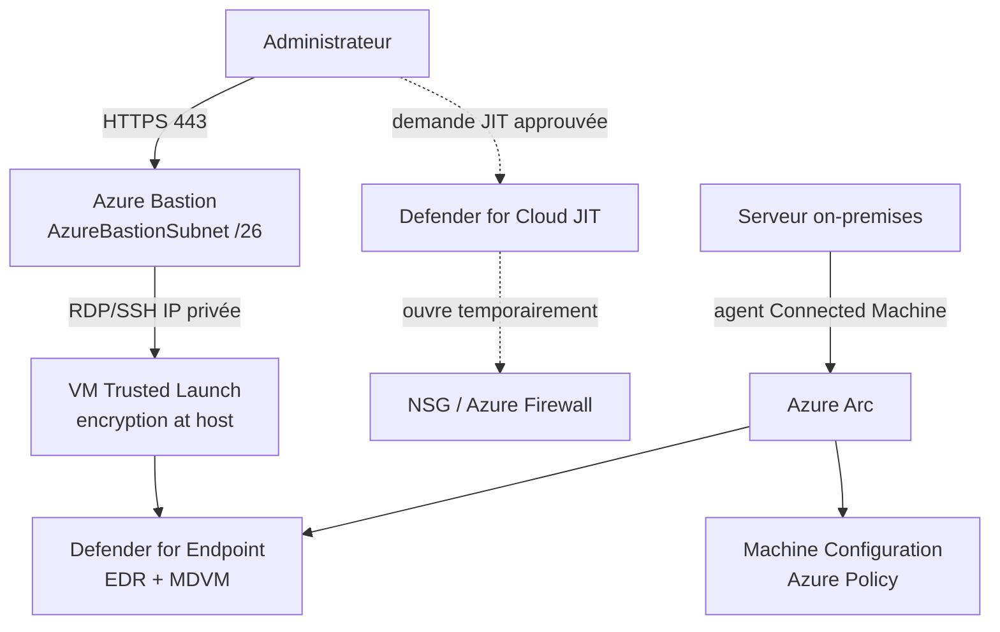

## L'essentiel en 2 minutes

Sécuriser un serveur, dans Azure comme ailleurs : **réduire l'exposition** (pas de port d'administration ouvert), **durcir** (démarrage sûr, configuration de l'OS), **chiffrer**, **détecter** (EDR, vulnérabilités). Azure ajoute **Arc** pour appliquer les mêmes contrôles aux serveurs on-premises et dans d'autres clouds.

| Besoin | Outil Azure |
| --- | --- |
| Administrer sans IP publique ni port ouvert | **Azure Bastion** |
| Ouvrir RDP/SSH seulement sur demande, pour un temps | **JIT VM access** (Defender for Servers P2) |
| Chiffrer disques, disque temporaire, caches | **Encryption at host** (+ clés client via Disk Encryption Set) |
| Démarrage vérifié, protection contre bootkits | **Trusted Launch** (Secure Boot, vTPM, attestation) |
| Configuration de l'OS imposée | **Machine Configuration** (via Azure Policy) |
| Serveurs hors Azure | **Azure Arc** |
| EDR, vulnérabilités, malware | **Defender for Servers** (MDE, MDVM, analyse sans agent) |



## Chiffrement des disques {#s-3-2-1}

| | SSE (toujours actif) | **Encryption at host** | Azure Disk Encryption (ADE) | Confidential disk encryption |
| --- | --- | --- | --- | --- |
| Disques OS et données au repos | Oui | Oui | Oui | Oui (disque OS) |
| **Disque temporaire** | Non | Oui (clés plateforme) | Oui | Oui (option) |
| **Caches** et flux calcul-stockage | Non | Oui | Oui | Oui |
| Clés client | Avec **Disk Encryption Set** | Avec DES | Avec KEK | Avec DES |
| Utilise le CPU de la VM | Non | Non | **Oui** (BitLocker/DM-Crypt) | Oui |
| Statut Defender for Cloud | Non sain | Sain | Sain | Non applicable |

> [!ATTENTION] **Azure Disk Encryption sera retiré le 15 septembre 2028.** Après cette date, les disques chiffrés par ADE ne se déverrouilleront plus au redémarrage. Microsoft recommande **encryption at host** pour les nouvelles VM et la **migration** des VM ADE existantes (sauvegardes comprises).

```azurecli
# Activer la fonctionnalité sur l'abonnement (une fois), puis créer une VM avec encryption at host
az feature register --namespace Microsoft.Compute --name EncryptionAtHost
az vm create -g rg-app -n vm-app01 --image Win2022Datacenter --size Standard_D2s_v5 \
  --encryption-at-host true --security-type TrustedLaunch --enable-secure-boot true --enable-vtpm true \
  --public-ip-address "" --admin-username azureadmin
```

```bicep
// Disk Encryption Set : clé client du coffre, pour SSE et encryption at host
resource des 'Microsoft.Compute/diskEncryptionSets@2023-10-02' = {
  name: 'des-brisemer-prod'
  location: location
  identity: { type: 'SystemAssigned' }
  properties: {
    encryptionType: 'EncryptionAtRestWithCustomerKey'
    activeKey: { keyUrl: keyUrl, sourceVault: { id: keyVaultId } }
    rotationToLatestKeyVersionEnabled: true
  }
}
```

L'identité du Disk Encryption Set doit pouvoir faire wrap/unwrap dans le coffre (rôle **Key Vault Crypto Service Encryption User**), et le coffre doit avoir la purge protection (voir 1.2).

> [!EXAMEN] « Chiffrer le disque temporaire et les caches, sans impact CPU, avec des clés gérées par l'entreprise » : **encryption at host** + **Disk Encryption Set** (attention : disque temporaire avec clés plateforme uniquement).

## Azure Bastion {#s-3-2-2}

Bastion offre RDP/SSH **depuis le navigateur (TLS 443)** vers les IP **privées** des VM : aucune IP publique sur les VM, aucun port de gestion exposé.

| Fonctionnalité | Developer | Basic | Standard | Premium |
| --- | --- | --- | --- | --- |
| Sous-réseau dédié `AzureBastionSubnet` (/26 min.) | Non | Oui | Oui | Oui |
| Host scaling (nombre d'instances) | Non | 2 instances fixes | Oui | Oui |
| Ports personnalisés, **shareable link** | Non | Non | Oui | Oui |
| **Session recording** | Non | Non | Non | Oui |
| Déploiement **private-only** (sans IP publique) | Non | Non | Non | Oui (à vérifier) |

Exigences : sous-réseau nommé exactement **AzureBastionSubnet**, **/26 ou plus**, sans autre ressource ; IP publique **Standard**, **statique** (sauf Developer et private-only). Le client natif et la connexion par IP nécessitent au moins le SKU Standard (à vérifier).

> [!TERRAIN] Dans un hub-and-spoke, un Bastion dans le hub atteint les VM des spokes appairés : pas besoin d'un Bastion par spoke. Côté NSG, le sous-réseau Bastion a des règles obligatoires (443 entrant depuis Internet, sortie vers les VM en 3389/22) : copiez-les depuis la documentation plutôt que de les deviner.

## Accès juste-à-temps (JIT) aux VM {#s-3-2-3}

JIT est une fonctionnalité de **Defender for Servers Plan 2**. Principe :

- Defender for Cloud ajoute des règles **deny all inbound** sur les ports choisis (22, 3389, 5985/5986...) dans le **NSG** et dans **Azure Firewall** (règles classiques uniquement : pas les VM protégées par un pare-feu géré par **Firewall Manager**) ;
- un utilisateur **demande** l'accès (portail, PowerShell, API) : Defender vérifie ses **droits RBAC** sur la VM ;
- si la demande est valide, Defender ouvre le port **depuis l'IP demandée** pour la **durée demandée** ;
- à l'expiration, les règles sont **restaurées** ; les connexions établies ne sont pas coupées ;
- sur **AWS**, JIT agit sur les **security groups EC2**.

Une VM éligible sans JIT apparaît dans la recommandation correspondante de Defender for Cloud (onglet Unhealthy resources), ce qui permet de suivre et d'imposer l'usage.

```powershell
# Politique JIT : RDP, durée maximale 3 heures, depuis n'importe quelle IP autorisée par la demande
$vm = Get-AzVM -ResourceGroupName rg-app -Name vm-app01
$policy = @(@{ id = $vm.Id; ports = @(@{ number = 3389; protocol = "*"; allowedSourceAddressPrefix = @("*"); maxRequestAccessDuration = "PT3H" }) })
Set-AzJitNetworkAccessPolicy -Kind "Basic" -Location $vm.Location -Name "default" -ResourceGroupName rg-app -VirtualMachine $policy

# Demande d'accès depuis une IP précise pour 1 heure
$req = @{ id = $vm.Id; ports = @(@{ number = 3389; endTimeUtc = (Get-Date).ToUniversalTime().AddHours(1).ToString("o"); allowedSourceAddressPrefix = @("203.0.113.10") }) }
Start-AzJitNetworkAccessPolicy -ResourceId "/subscriptions/<subId>/resourceGroups/rg-app/providers/Microsoft.Security/locations/$($vm.Location)/jitNetworkAccessPolicies/default" -VirtualMachine $req
```

> [!PIEGE] **JIT VM access** (réseau : ouvrir un port temporairement) et **PIM** (identité : activer un rôle temporairement) sont complémentaires. Dans le projet Brisemer : PIM pour avoir le droit de demander, JIT pour que le port n'existe qu'au moment de l'intervention, Bastion pour ne jamais exposer le port à Internet.

## Étendre les contrôles avec Azure Arc {#s-3-2-4}

L'**agent Azure Connected Machine** projette un serveur (on-premises, AWS, GCP, edge) comme ressource Azure : tags, RBAC, Azure Policy et Machine Configuration, extensions (Defender for Endpoint, Azure Monitor Agent), **identité managée** propre au serveur.

Sécurité de l'agent (documentée) :

- Azure est la **source de vérité** : toute action passe par la ressource Azure, donc par RBAC et Policy ;
- l'agent a ses **contrôles locaux**, prioritaires sur le cloud : désactiver les connexions entrantes (accès à distance), **allowlist** d'extensions ou désactivation du gestionnaire d'extensions, désactivation de Machine Configuration ;
- pour les actifs **Tier 0** (contrôleurs de domaine, PKI) : **abonnement dédié** avec très peu d'administrateurs, et verrouillage local.

```azurecli
# Sur un contrôleur de domaine : seulement AMA et Defender for Endpoint
azcmagent config set incomingconnections.enabled false
azcmagent config set guestconfiguration.enabled false
azcmagent config set extensions.allowlist "Microsoft.Azure.Monitor/AzureMonitorWindowsAgent,Microsoft.Azure.AzureDefenderForServers/MDE.Windows"
```

> [!PIEGE] Un **Owner** de l'abonnement qui contient des serveurs Arc Tier 0 est, de fait, **administrateur local** de ces serveurs (il peut pousser une extension de script). D'où l'abonnement dédié et l'allowlist locale.

## Embarquer les serveurs dans Defender for Servers {#s-3-2-5}

| Plan | Contenu |
| --- | --- |
| **Plan 1** | Intégration **Defender for Endpoint** (EDR), alertes et incidents intégrés, inventaire logiciel, vulnérabilités (avec agent), conformité |
| **Plan 2** | Tout P1 + **analyse sans agent** (vulnérabilités, **secrets**, **malware**), **JIT**, **file integrity monitoring**, alertes **Defender for DNS** et couche réseau Azure, mises à jour OS, écarts de configuration OS (MCSB), fonctionnalités **premium MDVM**, **500 Mo d'ingestion gratuite** (par machine et par jour, à vérifier) |

Portée : activer au niveau **abonnement** (recommandé). **Plan 1** peut s'activer **par ressource** ; **Plan 2** ne s'active **pas** par ressource (on peut seulement le désactiver sur une ressource). Essai de **30 jours** non prolongeable.

Embarquement selon l'origine :

- **VM Azure** : automatique dès que le plan est actif sur l'abonnement ;
- **on-premises** : via **Azure Arc** (pour la plupart des fonctionnalités) ;
- **AWS et GCP** : connecteurs multicloud de Defender for Cloud (voir 4.1), avec provisionnement automatique d'Arc.

```azurecli
az security pricing create -n VirtualMachines --tier Standard --subplan P2
```

## Paramètres de Defender for Servers : vulnérabilités et EDR {#s-3-2-6}

- **Defender for Endpoint** : le capteur (extension `MDE.Windows` / `MDE.Linux`) est **provisionné automatiquement** sur les machines prises en charge ; la licence Defender for Servers donne aux serveurs les droits de **MDE Plan 2**, facturés à l'heure ; désactivable si besoin ;
- **vulnérabilités** : **Defender Vulnerability Management** activé par défaut sur les machines avec MDE ; fonctionnalités premium en P2 ;
- **santé du capteur MDE** : problèmes d'installation et de heartbeat visibles (P2, ou Defender CSPM + P1), mis à jour toutes les 4 heures ;
- **évaluation de la configuration EDR** par l'analyse sans agent (EDR présent et bien configuré).

> [!INFO] Defender for Servers n'utilise plus l'agent Log Analytics ni AMA pour la plupart de ses fonctionnalités : l'analyse sans agent et MDE les remplacent. AMA reste utilisé pour l'avantage d'ingestion de 500 Mo.

## Analyse sans agent des VM {#s-3-2-7}

Defender for Cloud **prend des instantanés** des disques (OS et données), les analyse **hors bande** dans un environnement régional isolé, puis les **supprime** (quelques minutes) : aucun agent, aucune connectivité, aucun impact sur la VM.

- analyse : configuration EDR, **inventaire logiciel**, **vulnérabilités** (MDVM), **secrets**, **malware** (Defender Antivirus ; P2 seulement), nœuds Kubernetes ;
- plans : **Defender CSPM** ou **Defender for Servers P2** (malware : P2 uniquement) ;
- clouds : VM Azure, **AWS EC2**, **GCP** ;
- permissions Azure : rôle intégré **VM scanner operator** (lecture des disques pour les instantanés), ajouté automatiquement ; pour les disques chiffrés par **CMK**, permissions Key Vault en plus (wrap/unwrap) ;
- **exclusions** par tags possibles.

> [!EXAMEN] « Évaluer les vulnérabilités de VM sur lesquelles on ne peut installer aucun agent (appliances, VM critiques) » : **analyse sans agent** (Defender CSPM ou Defender for Servers P2).

## Fonctions de sécurité de la VM : Trusted Launch {#s-3-2-8}

**Type de sécurité** d'une VM : **Standard**, **Trusted launch**, ou **Confidential VM**.

Trusted Launch (VM **Generation 2**) apporte :

- **Secure Boot** : seuls des composants de démarrage signés par des éditeurs de confiance démarrent ;
- **vTPM** (TPM 2.0) : coffre de clés et de mesures, isolé de la VM, base de l'**attestation** ;
- **boot integrity monitoring** : avec l'extension **Guest Attestation**, Defender for Cloud vérifie à distance que la VM a démarré sainement, et lève une alerte en cas d'échec ;
- **VBS** : HVCI et Credential Guard sous Windows.

Trusted Launch est le **défaut** pour les nouvelles VM Gen2 créées depuis le portail, PowerShell et CLI (et avec l'API Compute 2025-11-01 ou plus si les conditions sont remplies). Il peut être activé sur des VM Gen2 **existantes**, et les VM Gen1 peuvent être migrées. **Aucun surcoût**. Recommandations Defender for Cloud : activer Secure Boot, activer vTPM, installer Guest Attestation.

```bicep
resource vm 'Microsoft.Compute/virtualMachines@2024-07-01' = {
  name: 'vm-app01'
  location: location
  properties: {
    securityProfile: {
      securityType: 'TrustedLaunch'
      uefiSettings: { secureBootEnabled: true, vTpmEnabled: true }
      encryptionAtHost: true
    }
    // hardwareProfile, storageProfile, osProfile, networkProfile...
  }
}
```

> [!PIEGE] Désactiver Secure Boot (par exemple pour un pilote non signé) fait **échouer l'attestation** et génère des alertes : à supprimer explicitement si c'est voulu.

## Machine Configuration {#s-3-2-9}

**Azure Machine Configuration** (anciennement guest configuration) **audite** ou **configure** les paramètres **à l'intérieur** de l'OS (Windows et Linux, VM Azure et serveurs **Arc**), orchestré à l'échelle par **Azure Policy**. Les configurations sont des **ressources d'extension** de la machine, écrites avec PowerShell DSC pour les configurations personnalisées.

| Mode | Effet |
| --- | --- |
| **Audit** | Rapporte seulement l'état |
| **Apply and Monitor** | Applique, puis surveille la dérive |
| **Apply and Autocorrect** | Applique et **corrige automatiquement** toute dérive |

Points à connaître : jusqu'à **50** affectations par machine ; nécessite l'**extension** Machine Configuration et une **identité managée** sur les VM Azure (initiative de prérequis) ; les écarts par rapport aux baselines MCSB remontent dans Defender for Servers P2.

```azurecli
# Initiative de prérequis (extension + identité managée), puis une politique d'audit de baseline
az policy set-definition list --query "[?contains(displayName,'Deploy prerequisites to enable Guest Configuration')].name" -o tsv
az policy assignment create --name mc-prereq --policy-set-definition <nomInitiative> \
  --scope /subscriptions/<subId> --mi-system-assigned --location francecentral
```

## Comparatif : accès d'administration

| Solution | Port exposé à Internet | Identité | Traçabilité |
| --- | --- | --- | --- |
| IP publique + NSG ouvert | Oui | Comptes locaux | Faible |
| JIT seul | Temporairement, depuis une IP | RBAC Azure pour la demande | Journal d'activité |
| **Bastion** | Non (443 vers Bastion) | Entra ID pour le portail | Journaux Bastion, enregistrement (Premium) |
| Bastion + JIT + PIM | Non | PIM + RBAC + JIT | Maximale |

## Sources

Affirmations vérifiées sur les pages Microsoft Learn listées en bas de page, le 2026-10-04.
