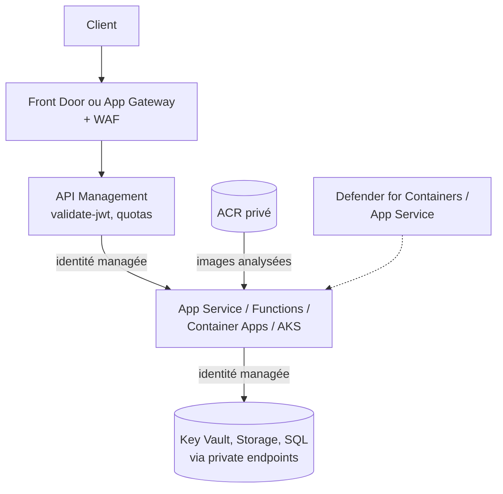

## L'essentiel en 2 minutes

Les services de plateforme (PaaS et conteneurs) se sécurisent tous selon le même canevas. Retenez-le, il structure presque toutes les questions de cet objectif :

| Couche | Questions à se poser | Outils typiques |
| --- | --- | --- |
| **Entrée** | Qui peut appeler ? Depuis où ? | Authentification Entra (Easy Auth, validate-jwt), restrictions d'accès, private endpoints, WAF |
| **Identité sortante** | Comment l'app accède aux autres services ? | **Identité managée**, références Key Vault, jamais de secret en dur |
| **Déploiement** | Qui peut publier ? | RBAC, désactiver FTP et l'authentification basique, pipeline avec identité fédérée |
| **Chaîne d'approvisionnement** | L'image ou le code est-il sûr ? | Analyse de vulnérabilités, registre privé, déploiement conditionné |
| **Exécution** | Détecter et contenir | Defender for Containers, Defender for App Service, journaux |



## Defender for Containers {#s-3-3-1}

Cinq domaines :

- **gestion de la posture** : découverte **sans agent** des clusters (API cloud et Kubernetes), inventaire, durcissement du **plan de contrôle** (recommandations), chasse via cloud security explorer ;
- **évaluation des vulnérabilités** sans agent : images d'**ACR**, ECR, Google Artifact/Container Registry et registres externes pris en charge, **nœuds** Kubernetes, et (préversion multicloud) conteneurs **en cours d'exécution**, avec rescan quotidien ;
- **protection à l'exécution** : plus de 60 détections Kubernetes, mappées sur MITRE ATT&CK pour conteneurs ; sources : **capteur Defender** (DaemonSet) et **journaux d'audit Kubernetes** (sans agent). Exemples : tableau de bord exposé, service LoadBalancer exposé, rôle à hauts privilèges, montage sensible ; fonctions capteur : antimalware, **détection et blocage de dérive binaire**, détection DNS ;
- **chaîne d'approvisionnement** : résultats de vulnérabilités signés et associés à l'image, **déploiement conditionné** (gated deployment) pour auditer ou **bloquer** les images non conformes ;
- **déploiement et supervision** des capteurs (clusters non protégés).

Le **durcissement du plan de données** s'appuie sur **Azure Policy for Kubernetes** (par exemple interdire les conteneurs privilégiés). Clusters couverts : **AKS**, **EKS**, **GKE** et Kubernetes **activé par Arc**. Les alertes ne concernent que les actions postérieures à l'activation du plan.

```azurecli
az security pricing create -n Containers --tier Standard
# Capteur Defender et Azure Policy sur un cluster existant
az aks update -g rg-aks -n aks-brisemer --enable-defender
az aks enable-addons -g rg-aks -n aks-brisemer --addons azure-policy
```

> [!EXAMEN] « Empêcher le déploiement d'images ayant des vulnérabilités critiques » : **gated deployment** de Defender for Containers (ou Azure Policy for Kubernetes). « Détecter un processus inconnu lancé dans un conteneur en production » : **binary drift detection** (capteur).

## Contrôles de sécurité d'AKS {#s-3-3-2}

| Domaine | Contrôle |
| --- | --- |
| Accès au **serveur d'API** | **Plages IP autorisées** ou **cluster privé** ; intégration VNet du serveur d'API |
| **Authentification / autorisation** | Intégration **Microsoft Entra ID** ; **Azure RBAC pour Kubernetes** ou Kubernetes RBAC ; désactiver les comptes locaux (à vérifier) |
| **Pipeline** | Identité fédérée, rôle **Azure Kubernetes Service Cluster User** (récupère la kubeconfig, sans droits API), rôle **AKS RBAC Writer** au plus petit namespace, jamais cluster-admin |
| **Nœuds** | Mis à jour au déploiement et au scale, sans IP publique ; **Trusted Launch** sur Gen2 ; autorisation de nœud (kubelet) par défaut depuis 1.24 ; OS optimisés (Azure Linux, Azure Container Linux) |
| **Réseau** | NSG au niveau sous-réseau (ne pas toucher au NSG de carte géré par AKS) ; **network policies** Kubernetes entre pods |
| **Workloads** | **Workload identity** (identité fédérée Entra pour les pods) ; pas de conteneurs privilégiés ; AppArmor, seccomp ; Pod Security Standards |
| **Secrets** | Secrets Kubernetes (tmpfs, namespace) ; chiffrement d'**etcd** avec **KMS** et clé client ; fournisseur Key Vault pour le Secrets Store CSI Driver |

**AKS Automatic** préconfigure une base durcie : Azure RBAC pour Kubernetes, intégration VNet du serveur d'API, workload identity et émetteur OIDC, garde-fous de déploiement et Pod Security Standards **baseline** en mode enforce, image cleaner.

> [!PIEGE] Le multi-locataire **hostile** n'est pas sûr sur un même cluster Kubernetes : la frontière de sécurité est le **cluster**. Pour des tenants qui ne se font pas confiance, des clusters séparés (ou une isolation matérielle).

```azurecli
az aks create -g rg-aks -n aks-brisemer --enable-aad --enable-azure-rbac \
  --enable-private-cluster --enable-oidc-issuer --enable-workload-identity \
  --network-plugin azure --network-policy azure --enable-defender
az role assignment create --role "Azure Kubernetes Service RBAC Writer" \
  --assignee <pipelineIdentity> --scope "$(az aks show -g rg-aks -n aks-brisemer --query id -o tsv)/namespaces/app-prod"
```

## Contrôles de sécurité d'Azure Container Registry {#s-3-3-3}

| Méthode d'authentification | Usage | RBAC Entra |
| --- | --- | --- |
| Identité Entra individuelle (`az acr login`) | Développeurs ; jeton valable **3 heures** | Oui |
| **Service principal** | Pipelines, orchestrateurs | Oui |
| **Identité managée** | Services Azure (pull d'images) | Oui |
| **Utilisateur admin** | Tests ; **désactivé par défaut** ; accès push et pull complet, **un seul compte** partagé | **Non** |
| Jetons à portée de dépôt (scope maps) | Accès limité à des dépôts, appareils externes | Non (pour des permissions par dépôt avec Entra : ABAC) |

Autres contrôles : **private endpoint** et désactivation de l'accès public (SKU Premium pour Private Link, à vérifier), analyse des images par **Defender for Containers**, rôle **AcrPull** pour l'identité des nœuds AKS (`az aks update --attach-acr`).

```azurecli
az acr update -n acrbrisemer --admin-enabled false --public-network-enabled false
az aks update -g rg-aks -n aks-brisemer --attach-acr acrbrisemer
```

> [!PIEGE] Le portail exige encore l'**utilisateur admin** pour certains déploiements directs d'image vers ACI ou Container Apps. En production, utilisez une **identité managée** avec AcrPull et laissez l'admin désactivé.

## Container Instances et Container Apps {#s-3-3-4}

**Container Apps** :

- environnement **workload profiles** (par défaut) : UDR, sortie par **NAT Gateway** ou **Azure Firewall**, **private endpoints** ; sous-réseau dédié **/27** minimum. L'ancien type **Consumption only** ne prend pas en charge les UDR (sous-réseau /23) ;
- accessibilité **External** (IP publique) ou **Internal** (ILB, IP privée, aucune exposition) ; pour des private endpoints, l'accès public doit être **Disabled** ;
- entrée : ingress limité à l'environnement, **restrictions IP**, **mTLS client**, intégration Front Door par Private Link, WAF via Application Gateway ;
- sortie et accès : **identités managées** (système ou utilisateur), notamment pour tirer les images d'ACR et lire Key Vault.

**Container Instances** : déploiement d'un groupe de conteneurs **dans un sous-réseau** de VNet (pas d'IP publique), identité managée pour accéder aux ressources Azure.

```azurecli
az containerapp env create -g rg-app -n cae-brisemer -l francecentral \
  --infrastructure-subnet-resource-id <subnetId> --internal-only true
az containerapp create -g rg-app -n ca-api --environment cae-brisemer \
  --image acrbrisemer.azurecr.io/api:1.4.2 --registry-server acrbrisemer.azurecr.io \
  --registry-identity system --system-assigned --ingress internal --target-port 8080
```

## Azure Functions : authentification et accès réseau {#s-3-3-5}

Approche en couches documentée par Microsoft, de la plus simple à la plus stricte :

1. **HTTPS obligatoire** et TLS minimal ;
2. **clés d'accès** (niveaux `function`, `admin`) : elles compliquent l'accès mais **n'authentifient pas** un appelant ;
3. **App Service Authentication** (Easy Auth) avec Entra ID ;
4. **API Management** devant, et l'app n'accepte que l'IP d'APIM ;
5. **réseau** : restrictions d'accès, **private endpoints** (Flex Consumption, Elastic Premium, Dedicated), intégration VNet pour la sortie ;
6. **isolation** : App Service Environment.

Autres réglages : désactiver les **points de terminaison `/admin`** (`functionsRuntimeAdminIsolationEnabled`), **identité managée** et **connexions basées sur l'identité** pour les déclencheurs et liaisons, **références Key Vault** dans les paramètres d'application, **CORS** sans joker, désactiver **FTP** et le débogage à distance, protéger le **compte de stockage** de l'app (il peut contenir le code).

```azurecli
az functionapp update -g rg-app -n func-brisemer-batch --set httpsOnly=true
az functionapp config set -g rg-app -n func-brisemer-batch --min-tls-version 1.2 --ftps-state Disabled
az functionapp identity assign -g rg-app -n func-brisemer-batch
az functionapp config appsettings set -g rg-app -n func-brisemer-batch \
  --settings "SqlConn=@Microsoft.KeyVault(SecretUri=https://kv-brisemer-prod-01.vault.azure.net/secrets/sql-conn/)"
```

> [!EXAMEN] « Exiger que seuls les utilisateurs Entra de l'entreprise appellent la fonction, sans écrire de code » : **App Service Authentication** (Easy Auth) avec Microsoft Entra ID. Une clé de fonction n'identifie personne.

## Azure Logic Apps {#s-3-3-6}

| Risque | Contrôle |
| --- | --- |
| URL de rappel du déclencheur Request divulguée (SAS dans l'URL) | **Régénérer** les clés d'accès ; URL de rappel **expirante** ; **OAuth Entra ID** (politique d'autorisation avec au moins les claims `iss` et `aud`) ; **désactiver la SAS** si OAuth suffit |
| Appels depuis n'importe où | **Adresses IP entrantes autorisées** (Consumption) ou restrictions d'accès (Standard) |
| Données sensibles visibles dans l'historique d'exécution | **Secure inputs / secure outputs** ; restriction IP de l'accès au contenu de l'historique |
| Identifiants dans les connexions | **Identité managée** ; paramètres `securestring` ; Key Vault |
| Droits trop larges | Rôles **Logic App Contributor / Operator** (Consumption), **Logic Apps Standard Reader / Operator / Developer / Contributor** (Standard) |

```json
"accessControl": {
  "triggers": {
    "openAuthenticationPolicies": {
      "policies": {
        "EntraOnly": {
          "type": "AAD",
          "claims": [
            { "name": "iss", "value": "https://sts.windows.net/<tenantId>/" },
            { "name": "aud", "value": "api://logic-brisemer-intake" }
          ]
        }
      }
    },
    "sasAuthenticationPolicy": { "state": "Disabled" }
  }
}
```

> [!PIEGE] Secure inputs/outputs n'est pas disponible sur certaines actions intégrées (Compose, Parse JSON, For each, Condition...). Si une donnée sensible y transite, elle reste visible dans l'historique.

## Azure App Service {#s-3-3-7}

Recommandations de Microsoft, regroupées :

- **déploiement** : désactiver l'**authentification basique** (FTP et SCM) au profit d'Entra ; FTP désactivé ou **FTPS uniquement** ;
- **réseau** : **private endpoints** (entrée), **intégration VNet** (sortie), **restrictions d'accès** (IP, service tags, service endpoints), WAF devant (Front Door ou Application Gateway), **App Service Environment** pour l'isolation complète ;
- **identité** : **identité managée** (système ou utilisateur) pour les appels sortants, **Easy Auth** pour les utilisateurs, RBAC minimal sur le plan de gestion, **mTLS** (certificats clients) pour le B2B ;
- **données** : **HTTPS only** (pas activé par défaut), **TLS 1.2 minimum** (1.3 pris en charge), **références Key Vault** ;
- **détection** : journaux de diagnostic, Application Insights, **Defender for App Service**.

```azurecli
az webapp update -g rg-app -n app-brisemer-portail --https-only true
az webapp config set -g rg-app -n app-brisemer-portail --min-tls-version 1.2 --ftps-state Disabled
az resource update -g rg-app --namespace Microsoft.Web --resource-type basicPublishingCredentialsPolicies \
  --parent sites/app-brisemer-portail --name scm --set properties.allow=false
az webapp config access-restriction add -g rg-app -n app-brisemer-portail \
  --rule-name only-frontdoor --priority 100 --service-tag AzureFrontDoor.Backend
```

> [!TERRAIN] Avec une restriction sur le service tag `AzureFrontDoor.Backend`, n'importe quel Front Door (y compris celui d'un autre client) peut atteindre votre app. Ajoutez un filtre sur l'en-tête **X-Azure-FDID** avec l'ID de **votre** profil, ou utilisez Front Door Premium avec Private Link (à vérifier selon la documentation des restrictions d'accès).

## Azure Web Application Firewall {#s-3-3-8}

| | WAF sur **Application Gateway** | WAF sur **Azure Front Door** |
| --- | --- | --- |
| Portée | **Régionale**, dans votre VNet | **Globale**, en périphérie du réseau Microsoft |
| Usage typique | Applications régionales, backends privés | Applications mondiales, blocage au plus près de l'attaquant |
| Règles gérées | Jeux de règles gérés (CRS / DRS) | **Default Rule Set** et **Bot Manager** : **Front Door Premium** ; **Standard = règles personnalisées seulement** |

Communs aux deux : modes **Detection** (journalise seulement) et **Prevention** (applique l'action) ; **règles personnalisées** traitées **avant** les règles gérées : listes IP, **géofiltrage**, conditions sur les paramètres HTTP, méthode, taille, **limitation de débit** ; actions **Allow, Block, Log, Redirect**, et **Anomaly score** avec DRS 2.0 ou plus. Sur Front Door, une politique peut être attachée au **profil**, au **domaine** ou à la **route** (la plus spécifique gagne), et le jeu **HTTP DDoS** est évalué avant les règles personnalisées.

```azurecli
az network front-door waf-policy create -g rg-edge -n wafBrisemer --sku Premium_AzureFrontDoor --mode Prevention
az network front-door waf-policy managed-rules add -g rg-edge --policy-name wafBrisemer \
  --type Microsoft_DefaultRuleSet --version 2.1 --action Block
```

Les versions de rule set disponibles et la syntaxe exacte des sous-commandes `az network front-door waf-policy` évoluent : vérifiez avec `--help` avant usage (à vérifier).

> [!EXAMEN] Commencez en **Detection**, analysez les journaux (faux positifs), créez des exclusions, puis passez en **Prevention** : c'est la démarche attendue. Et : « WAF avec règles gérées sur Front Door » implique le tier **Premium**.

## Protection des API backend avec API Management {#s-3-3-9}

1. Enregistrer l'API dans Entra (app registration **backend-app**, Application ID URI, **scopes** ou app roles) ;
2. dans APIM, politique **`validate-jwt`** (ou **`validate-azure-ad-token`**) en `inbound` : vérifie signature, **audience**, **émetteur**, claims requis ; renvoie **401** sinon ;
3. compléter par quotas et limites de débit (`rate-limit-by-key`, `quota-by-key`), filtrage IP (`ip-filter`) ;
4. vers le backend : **identité managée** d'APIM (`authentication-managed-identity`) ou certificat client ; le backend n'accepte que le trafic d'APIM.

```xml
<inbound>
  <base />
  <validate-azure-ad-token tenant-id="<tenantId>" header-name="Authorization"
      failed-validation-httpcode="401" failed-validation-error-message="Jeton absent ou invalide.">
    <client-application-ids>
      <application-id><clientAppId></application-id>
    </client-application-ids>
    <audiences>
      <audience>api://brisemer-suivi</audience>
    </audiences>
    <required-claims>
      <claim name="roles" match="any"><value>Suivi.Lecture</value></claim>
    </required-claims>
  </validate-azure-ad-token>
  <rate-limit-by-key calls="100" renewal-period="60" counter-key="@(context.Request.IpAddress)" />
  <authentication-managed-identity resource="api://brisemer-backend" />
</inbound>
```

> [!PIEGE] Avec l'endpoint v2 d'Entra, la propriété `accessTokenAcceptedVersion` doit valoir **2** dans le manifeste de l'API (et du client), sinon l'émetteur et l'audience ne correspondent pas à ce que valide la politique.

## Comparatif : authentifier l'appelant d'une app PaaS

| Service | Option recommandée | Options à éviter seules |
| --- | --- | --- |
| App Service / Functions | Easy Auth (Entra), APIM en frontal | Clés de fonction, secrets partagés |
| Logic Apps (Request) | OAuth Entra (+ SAS désactivée), IP autorisées | URL avec SAS seule, jamais renouvelée |
| API Management | validate-jwt / validate-azure-ad-token | Clé d'abonnement seule |
| AKS (API Kubernetes) | Entra + Azure RBAC pour Kubernetes, comptes locaux désactivés | Certificat admin partagé |
| ACR | Identité managée, service principal | Utilisateur admin |

## Sources

Affirmations vérifiées sur les pages Microsoft Learn listées en bas de page, le 2026-10-04.
