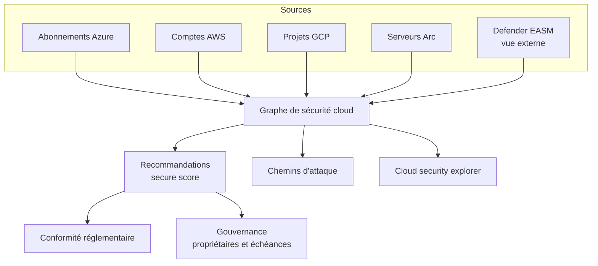

## L'essentiel en 2 minutes

Defender for Cloud est une **CNAPP** (Cloud Native Application Protection Platform) qui combine trois piliers : **CSPM** (posture : trouver les mauvaises configurations), **CWPP** (protection des charges de travail : détecter les attaques en cours) et **DevSecOps** (sécurité du code et des pipelines). Il couvre Azure, AWS, GCP et, via Azure Arc, l'on-premises.

| Question | Outil |
| --- | --- |
| Mes ressources sont-elles bien configurées ? | Recommandations et **secure score** (Foundational CSPM, gratuit) |
| Quels risques sont réellement exploitables ? | **Attack path analysis**, **cloud security explorer** (Defender CSPM) |
| Suis-je conforme à ISO 27001, PCI DSS, NIST ? | **Regulatory compliance** (standards ajoutés : plan payant requis) |
| Mes VM, conteneurs, bases sont-ils attaqués ? | Plans **CWPP** : Defender for Servers, Containers, Storage, Databases... |
| AWS et GCP | **Connecteurs natifs** (fédération, sans secret stocké) |
| Vulnérabilités logicielles des VM | **Defender Vulnerability Management** (MDVM) |
| Que voit un attaquant depuis Internet ? | **Defender EASM** (outside-in) |



## Identifier les risques avec Defender CSPM {#s-4-1-1}

Defender for Cloud propose deux plans de posture :

| Fonctionnalité | Foundational CSPM (gratuit) | Defender CSPM (payant) |
| --- | --- | --- |
| Inventaire, recommandations, **secure score**, MCSB | Oui | Oui |
| Export continu, workbooks, workflow automation | Oui | Oui |
| **Attack path analysis**, **cloud security explorer** | Non | Oui |
| **Conformité réglementaire** (standards ajoutés) | Non | Oui |
| **Gouvernance** (propriétaires, échéances) | Non | Oui |
| Analyse **sans agent** des VM (vulnérabilités, secrets) | Non | Oui |
| DSPM (données sensibles), **AI-SPM**, API posture | Non | Oui |
| Analyse d'exposition Internet, intégration **EASM** | Non | Oui |
| Recommandations personnalisées, protection des actifs critiques | Non | Oui |

**Graphe de sécurité cloud** : moteur de contexte qui relie inventaire, connexions, possibilités de mouvement latéral, exposition Internet, permissions et vulnérabilités. Deux usages :

- **Attack path analysis** : un algorithme cherche des chemins qui partent d'un **point d'entrée externe** exploitable (ressource exposée et vulnérable, identifiants divulgués) et mènent, par mouvement latéral, à une **cible critique** (base de données sensible, par exemple). Il propose les recommandations qui **cassent** le chemin. Le risque tient compte de l'exposition Internet, des permissions et du mouvement latéral.
- **Cloud security explorer** : requêtes de recherche de chemins sur le graphe, construites avec un générateur de requêtes (« VM exposées à Internet avec une vulnérabilité critique et une identité qui a accès à un coffre »).

Prérequis documenté : ces capacités demandent d'activer l'**analyse sans agent des VM** ou l'**évaluation de vulnérabilités** de Defender for Servers.

Portail : **Defender for Cloud > Attack path analysis** et **Defender for Cloud > Cloud security explorer**.

```azurecli
# Activer Defender CSPM sur l'abonnement (nom technique du plan : CloudPosture) (à vérifier)
az security pricing create -n CloudPosture --tier Standard
az security pricing show -n CloudPosture --query "{plan:name, tier:pricingTier}"
```

```kusto
// Azure Resource Graph : secure score de chaque abonnement
securityresources
| where type == "microsoft.security/securescores"
| project subscriptionId, score = properties.score.current, max = properties.score.max
```

> [!EXAMEN] « Prioriser les corrections selon le risque réel, en tenant compte de l'exposition Internet et des permissions » : **attack path analysis** (Defender CSPM). Le **secure score** seul ne raisonne pas en chemins.

> [!PIEGE] La **gouvernance** (affecter un propriétaire et une échéance à chaque recommandation, avec rappels) est une fonctionnalité **Defender CSPM**, pas Foundational CSPM.

## Évaluer la conformité aux référentiels {#s-4-1-2}

Le tableau **Regulatory compliance** évalue en continu les ressources par rapport aux contrôles d'un standard.

- Le **Microsoft cloud security benchmark (MCSB)** est activé **par défaut** dès que Defender for Cloud couvre un abonnement, un compte AWS ou un projet GCP.
- **Ajouter d'autres standards** (ISO 27001, PCI DSS, NIST SP 800-53, CIS...) exige **au moins un plan payant**.
- **Rôles** : le rôle **Reader** sur l'abonnement donne accès aux données de conformité Policy, **pas Security Reader**. Pour gérer les standards : au minimum **Resource Policy Contributor** et **Security Admin**.
- Contrôles **automatisés** (liés à des recommandations, avec remédiation) et **manuels** (**attestation** avec preuves jointes).
- Évaluations environ **toutes les 12 heures** : une correction n'apparaît qu'après le prochain passage.
- Rapports : **Download report** (PDF/CSV de l'état), **Audit reports** (certificats Microsoft : ISO, SOC, PCI).
- **Export continu** vers Log Analytics ou Event Hubs (flux continu ou instantané hebdomadaire) ; **workflow automation** (Logic App) sur changement d'état d'une évaluation.
- Les données remontent aussi dans **Microsoft Purview Compliance Manager**.

> [!TERRAIN] Un auditeur veut une preuve mensuelle ? Export continu de la conformité vers le workspace Log Analytics du SOC, et un workbook. Vous gardez l'historique, alors que le tableau ne montre que l'état courant.

> [!PIEGE] Un utilisateur avec **Security Reader** ne voit pas les données de conformité réglementaire : il lui faut **Reader** sur l'abonnement.

## Activer et configurer les plans de protection {#s-4-1-3}

| Plan CWPP | Protège |
| --- | --- |
| **Defender for Servers** (P1, P2) | VM Azure, AWS, GCP, serveurs Arc (MDE, vulnérabilités, JIT en P2) |
| **Defender for Containers** | AKS, EKS, GKE, Arc ; registres et images |
| **Defender for Storage** | Comptes de stockage (malware, SAS, données sensibles) |
| **Defender for Databases** | Azure SQL, SQL sur machines, open source, Cosmos DB |
| **Defender for App Service** | Applications App Service |
| **Defender for Key Vault** | Accès anormaux aux coffres |
| **Defender for Resource Manager** | Opérations ARM suspectes |
| **Defender for APIs** | APIs publiées dans API Management |
| **AI Services** | Applications d'IA générative (voir leçon 3.1) |

Activation : portail **Defender for Cloud > Environment settings > abonnement > Defender plans**, plan par plan, avec les **paramètres** de chaque plan (par exemple pour Servers : sous-plan, analyse sans agent, vulnérabilités, MDE). À grande échelle : **Azure Policy** (initiatives intégrées qui activent les plans) ou API.

```powershell
# Activer Defender for Servers Plan 2 et Defender for Storage (module Az.Security)
Set-AzSecurityPricing -Name "VirtualMachines" -PricingTier "Standard" -SubPlan "P2"
Set-AzSecurityPricing -Name "StorageAccounts" -PricingTier "Standard"
Get-AzSecurityPricing | Select-Object Name, PricingTier, SubPlan
```

> [!INFO] Les **alertes** et **incidents** de Defender for Cloud apparaissent dès qu'un plan de protection est actif, et remontent dans **Defender XDR**. Pour les nouveaux abonnements, les alertes DNS suspectes sont incluses dans Defender for Servers **Plan 2**.

## Connecter AWS et GCP {#s-4-1-4}

| | AWS | GCP |
| --- | --- | --- |
| Portée | **Compte unique** ou **compte de gestion** (crée des connecteurs pour les comptes membres, actuels et futurs) | **Projet** ou **organisation** (exclusions de projets ou dossiers possibles) |
| Authentification | **Fédération** et identifiants de courte durée, rôles IAM créés à l'onboarding | **Workload identity federation** et usurpation de comptes de service |
| Déploiement côté cloud | **CloudFormation** (ou Terraform) | Script **gcloud** généré (pool et fournisseur d'identité, comptes de service, liaisons) |
| Intervalle d'analyse | **4, 6, 12 ou 24 h** | **4, 6, 12 ou 24 h** |
| Droits Azure | **Contributor** sur l'abonnement (Owner pour l'auto-provisioning Arc) | **Contributor** sur l'abonnement |

Points notables :

- Aucun secret long terme n'est stocké : c'est la bonne réponse à « sans clé d'accès ».
- **Defender for Servers** et **Defender for SQL** sur AWS/GCP : les instances reçoivent **Azure Arc** (auto-provisioning recommandé), plus l'agent **SSM** sur AWS.
- Choix des permissions : **Default access** (actuelles et futures) ou **Least privilege access** (actuelles seulement).
- Activer un plan ou changer une option après coup peut exiger de **mettre à jour le template CloudFormation** (ou de relancer le script gcloud).
- AWS : en cas d'onboarding du compte de gestion, **pas** de compte administrateur délégué.
- Santé : **Environment settings > colonne Connectivity status**.

> [!PIEGE] Defender CSPM interroge les API AWS plusieurs fois par jour : les lectures apparaissent dans **CloudTrail**. Si vous exportez CloudTrail vers un SIEM, filtrez le rôle `CspmMonitorAws` pour ne pas payer l'ingestion de ce bruit.

> [!EXAMEN] « Couvrir tous les comptes AWS d'une organisation, y compris ceux créés plus tard » : connecteur au niveau du **compte de gestion** (management account).

## Paramètres de Defender Vulnerability Management pour les VM {#s-4-1-5}

Defender for Cloud utilise **Microsoft Defender Vulnerability Management (MDVM)** pour l'analyse des vulnérabilités des machines, en deux modes :

| Mode | Prérequis | Particularité |
| --- | --- | --- |
| **Sans agent** | Defender for Servers **P2** ou **Defender CSPM** | Activé par défaut avec ces plans ; instantanés de disques |
| **Avec agent** (capteur MDE) | Defender for Servers **P1** ou **P2** | Utilise l'intégration Defender for Endpoint |

- L'analyse est **activée par défaut** avec Defender for Servers. Activation manuelle : **Environment settings > abonnement > Defender for Servers > Monitoring coverage > Settings > Vulnerability assessment for machines > Edit configuration** (choisir MDVM).
- Permissions : **Owner** au niveau du groupe de ressources pour déployer le scanner ; **Security Reader** pour lire les résultats.
- Par VM : l'API REST `.../providers/Microsoft.Security/serverVulnerabilityAssessments/mdetvm` (PUT pour activer, DELETE pour désactiver).
- Les résultats apparaissent dans la recommandation sur les vulnérabilités des machines et dans Defender XDR (inventaire logiciel, CVE). Les fonctionnalités **premium** de MDVM sont incluses en P2.

```azurecli
# Activer l'évaluation MDVM sur une VM via l'API REST
az rest --method put --url "https://management.azure.com/subscriptions/<subId>/resourceGroups/rg-app/providers/Microsoft.Compute/virtualMachines/vm-app01/providers/Microsoft.Security/serverVulnerabilityAssessments/mdetvm?api-version=2015-06-01-preview"
```

## Découvrir la surface d'attaque externe avec Defender EASM {#s-4-1-6}

**Defender External Attack Surface Management** cartographie, **depuis Internet** (outside-in), l'infrastructure exposée de l'organisation, y compris ce que l'équipe ignore (shadow IT, sites oubliés, certificats expirés).

- **Découverte** à partir de **graines** (discovery seeds) : domaines, blocs d'adresses IP, hôtes, contacts e-mail, **ASN**, organisations Whois. L'outil suit récursivement les connexions observées.
- **États des actifs** :

| État | Sens | Traitement |
| --- | --- | --- |
| **Approved Inventory** | Vous en êtes responsable | Dans les tableaux de bord, **analysé chaque jour** |
| **Dependency** | Tiers, mais soutient vos actifs | Hors tableaux par défaut |
| **Monitor Only** | Pertinent mais non contrôlé (filiale, franchisé) | Hors tableaux par défaut |
| **Candidate** | Lien faible avec vos graines | **Analysé seulement pendant la découverte** : à revoir |
| **Requires Investigation** | Lien à valider manuellement | À qualifier |

- Tableaux de bord sur les vulnérabilités, la conformité et l'hygiène de sécurité ; suivi des **changements d'inventaire** sur 7 ou 30 jours.
- Ressource Azure : rôle **Contributor** pour la créer ; **Owner/Contributor** gèrent, **Reader** consulte. **Pas d'accès inter-tenants**, même via Azure Lighthouse.
- **Essai gratuit de 30 jours**.
- **Intégration Defender CSPM** : incluse **sans licence EASM séparée** ; elle alimente la découverte des ressources exposées, les chemins d'attaque partant d'IP exposées et les requêtes du cloud security explorer.

> [!EXAMEN] « Découvrir des sous-domaines et IP exposés que l'équipe ne connaît pas » : **Defender EASM** (vue externe). « Une VM Azure connue est-elle exposée et exploitable vers une base sensible ? » : **attack path analysis** (vue interne, enrichie par EASM).

> [!PIEGE] Des actifs restés en **Candidate** ne sont pas surveillés au quotidien. Après la première découverte, la vraie tâche est de **qualifier** l'inventaire.

## Comparatif : quel outil pour quelle question ?

| Question | Outil | Plan |
| --- | --- | --- |
| Écart de configuration sur une ressource | Recommandation | Foundational |
| Mesurer la progression globale | Secure score | Foundational |
| Risque exploitable de bout en bout | Attack path analysis | Defender CSPM |
| Question ad hoc sur le graphe | Cloud security explorer | Defender CSPM |
| Conformité ISO, PCI, NIST | Regulatory compliance | Plan payant |
| Responsabiliser les équipes | Gouvernance | Defender CSPM |
| CVE sur les VM | MDVM | Servers P1/P2 ou CSPM (sans agent) |
| Actifs Internet inconnus | Defender EASM | EASM (ou intégration CSPM) |

## Sources

Affirmations vérifiées sur les pages Microsoft Learn listées en bas de page, le 2026-10-04.
