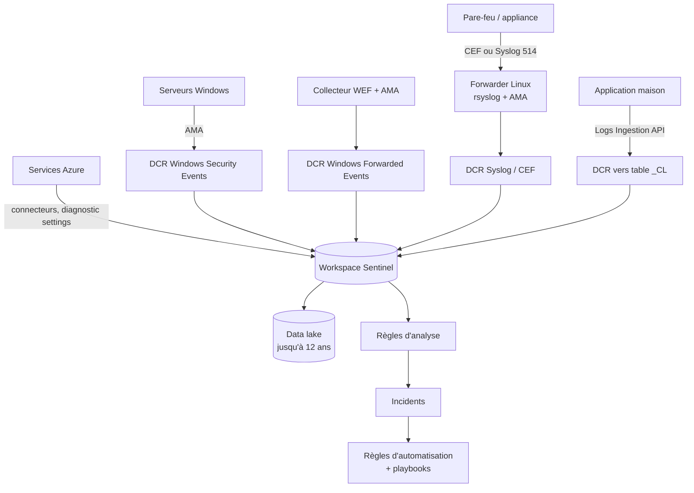
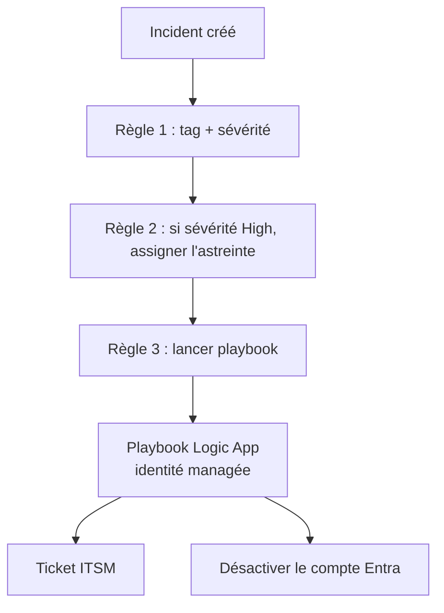

## L'essentiel en 2 minutes

Vous connaissez les SIEM : Sentinel en est un, bâti sur un **workspace Log Analytics**. Ce qui change par rapport à un SIEM classique : la collecte passe par l'**Azure Monitor Agent (AMA)** piloté par des **règles de collecte (DCR)**, le contenu (connecteurs, règles, workbooks, playbooks) s'installe depuis le **content hub**, et l'automatisation repose sur des **règles d'automatisation** et des **playbooks Logic Apps**.

> [!ATTENTION] **Après le 31 mars 2027**, Sentinel ne sera plus pris en charge dans le portail Azure : il sera uniquement disponible dans le **portail Microsoft Defender**. Les nouveaux clients disposant des droits Owner ou User Access Administrator sont déjà embarqués automatiquement dans le portail Defender.

| Étape | Outil |
| --- | --- |
| Stocker | Workspace Log Analytics + Sentinel (+ data lake pour le long terme) |
| Donner les accès | Rôles Sentinel (Azure RBAC), rôles Entra pour le data lake |
| Installer le contenu | Content hub (solutions) |
| Collecter Azure | Connecteurs service à service, diagnostic settings, Azure Policy |
| Collecter Linux, pare-feu, appliances | Syslog / CEF via AMA (forwarder Linux) |
| Collecter Windows | Windows Security Events via AMA, Windows Forwarded Events (WEF) |
| Sources maison | Table `_CL` + DCR + Logs Ingestion API |
| Répondre | Règles d'automatisation + playbooks |



## Créer et connecter les workspaces {#s-4-2-1}

**Conception** : Microsoft recommande de **commencer par un seul workspace** et de n'en ajouter que si un critère l'impose :

| Critère | Plusieurs workspaces si... |
| --- | --- |
| Tenants Entra | Plusieurs tenants (la plupart des sources n'envoient qu'au même tenant) |
| Région | Exigence de résidence des données |
| Propriété des données | Filiales à séparer |
| Rétention | Rétention différente pour des ressources qui écrivent dans la même table |
| Facturation | Refacturation impossible par Cost Management ou requête |
| Données opérationnelles et sécurité | Séparation exigée, ou coût : dans un workspace Sentinel, **toutes** les données sont facturées au tarif Sentinel |

Alternative au découpage : **resource-context RBAC** (un propriétaire de ressource voit les journaux de ses ressources) et **table-level RBAC**.

**Activer Sentinel** : il faut **Contributor** sur l'abonnement du workspace. Puis **Microsoft Sentinel > Create > choisir le workspace > Add**.

- Les **workspaces par défaut créés par Defender for Cloud** ne peuvent pas recevoir Sentinel.
- Une fois Sentinel déployé, le workspace **ne peut plus être déplacé** vers un autre groupe de ressources ou abonnement.
- Rétention : un workspace Sentinel bénéficie de **90 jours** de rétention gratuite ; Microsoft recommande de régler la rétention à 90 jours.
- Portail Defender : plusieurs workspaces possibles, **un workspace principal par tenant** (Settings > Microsoft Sentinel > Workspaces).

```azurecli
az group create -n rg-soc -l francecentral
az monitor log-analytics workspace create -g rg-soc -n law-soc-brisemer -l francecentral --retention-time 90
# Activer Sentinel (onboarding state), extension sentinel de la CLI (à vérifier selon la version)
az sentinel onboarding-state create -g rg-soc --workspace-name law-soc-brisemer -n default
```

> [!PIEGE] Mélanger journaux opérationnels volumineux et données de sécurité dans le workspace Sentinel fait payer **le tarif Sentinel sur tout**. À l'inverse, combiner peut faire atteindre un **commitment tier**. Il n'y a pas de réponse universelle : c'est le coût et la séparation des rôles qui tranchent.

## Attribuer les rôles {#s-4-2-2}

Rôles Azure intégrés, à attribuer de préférence **au groupe de ressources** du workspace (sinon il faut aussi les poser sur la ressource de solution SecurityInsights) :

| Rôle | Peut |
| --- | --- |
| **Microsoft Sentinel Reader** | Voir données, incidents, workbooks |
| **Microsoft Sentinel Responder** | + **gérer les incidents** (assigner, changer statut) |
| **Microsoft Sentinel Contributor** | + créer/modifier règles, workbooks, **gérer le content hub** |
| **Microsoft Sentinel Playbook Operator** | Lister et **lancer manuellement** des playbooks |
| **Microsoft Sentinel Automation Contributor** | Permet **au service Sentinel** d'ajouter des playbooks aux règles d'automatisation. **Pas pour les utilisateurs** |
| **Logic App Contributor** | Créer et modifier les playbooks |

Tâches qui demandent plus :

- **Connecter une source** : droit d'**écriture sur le workspace** (plus les droits propres au connecteur).
- **Créer/supprimer des workbooks** : rôle Sentinel + **Workbook Contributor**.
- **Invité qui assigne des incidents** : **Directory Reader** (rôle Entra) + Responder.
- **Data lake** : rôles **Entra** (Security Reader, Security Operator, Security Administrator...) ou rôles Defender XDR unified RBAC personnalisés.

| Profil | Rôles recommandés |
| --- | --- |
| Analyste SOC | Sentinel **Responder** + **Playbook Operator** |
| Ingénieur sécurité | Sentinel **Contributor** + **Logic App Contributor** |
| Principal de service d'automatisation | Sentinel **Contributor** |

> [!EXAMEN] « L'analyste doit traiter les incidents et lancer les playbooks existants, sans pouvoir modifier les règles » : **Responder** + **Playbook Operator**. Contributor serait trop large.

> [!PIEGE] Les rôles sont **cumulatifs** : un utilisateur Reader et Contributor a les droits de Contributor. Et **Owner/Contributor** Azure donnent déjà accès au workspace : vérifiez-les avant de croire qu'un rôle Sentinel restreint suffit.

## Content hub et solutions {#s-4-2-3}

Le **content hub** centralise le contenu prêt à l'emploi : **connecteurs**, **règles d'analyse**, **requêtes de chasse**, **parsers ASIM**, **playbooks**, **watchlists**, **workbooks**, **modèles de summary rules**.

- **Solution** : paquet de bout en bout pour un produit ou un domaine (par exemple Fortinet FortiGate, Azure Activity), avec **gestion du cycle de vie** (mises à jour depuis le content hub).
- **Standalone** : élément isolé, mis à jour automatiquement.
- **Custom** et **Repositories** : contenu personnalisé, ou déployé depuis un dépôt Git (CI/CD).
- **Support** : **Microsoft-supported**, **Partner-supported** (contact du partenaire), **Community-supported** (GitHub).
- **Installer ou gérer** : **Microsoft Sentinel Contributor** au niveau du groupe de ressources.

Après installation, un **modèle** de règle n'est pas actif : il faut **Create rule** depuis le modèle (portail : **Content hub > solution > Manage**, puis la règle).

> [!TERRAIN] Avant d'écrire une règle de détection pour vos FortiGate ou vos F5, cherchez la solution du constructeur dans le content hub : connecteur, parser et règles y sont souvent déjà. Vous adaptez ensuite, plutôt que de partir de zéro.

## Connecteurs Microsoft pour les ressources Azure {#s-4-2-4}

Les connecteurs s'obtiennent en **installant la solution** correspondante depuis le content hub ; ils apparaissent ensuite dans **Configuration > Data connectors**.

| Mécanisme | Exemples |
| --- | --- |
| **Service à service** (intégration native) | Microsoft Defender XDR, Microsoft Defender for Cloud, Microsoft Entra ID, Microsoft 365 |
| **Azure Policy** (affectation qui configure la collecte à l'échelle) | **Azure Activity** (journal d'activité des abonnements) |
| **Diagnostic settings** (souvent poussés par Azure Policy) | Key Vault, Storage, Azure Firewall, SQL |
| **Agent AMA + DCR** | Windows, Syslog, CEF, fichiers |
| **Codeless Connector Framework** ou **Logs Ingestion API** | Sources SaaS et API tierces |

Exemple du démarrage rapide Microsoft : connecteur **Azure Activity** > **Launch Azure Policy Assignment Wizard** > portée = abonnement > paramètre **Primary Log Analytics workspace** > Create. Vérification : `AzureActivity` dans Logs ou Advanced hunting.

```kusto
// Qui a modifié des attributions de rôle cette semaine ?
AzureActivity
| where TimeGenerated > ago(7d)
| where OperationNameValue has "Microsoft.Authorization/roleAssignments"
| project TimeGenerated, Caller, OperationNameValue, ActivityStatusValue, ResourceGroup
```

> [!ATTENTION] L'ancienne **HTTP Data Collector API** n'est plus prise en charge depuis le **14 septembre 2026**. Les intégrations doivent passer par la **Logs Ingestion API** ou le **Codeless Connector Framework**.

## Syslog et CEF via AMA {#s-4-2-5}

Deux connecteurs : **Syslog via AMA** (table **Syslog**) et **Common Event Format (CEF) via AMA** (table **CommonSecurityLog**).

Architecture pour des appliances (pare-feu, proxy, F5...) : un **forwarder Linux** dédié.

- Forwarder : VM Azure, ou machine avec l'agent **Azure Arc** (Connected Machine) si hors Azure.
- Démon **rsyslog** ou **syslog-ng**, **Python** 2.7 ou 3.
- Le connecteur crée une **DCR** (Basics, **Resources** = le forwarder, **Collect** = facilities et niveau minimal) et installe AMA.
- Sur le forwarder, le script **Forwarder_AMA_installer.py** configure le démon et ouvre le port **514 en UDP et TCP**.
- Les appliances envoient vers le forwarder, pas vers leur démon local.
- Rôles : **Virtual Machine Contributor** ou **Azure Connected Machine Resource Administrator** (agent), **Monitoring Contributor** (DCR).

```bash
# Sur le forwarder Linux (commande fournie par la page du connecteur)
sudo wget -O Forwarder_AMA_installer.py https://raw.githubusercontent.com/Azure/Azure-Sentinel/master/DataConnectors/Syslog/Forwarder_AMA_installer.py && sudo python3 Forwarder_AMA_installer.py
sudo systemctl status azuremonitoragent.service
# Message de test CEF
logger -p local4.warn -P 514 -n 127.0.0.1 --rfc3164 -t CEF "0|Brisemer-test|LAB|1.0|100|Test CEF|3|src=10.0.0.1"
```

```kusto
CommonSecurityLog
| where TimeGenerated > ago(1h)
| summarize count() by DeviceVendor, DeviceProduct
```

Les messages peuvent mettre jusqu'à **20 minutes** à apparaître.

> [!PIEGE] Utiliser la **même facility** pour du Syslog et du CEF dans les DCR provoque une **ingestion en double**. Séparez les facilities (par exemple local4 pour le CEF, local7 pour le Syslog brut).

> [!EXAMEN] « Choisir le niveau LOG_ERR » collecte LOG_ERR **et tous les niveaux plus graves** (CRIT, ALERT, EMERG), pas seulement LOG_ERR.

## Événements de sécurité Windows : DCR et WEF {#s-4-2-6}

**Windows Security Events via AMA** : la DCR choisit les machines (VM Azure, serveurs **Arc**) et les événements :

| Jeu d'événements | Usage |
| --- | --- |
| **All events** | Tout le journal de sécurité (coûteux) |
| **Common** | Jeu standard pour l'audit et l'investigation |
| **Minimal** | Jeu réduit pour la détection |
| **Custom** | Requêtes **XPath 1.0** (jusqu'à 20 expressions par champ, 100 champs par règle) |

Filtrer **à la source** avec XPath réduit fortement les coûts. Tester une requête XPath localement avec `Get-WinEvent -FilterXPath`.

```powershell
# Valider une requête XPath avant de la mettre dans la DCR
$XPath = '*[System[(EventID=4624 or EventID=4625 or EventID=4672)]]'
Get-WinEvent -LogName 'Security' -FilterXPath $XPath -MaxEvents 5
```

```json
{
  "dataSources": {
    "windowsEventLogs": [
      {
        "name": "securityEvents",
        "streams": [ "Microsoft-SecurityEvent" ],
        "xPathQueries": [ "Security!*[System[(EventID=4624 or EventID=4625 or EventID=4672 or EventID=4688)]]" ]
      }
    ]
  }
}
```

**Windows Event Forwarding (WEF)** : les serveurs transfèrent leurs événements à un **collecteur WEC** ; **AMA est installé sur le collecteur** et le connecteur **Windows Forwarded Events** les envoie dans la table **WindowsEvent**.

> [!PIEGE] Les événements reçus par WEF arrivent dans **WindowsEvent**, **pas dans SecurityEvent**, même ceux du journal Security. Beaucoup de règles intégrées interrogent **SecurityEvent** : il faut les adapter (ou utiliser les parsers **ASIM**), ou collecter directement avec Windows Security Events via AMA.

> [!INFO] Tout serveur hors Azure (physique, VM on-premises, autre cloud) doit avoir **Azure Arc** installé **avant** d'activer un connecteur basé sur AMA.

## Tables personnalisées {#s-4-2-7}

Pour une source maison (application métier, script), on crée une **table personnalisée** alimentée par une **DCR**.

- Suffixe **`_CL`** obligatoire (ajouté automatiquement par le portail).
- Colonne **`TimeGenerated`** obligatoire (ajoutée par la transformation si absente).
- **Plan de table** : **Analytics** (défaut, requêtes complètes, règles), **Basic** (requêtes limitées, 30 jours), **Auxiliary / Lake** (bas coût, requêtable sur toute la rétention).
- La DCR peut porter une **transformation KQL** (filtrer, renommer, masquer) avant stockage.
- Ingestion par la **Logs Ingestion API** ; une DCR de type **Direct** n'a pas besoin de DCE.
- Droits : `Microsoft.OperationalInsights/workspaces/*` (par exemple **Log Analytics Contributor**).
- Colonnes personnalisées ajoutées à une table **Azure** : suffixe **`_CF`**. Après tout changement de schéma, **mettre à jour la DCR** (elle n'est pas mise à jour automatiquement).

```azurecli
az monitor log-analytics workspace table create -g rg-soc --workspace-name law-soc-brisemer \
  -n BadgeAccess_CL --plan Analytics \
  --columns TimeGenerated=datetime Badge=string Porte=string Resultat=string
```

> [!PIEGE] Ne mettez **aucune information sensible dans le nom** d'une table : Azure utilise les noms de tables pour la facturation.

## Règles d'automatisation et playbooks {#s-4-2-8}

**Règles d'automatisation** : gestion centralisée de la réponse, sans code.

- **Déclencheurs** : **incident créé**, **incident mis à jour**, **alerte créée** (alertes des règles Scheduled ou NRT).
- **Conditions** : propriétés de l'incident et des entités, règle d'analyse d'origine ; pour la mise à jour : « changed from / changed to », **Updated by**.
- **Actions** : changer statut (fermeture avec raison), sévérité, **propriétaire**, **tags**, ajouter des **tâches**, **lancer un playbook**.
- **Ordre** : numéro d'ordre ; exécution **séquentielle**, chaque règle voit l'état laissé par la précédente. Les règles « création » passent avant les règles « mise à jour ».
- **Date d'expiration** : idéale pour fermer le bruit d'un **test d'intrusion** planifié.

**Playbooks** : workflows **Azure Logic Apps** (Consumption ou Standard), déclenchés par incident, alerte ou entité. Un playbook à déclencheur incident ne peut être lancé que par une règle à déclencheur incident.

**Permission indispensable** : Sentinel lance les playbooks avec un **compte de service** dédié. Ce compte doit recevoir des droits explicites (rôle **Microsoft Sentinel Automation Contributor**) sur le **groupe de ressources du playbook** ; il faut être **Owner** de ce groupe pour les accorder (lien **Manage playbook permissions**). Un playbook sans ces droits apparaît **grisé**.



> [!EXAMEN] « Un playbook n'apparaît pas dans la liste de l'action Run playbook » : Sentinel n'a pas les **permissions sur le groupe de ressources** du playbook (Automation Contributor), ou le **type de déclencheur** ne correspond pas.

> [!TERRAIN] Dans le portail Defender, une règle d'automatisation peut mettre jusqu'à 10 minutes à s'exécuter après la création de l'incident, et plusieurs modifications en 5 à 10 minutes ne produisent qu'une seule mise à jour. Évitez de baser vos conditions sur le **titre** de l'incident (il peut changer avec la corrélation) : préférez le nom de la règle d'analyse et les tags.

## Rétention des données {#s-4-2-9}

| Notion | Valeur |
| --- | --- |
| Rétention analytique par défaut | **30 jours** (90 jours pour certaines tables comme AzureActivity et Usage ; 90 jours gratuits dans un workspace Sentinel) |
| Rétention analytique max (plan Analytics) | **730 jours** (2 ans) |
| **Rétention totale** max (long terme comprise) | **12 ans** (4 383 jours) |
| Plan Basic | Requêtes sur 30 jours |
| Plan Auxiliary / Lake | Requêtable sur toute la rétention totale |
| Données au-delà de la rétention analytique | **Search jobs** (ou restauration) |
| Réduction de la rétention totale | Données supprimées après un **délai de 30 jours** (pour pouvoir annuler) |

Réglage par **workspace** (défaut) ou **par table** (Log Analytics > Tables > Manage table).

```azurecli
# SigninLogs : 180 jours d'analytique, 2 ans au total
az monitor log-analytics workspace table update -g rg-soc --workspace-name law-soc-brisemer \
  -n SigninLogs --retention-time 180 --total-retention-time 730
```

**Microsoft Sentinel data lake** (workspace embarqué dans le portail Defender) :

- Deux niveaux : **analytics tier** (détection, chasse, incidents) et **data lake tier** (stockage long terme bas coût, format **Parquet**, jusqu'à **12 ans**).
- Les données de l'analytics tier sont **mises en miroir** dans le lake : **une seule copie**.
- Exploration en **KQL**, **notebooks Jupyter**, **jobs** (ponctuels ou planifiés) qui **promeuvent** des données du lake vers l'analytics tier.
- Activité du lake **auditée** par défaut.
- On ne peut pas purger des enregistrements précis du lake (la purge RGPD agit sur l'analytics tier).

> [!EXAMEN] « Garder 7 ans de journaux de pare-feu pour la conformité, au coût le plus bas, en pouvant les interroger occasionnellement » : rétention **totale** longue (long terme ou **data lake**), pas une rétention analytique de 7 ans (impossible au-delà de 2 ans).

## Interroger l'audit Purview dans Defender XDR {#s-4-2-10}

L'**audit unifié Microsoft Purview** enregistre les activités utilisateurs et administrateurs (Exchange, SharePoint, OneDrive, Teams, Entra...). Deux façons de l'exploiter :

**Dans Purview (Audit > Search)** :

- Rôles **Audit Logs** ou **View-Only Audit Logs**.
- Rétention : **180 jours** (Audit Standard) ; **1 an** pour Entra, Exchange et SharePoint avec une licence E5 (Audit Premium), et politiques de rétention d'audit jusqu'à 1 an pour les autres services.
- Recherche sur **180 jours maximum** ; jobs conservés 30 jours ; export CSV.
- PowerShell : `Search-UnifiedAuditLog` (Exchange Online PowerShell).
- Disponibilité typique : 60 à 90 minutes après l'événement pour les services principaux.

**Dans Defender XDR (Advanced hunting)** : la table **CloudAppEvents** contient les activités Office 365 et des applications cloud, enrichies par **Defender for Cloud Apps**. Prérequis : **Settings > Cloud apps > App connectors**, connecteur Microsoft 365 avec la case **Microsoft 365 activities**. L'événement brut est dans **RawEventData**.

```kusto
// Téléchargements massifs SharePoint/OneDrive par un compte sur 24 h
CloudAppEvents
| where Timestamp > ago(1d)
| where Application in ("Microsoft SharePoint Online", "Microsoft OneDrive for Business")
| where ActionType == "FileDownloaded"
| summarize Fichiers = count() by AccountDisplayName, IPAddress
| where Fichiers > 100
| order by Fichiers desc
```

> [!PIEGE] Si `CloudAppEvents` reste vide alors que l'audit Purview fonctionne : le **connecteur Microsoft 365** de Defender for Cloud Apps n'a pas l'option **Microsoft 365 activities** cochée.

> [!INFO] Dans Sentinel, le connecteur **Microsoft 365** alimente la table **OfficeActivity**, et les tables de Defender XDR peuvent être interrogées avec celles de Sentinel dans l'advanced hunting du portail Defender (à vérifier selon votre configuration).

## Comparatif : où vont mes journaux ?

| Source | Connecteur | Table |
| --- | --- | --- |
| Pare-feu, proxy en CEF | CEF via AMA | CommonSecurityLog |
| Linux, appliances en Syslog | Syslog via AMA | Syslog |
| Journal Security Windows (AMA direct) | Windows Security Events via AMA | SecurityEvent |
| Événements transférés par WEF | Windows Forwarded Events | WindowsEvent |
| Journal d'activité Azure | Azure Activity (Policy) | AzureActivity |
| Application maison | Logs Ingestion API + DCR | `Nom_CL` |
| Activités Microsoft 365 (XDR) | Defender for Cloud Apps | CloudAppEvents |

## Sources

Affirmations vérifiées sur les pages Microsoft Learn listées en bas de page, le 2026-10-04.
