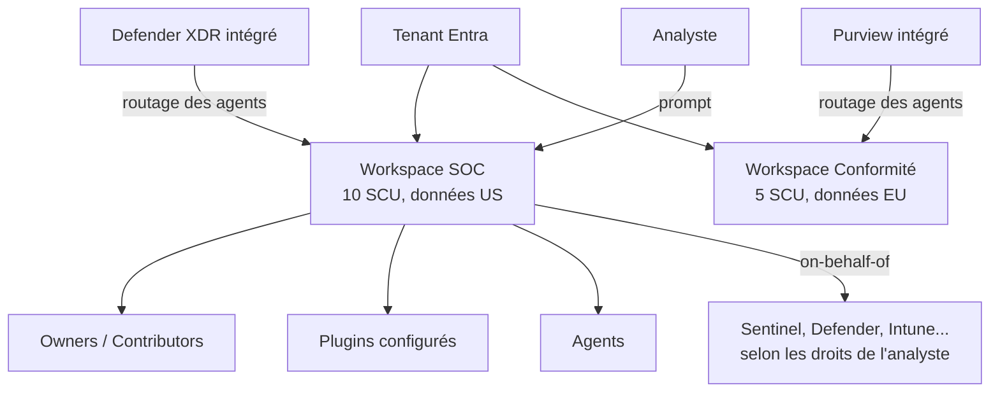

## L'essentiel en 2 minutes

**Microsoft Security Copilot** est un assistant d'IA générative pour la sécurité : sessions de prompts, **promptbooks**, expériences **intégrées** (Defender, Entra, Intune, Purview) et **agents** qui automatisent des tâches répétitives. Le rôle de l'ingénieur sécurité est de le **déployer proprement** : capacité, résidence des données, accès, plugins et agents.

| Brique | À retenir |
| --- | --- |
| **Workspace** | Environnement isolé : sessions, capacité, rôles, plugins |
| **SCU** (Security Compute Unit) | Unité de capacité, provisionnée par workspace |
| **Rôles** | Copilot **owner** et **contributor**, propres à Security Copilot |
| **Authentification** | **On-behalf-of** : jamais plus que les droits de l'utilisateur |
| **Plugins** | Préinstallés (Microsoft et tiers) et personnalisés |
| **Agents** | Tâches automatisées, avec identité, déclencheur, permissions |
| **Security Store** | Vitrine pour acheter et déployer agents et solutions |



## Configurer les workspaces {#s-4-3-1}

Un **workspace** est un environnement à portée de tenant où travaillent utilisateurs, agents et automatisations. Chacun a son **historique de sessions**, sa **capacité**, ses **rôles** et sa **configuration** (plugins, paramètres owner). Plusieurs workspaces permettent de séparer équipes, exigences de conformité ou bacs à sable.

**Capacité** :

| Modèle | Fonctionnement |
| --- | --- |
| **Pay-as-you-go** (abonnement Azure) | SCU **provisionnées** à l'heure (base continue) + SCU **d'overage** facturées seulement si consommées |
| **Inclusion Microsoft 365 E5** | **400 SCU par mois pour 1 000 licences E5**, capacité par défaut créée automatiquement, **pas de report** |

**Deux choix géographiques à la création** :

- **Emplacement de stockage des données** (sessions, prompts, réponses, configuration) : Australie (ANZ), Europe (EU), Suisse (CH), Royaume-Uni (UK), États-Unis (US). **Non modifiable après création.**
- **Emplacement d'évaluation des prompts** : la même région, ou « n'importe où avec de la capacité » (plus réactif, mais traitement possible hors de la région de stockage).

**Droits pour créer** : un rôle pris en charge (par exemple **Security Administrator**, ou un rôle Purview comme Compliance Administrator), plus **Owner ou Contributor Azure** sur l'abonnement où la capacité est créée.

**Agents intégrés** : pour chaque produit (Defender XDR, Purview, Intune, Entra), un owner désigne le workspace qui reçoit le trafic : **Owner settings > Workspaces for Microsoft Security Copilot agents**. Paramètre **à l'échelle du tenant**. Sans désignation, tout va dans le **workspace par défaut**, le **plus ancien** du tenant. L'utilisateur doit avoir accès au workspace désigné, sinon erreur.

```bicep
// Capacité Security Copilot (type et propriétés à vérifier dans la référence ARM)
resource scu 'Microsoft.SecurityCopilot/capacities@2023-12-01-preview' = {
  name: 'scu-soc-brisemer'
  location: 'westeurope'
  properties: {
    numberOfUnits: 3
    crossGeoCompute: 'NotAllowed'
    geo: 'EU'
  }
}
```

> [!EXAMEN] « Les sessions de l'équipe conformité doivent rester en Europe, et les prompts ne doivent pas être traités ailleurs » : workspace avec **stockage EU** et **évaluation des prompts dans la même région** (pas « anywhere »). À décider **à la création**.

> [!PIEGE] Changer l'affectation d'un produit vers un autre workspace : désactivez d'abord les déclencheurs des agents dans l'ancien workspace. Les agents reconfigurés dans le nouveau **n'accèdent pas** aux données propres à l'ancien (feedback, mémoire des sessions).

## Gérer les rôles et permissions {#s-4-3-2}

Trois couches d'autorisation :

| Couche | Contrôle |
| --- | --- |
| **Rôles Security Copilot** (owner, contributor) | Accès à la plateforme et à ses fonctions. **Ne sont pas des rôles Entra**, ne donnent **aucune** donnée |
| **Rôles Entra / services** | Données accessibles par les plugins (on-behalf-of) |
| **Azure RBAC** | Ressources Azure : capacité SCU, workspaces Sentinel |

**Owners hérités** : certains rôles reçoivent automatiquement **Copilot owner** : **Global Administrator**, **Security Administrator**, **Billing Administrator**, **Compliance Administrator**, **Intune Administrator**, et des rôles Purview (Compliance Administrator, Data Governance Administrator, Organization Management). Security Copilot impose de **garder deux owners** à tout moment.

**Contributors** : par défaut pour les nouveaux déploiements, le groupe **Recommended Microsoft Security roles** (les utilisateurs qui ont déjà des rôles de sécurité). Certaines organisations ont encore **Everyone** : on peut le retirer, mais **plus le réattribuer** ensuite. L'attribution à des groupes exige des **groupes assignables à des rôles**.

| Capacité | Owner | Contributor |
| --- | --- | --- |
| Créer des sessions, lancer des promptbooks | Oui | Oui |
| Gérer ses plugins personnalisés | Oui | Non par défaut |
| Restreindre les plugins préinstallés | Oui | Non |
| Partage des données et feedback | Oui | Non |
| Gestion de la capacité, tableau d'usage | Oui | Non |

**On-behalf-of** : un contributor sans autre rôle n'obtient rien du plugin Sentinel ; il lui faut par exemple **Microsoft Sentinel Reader**. Même logique pour Intune (Endpoint Security Manager) ou Defender XDR (unified RBAC).

**Sessions partagées** : lecture seule, même tenant, le destinataire n'a **pas besoin** des droits du plugin pour lire la réponse partagée. Attention donc à ce que l'on partage.

Portail : **menu principal > Role assignment > Add members** (Security Copilot). Les rôles Entra se gèrent, eux, dans le centre d'administration Entra.

> [!PIEGE] Ne donnez pas **Security Administrator** à quelqu'un « pour qu'il ait accès à Copilot » : rôle privilégié. Créez un **groupe** et attribuez-lui **Copilot contributor**, puis les rôles de lecture nécessaires dans chaque service.

> [!TERRAIN] Dans le projet Brisemer, l'accès à Security Copilot suit la même logique que le reste : groupe assignable à des rôles, ajout par **PIM pour les groupes** si l'usage est ponctuel, et une **politique d'accès conditionnel** dédiée aux applications d'IA de sécurité.

## Activer et configurer les plugins {#s-4-3-3}

| Type | Exemples | Gestion |
| --- | --- | --- |
| **Préinstallés Microsoft** | Defender XDR, Sentinel, Entra, Intune, Purview, Natural Language to KQL | Owner : disponibles pour **tous** ou **owners seulement** |
| **Préinstallés tiers** | Services de partenaires | Idem |
| **Personnalisés** | Plugin Security Copilot (**YAML ou JSON**), plugin OpenAI | Paramètres owner : qui peut ajouter pour soi, qui peut publier pour tous |

- Par défaut, **seuls les owners** ajoutent des plugins personnalisés. Paramètres : **Owner > Plugin settings** : « qui peut ajouter et gérer ses propres plugins » (Owners only / Owners and Contributors), puis « qui peut le faire pour toute l'organisation ».
- **Restreindre** un plugin préinstallé est **immédiat** et touche aussi les **expériences intégrées** (par exemple Copilot dans Defender).
- Certains plugins (Sentinel, Azure AI Search) demandent une **configuration par utilisateur** (icône d'engrenage, **Set up**).
- À la configuration d'un agent, ses plugins requis sont activés **pour cet agent uniquement**, sans changer la disponibilité générale.
- Bonne pratique : tester un plugin personnalisé **pour soi** avant de le publier pour l'organisation.

```yaml
# Plugin personnalisé KQL (structure de manifeste à vérifier dans la documentation des plugins)
Descriptor:
  Name: BrisemerPimActivations
  DisplayName: Activations PIM Brisemer
  Description: Liste les activations de rôles PIM des dernières 24 heures
SkillGroups:
  - Format: KQL
    Skills:
      - Name: ActivationsPim24h
        DisplayName: Activations PIM sur 24 heures
        Description: Retourne les activations de rôles privilégiés récentes
        Settings:
          Target: Sentinel
          Template: |-
            AuditLogs
            | where TimeGenerated > ago(24h)
            | where OperationName has "Add member to role completed (PIM activation)"
            | project TimeGenerated, InitiatedBy, TargetResources
```

> [!EXAMEN] « Les contributeurs doivent pouvoir tester leurs propres plugins, mais seuls les owners publient pour tout le monde » : **Owners and Contributors** pour la portée utilisateur, **Owners only** pour la portée organisation.

## Activer les agents Microsoft et du Security Store {#s-4-3-4}

Un **agent** Security Copilot automatise une tâche à fort volume (tri d'alertes de phishing, optimisation de l'accès conditionnel, briefing de threat intelligence...). Il consomme des **SCU** comme le reste et ne demande pas de licence supplémentaire.

**Paramètres d'un agent** :

| Paramètre | Sens |
| --- | --- |
| **Trigger** | Exécution planifiée/automatique ou manuelle |
| **Permissions** | Ce que l'agent peut lire ou faire (par exemple lire Defender EASM) |
| **Identity** | **Agent identity** (Microsoft Entra Agent ID, recommandé, pour les agents Microsoft) ou **compte utilisateur existant** (hérite de ses droits) |
| **Plugins** | Capacités utilisées |
| **Products** / **Role-based access** | Produits et rôles requis pour activer ou lancer l'agent |

**Mise en place** : Security Copilot > **Agents** > choisir > **Set up** > identité > paramètres > **Run**. Owners et contributors peuvent ensuite **éditer**, **mettre en pause**, donner du **feedback** (stocké dans la **mémoire** de l'agent, que l'on peut gérer et purger).

**Agents partenaires** : si l'agent accède à des données de produits Microsoft (Intune, Entra, Sentinel, Defender, Threat Intelligence), un **Global Administrator** doit d'abord **approuver** les permissions ; ensuite les owners/contributors finissent la configuration.

**Microsoft Security Store** : vitrine sécurité bâtie sur l'infrastructure du Microsoft Marketplace.

- Contenu : **agents**, **solutions SaaS**, **connecteurs et contenu** (dont Sentinel), **services** professionnels.
- Points d'entrée : site Security Store, **Defender** (agents SOC), **Security Copilot** (Agents > Browse more agents), **Entra**.
- Achat avec la facturation Microsoft existante (offres privées, MACC) ; tableau **My Solutions** pour suivre achats et déploiements.

> [!PIEGE] Choisir « compte utilisateur existant » pour l'identité d'un agent lui donne **tous les droits de ce compte** pendant l'exécution. Pour les agents Microsoft, préférez une **agent identity** dédiée, à qui l'on n'accorde que les permissions nécessaires (et que l'on gouverne comme les autres identités d'agents, voir leçon 3.1).

> [!EXAMEN] « Le bouton Set up d'un agent partenaire est grisé avec une bannière de consentement » : il faut l'**approbation d'un Global Administrator**.

## Comparatif : qui fait quoi ?

| Action | Qui |
| --- | --- |
| Créer un workspace et sa capacité | Security Administrator (ou rôle pris en charge) + Owner/Contributor Azure |
| Configurer un workspace, ses rôles, ses plugins | **Copilot owner** de ce workspace |
| Utiliser Copilot | **Copilot contributor** (+ rôles des services interrogés) |
| Router les agents intégrés d'un produit | Owner, paramètre tenant |
| Approuver un agent partenaire | **Global Administrator** |
| Configurer et lancer un agent | Owner ou contributor |

## Sources

Affirmations vérifiées sur les pages Microsoft Learn listées en bas de page, le 2026-10-04.
